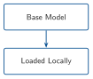
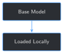

# Loading and Running Your First Local LLM {#sec-chapter-01}

::: {.content-visible when-format="html"}
::: {.pipeline-diagram}
{.diagram-light width="180"}
{.diagram-dark width="180"}
:::
:::

::: {.content-visible when-format="pdf"}
{width="180" fig-align="center"}
:::

::: {.chapter-status}
Progress `█░░░░░░░░░░░░` **1 / 13** &nbsp;·&nbsp; **Estimated time:** 20–30 min &nbsp;·&nbsp; **Difficulty:** 🟢 Beginner
:::

## Learning objectives

By the end of this chapter, you will be able to:

- Load an open-weight, instruction-tuned language model with
  `transformers`, entirely on your own machine
- Send it a question and read back its answer
- Explain, in plain language, why a fluent answer isn't the same as a
  correct one — and see it happen on your own screen

## Operational Problem

Oumy, the drilling engineer, has heard her company might start using AI
models to help make sense of years of drilling and completions reports.
Her first question isn't about accuracy — it's about control: *"Can we
run one of these models ourselves, on our own machine, so nothing about
this well ever leaves the building?"*

That's this chapter's problem to solve, and only this one. Not yet
whether the model understands drilling operations correctly — that's
coming. Just: can you load a real, working language model on your own
hardware and get an answer out of it, with nothing sent anywhere?

## Example report excerpt

Later chapters turn real reports like this one into training data. Here
is a genuine excerpt — quoted exactly as filed, typos and all — from
this book's own sample archive, report `Drilling_038` (2020-11-26), the
real stuck-pipe day referenced throughout this book:

::: {.callout-note title="Sample report excerpt -- FORGE-16A-78-32_Drilling_038_2020-11-26.pdf"}
```
23:30  04:00  4.5   Drill From 6,360' to 6,507', (147') Total, 32.6' feet per hour.
                     WOB 20 TO 35k, Rotary 50, Torque 6,500, SPP 3200-3400 GPM 560, DIFF 200-300psi
                     During the slide lost tool face and became assembly became stuck
04:00  06:00  2.0    Work pipe, circulate lube sweep, work tool back in position
                     Pipe free
```
:::

Hold that phrase — *"lost tool face and became stuck"* — in mind. Later
in this chapter, you'll ask the base model about it directly, and see
exactly how much (or how little) it understands.

## Theory

::: {.callout-tip title="Engineering Translation: base model"}
A **base model** is the general-purpose language model before any
fine-tuning on your own data — the raw, off-the-shelf unit, not yet
adjusted for this job. Every later chapter compares back to this
starting point.
:::

::: {.callout-tip title="Engineering Translation: weights / checkpoint"}
A model's **weights** (also called a **checkpoint**) are the millions of
learned numbers that determine what it says — the actual "knowledge,"
stored as files on disk. "Loading a model" means reading those files
into memory so they can be used.
:::

::: {.callout-tip title="Engineering Translation: chat template"}
Instruction-tuned models are trained on conversations formatted a
specific way (who's speaking, where a turn starts and ends). A **chat
template** is the exact formatting recipe for a given model — get it
wrong and the model still runs, just worse, because the input doesn't
look like anything it was trained on. `transformers` applies the right
one for you automatically once you tell it which model you're using.
:::

This book's chapters all fine-tune the same base model:
**Qwen2.5-1.5B-Instruct**, an open-weight, instruction-tuned model
released by Alibaba's Qwen team, small enough to load and run on an
ordinary laptop CPU. "1.5B" means 1.5 billion parameters — small by
current standards, which is exactly why it's usable without a GPU;
Chapter 5 revisits this size trade-off when you fine-tune it.

::: {.callout-tip title="Engineering Translation: pretraining"}
**Pretraining** is the process that produced Qwen2.5-1.5B-Instruct in
the first place — reading a huge amount of general text and adjusting
every one of its 1.5 billion numbers, over and over, until it can write
fluent, grammatical, sensibly-reasoned language and follow
instructions. That's a separate, much bigger job than anything this
book does. **Fine-tuning** — this book's whole subject, starting in
Chapter 5 — takes a model that's already been through that process and
adjusts it further, on a much smaller amount of your own text.
:::

## Why not train a model from scratch on our own reports?

A reasonable question before going any further: if a general-purpose
model doesn't know this operation's shorthand, why not just train a
model on this archive's reports from the very start, instead of
starting with someone else's model at all?

Because "training from scratch" means teaching a model to read and
write English — grammar, common sense, how to hold a conversation — at
the same time as teaching it drilling and completions. Pretraining a
model like Qwen2.5-1.5B took an enormous amount of general text and
compute to get right; even a large company's entire report archive,
every well, every year, is nowhere near enough text on its own to teach
a model language itself, let alone your domain on top of it. Fine-tuning
sidesteps that problem entirely: it starts from a model that has
already learned to read, write, and reason, and only asks it to learn
one more, much narrower thing — how *this* operation talks and what its
reports actually say. That's a small enough job to do on a laptop,
which training a model from scratch never would be.

## Why not just use a cloud AI assistant?

A fair question before writing any code: ChatGPT, Claude, and similar
hosted assistants already run instruction-tuned models, and you don't
have to install anything. Why bother loading one yourself?

- **Confidentiality.** A hosted assistant means your prompt — and
  anything you paste into it, including report excerpts — leaves your
  machine and goes to someone else's server. Section 4 of Appendix A
  covers this in more depth, but the short version: real drilling and
  completions reports are usually confidential, and "paste it into a
  chatbot" is rarely a decision you're allowed to make unilaterally.
- **You can't fine-tune what you don't have the weights to.** This
  book's whole arc — building a model that actually understands *your*
  operation — requires updating the model's own weights (Chapter 5
  onward). A hosted API gives you access to someone else's model, not
  the weights themselves.
- **No ongoing per-query cost.** Once downloaded, a local model runs as
  many times as you want at no marginal cost.

None of this means hosted assistants are bad — they're the right tool
for plenty of jobs. They're just not the tool for *this* job, which
needs both privacy and the ability to change the model itself.

## Implementation

### Step 1: Load the model and tokenizer

## What problem are we solving?

Before you can ask the model anything, its weights need to be
downloaded (first run only) and loaded into memory, alongside its
tokenizer — the component that translates between text and the numeric
form the model actually processes (Chapter 4 covers tokenization in
depth; for now, treat it as a black box that `transformers` handles for
you).

## Inputs

- The model name on Hugging Face: `Qwen/Qwen2.5-1.5B-Instruct`
- An internet connection for the first run only (the model is cached
  locally after that)

## Expected Output

No visible output yet — this step just gets the model ready in memory.
On the author's machine, the very first run (including the download)
took about 80 seconds; every run after that, loading from the local
cache took 3–4 seconds. Yours will vary with your connection and disk
speed, but a first run under a few minutes and cached runs under 10
seconds are both normal.

```{python}
#| eval: false
import torch
from transformers import AutoModelForCausalLM, AutoTokenizer

MODEL_NAME = "Qwen/Qwen2.5-1.5B-Instruct"

tokenizer = AutoTokenizer.from_pretrained(MODEL_NAME)
model = AutoModelForCausalLM.from_pretrained(MODEL_NAME, torch_dtype=torch.float32)
```

## What just happened?

`AutoTokenizer` and `AutoModelForCausalLM` each downloaded (or reused
the cached copy of) everything needed for this specific model, then
loaded it into memory. `torch_dtype=torch.float32` is the CPU-safe
numeric precision this book uses by default — Chapter 5 introduces
lower precision for faster fine-tuning on a GPU. (Depending on your
installed `transformers` version, this argument may print a harmless
deprecation notice suggesting `dtype=` instead — both work identically
for this book's purposes.)

## Production Reality

This loads one model into memory and keeps it there for the life of the
script. A real deployment (the companion app in `app/`, or Chapter 13's
continuous fine-tuning pipeline) has to think about things this chapter
skips: what happens if the download is interrupted, whether multiple
requests share one loaded model or each gets its own, and how to swap
in a newer fine-tuned checkpoint without restarting everything. None of
that changes how loading itself works — it's what you build *around*
this step once it's not just you at a keyboard.

### Step 2: Build a chat-formatted prompt and generate a reply

## What problem are we solving?

The model doesn't take a plain question — it expects input formatted as
a conversation, following the chat template mentioned above. This step
builds that formatted input, then asks the model to continue it (that's
what "generating" means: predicting what comes next, one token at a
time, until it decides to stop or hits a length limit).

## Inputs

- The loaded `model` and `tokenizer` from Step 1
- A question, as a plain string

## Expected Output

A chunk of generated text, printed to your terminal, in the neighborhood
of a paragraph or two, taking roughly 10–15 seconds on a CPU for a
response this length (again, faster with a GPU, slower on older
hardware).

```{python}
#| eval: false
def generate_reply(model, tokenizer, user_message: str, max_new_tokens: int = 340) -> str:
    messages = [{"role": "user", "content": user_message}]
    prompt = tokenizer.apply_chat_template(
        messages, tokenize=False, add_generation_prompt=True
    )
    inputs = tokenizer(prompt, return_tensors="pt")

    output_ids = model.generate(
        **inputs,
        max_new_tokens=max_new_tokens,
        do_sample=False,  # greedy decoding -- deterministic, same output every run
    )
    generated_ids = output_ids[0][inputs["input_ids"].shape[1]:]
    return tokenizer.decode(generated_ids, skip_special_tokens=True)


question = (
    "A driller's report says: 'During the slide lost tool face and "
    "became stuck.' What should the crew watch for on the next curve "
    "section?"
)
print(generate_reply(model, tokenizer, question))
```

Running this exact code prints:

```
Based on the information provided in the driller's report that "during the slide
lost tool face and became stuck," it suggests that there was an issue with the
drill bit or other tools getting caught during the descent of the drill string.
This could indicate several potential issues:

1. **Tool Catching**: The drill bit or any attached tools may have become
   entangled due to debris, mud cake buildup, or other obstructions.
2. **Drill String Configuration**: There might be a misalignment or improper
   configuration of the drill string that caused the tools to get caught.
3. **Downhole Conditions**: The conditions downhole (such as pressure changes,
   temperature variations) could have affected the performance of the tools.

For the next curve section, the crew should pay close attention to the following:

- **Check Tool Positioning**: Ensure that all tools are properly positioned and
  not obstructed by anything.
- **Inspect Downhole Equipment**: Check the condition of the drill bit and any
  other tools to ensure they are undamaged and functioning correctly.
- **Monitor Pressure and Temperature**: Be aware of any significant changes in
  pressure or temperature that could affect the performance of the equipment.
- **Review Drilling Parameters**: Adjust drilling parameters if necessary to
  prevent further complications.

By being vigilant about these factors, the crew can help avoid similar issues
and continue safely through the next curve section.
```

(Captured from a real run of this exact code, on CPU, with greedy
decoding — you should get this exact text too, word for word; see
"What just happened?" below for why.)

## What just happened?

`apply_chat_template` wrapped your question in the formatting this
model expects for a single user turn, then `generate` predicted the
reply one token at a time until it naturally finished (or would have
been cut off at `max_new_tokens`, whichever came first). `do_sample=False`
means the model always picks its single most-likely next word — no
randomness — which is why re-running this exact code gives you the
identical answer shown above, every time. (You may also see a harmless
warning about "generation flags... not valid" — that's the model's
default config mentioning sampling settings that greedy decoding simply
ignores; it's not an error.)

Read the answer again next to the real report excerpt above. It's
fluent, confident, and organized — and it never once mentions that the
crew already worked the pipe free that same shift, or references
anything about WOB, torque, or SPP from the actual report. It's a
generic answer to a specific question. That gap is this entire book.

## Practical exercise

🟢 **Beginner**

**Try it yourself:** open `code/chapter_01/load_local_model.py`, change
the `question` variable in `main()` to something from your own role —
Mike (completions), Sarah (intervention), or Sean (production) would
each ask something different — and re-run the script.

**You'll know it worked when:** you get a fluent, plausible-sounding
answer that doesn't reference any specific report, well, or number from
your own operation — because it can't. It has none of that yet.

## Field notes

::: {.callout-warning title="Field notes: the model doesn't know 'trip out of hole'"}
**Query:** `"In one sentence, what does 'trip out of hole' mean?"`

**Result (greedy decoding):** *"'Trip out of hole' is an idiomatic
expression that means to fall or stumble unexpectedly into something
difficult or unpleasant."*

**Result (sampled decoding, same question, different run):** *"The
phrase 'trip out of hole' is not standard English and doesn't have a
widely recognized meaning in common usage..."*

**Why:** "trip out of hole" (commonly abbreviated **TOOH**, and its
synonym **POOH** — "pull out of hole" — both appear in this book's own
[glossary](../appendix/appendix_b_glossary.qmd)) is basic, everyday
oilfield terminology: pulling the drill string out of the wellbore. It
appears throughout the sample archive `Drilling_038` above is drawn
from. Qwen2.5-1.5B-Instruct's general training data apparently didn't
include enough real oilfield operational text to have learned it — so
it confidently guesses at an English idiom instead, or in the sampled
run, denies the phrase means anything at all.

**Lesson:** fluent and confident is not the same as correct. The base
model doesn't yet know your domain's most basic vocabulary, let alone
its judgment calls — closing exactly that gap is what the rest of this
book does. (Reproduce this yourself with
`code/chapter_01/challenge/challenge.py`, below.)
:::

## Challenge exercise

🟠 **Intermediate**

**Challenge:** `model.generate()`'s `do_sample` argument controls
whether the model always picks its single most likely next word
(`do_sample=False`, what this chapter used) or samples with some
randomness (`do_sample=True`). Write a script that asks the same
question both ways and prints both answers side by side. A reference
solution — including the exact "trip out of hole" comparison from Field
notes above — is at `code/chapter_01/challenge/challenge.py`.

## Key takeaways

- A "local" model means the weights and the computation both live on
  your own machine — nothing is sent anywhere once it's downloaded.
- `transformers`' `AutoModelForCausalLM` and `AutoTokenizer` handle
  downloading, caching, and loading a model with a few lines of code.
- A chat template formats your question the way the model was trained
  to expect it; `apply_chat_template` handles this for you.
- `do_sample=False` (greedy decoding) is deterministic — the same input
  always produces the same output — which is why this book can show you
  exact expected output and mean it.
- Fluent output is not the same as grounded output. The base model can
  write confidently about something it has never actually learned.

## Repository files

| File | Purpose |
|---|---|
| `code/chapter_01/load_local_model.py` | Loads the base model and generates a reply to one question |
| `code/chapter_01/challenge/challenge.py` | Reference solution: greedy vs. sampled decoding, side by side |
| `code/chapter_01/build_sample_training_set.py` | Reproduces `datasets/sample_training_set/` from the full archive |
| `datasets/sample_training_set/` | The 10-report curated Utah FORGE subset, including `Drilling_038` |
| `notebooks/chapter_01_explore.ipynb` | Interactive companion notebook |

::: {.callout-caution title="CHECKPOINT — Chapter 1"}
- [x] Loaded an open-weight local model with `transformers`
- [x] Sent it a question through its chat template and read back a reply
- [x] Observed, on a real run, that a fluent answer can still be
      operationally ungrounded
:::

::: {.callout-tip .built-box title="✓ WHAT YOU BUILT"}
**`load_local_model.py`** — a working script that loads
Qwen2.5-1.5B-Instruct entirely locally and answers a question. Every
later chapter in Part I builds directly on `load_model_and_tokenizer()`
and `generate_reply()` from this file.
:::

## What can you do now that you couldn't do before?

You can load and run a real language model on your own machine, with no
account, no API key, and no data leaving your computer — and you've seen
direct, reproducible evidence of exactly what it does and doesn't
understand yet.

## Suggested next step

**Coming up in Chapter 2:** the base model has no idea what "trip out of
hole" means because it never saw enough text like `Drilling_038` during
its own training. Chapter 2 turns reports like that one into the
instruction/response training examples that later chapters will
actually fine-tune the model on.
