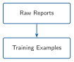
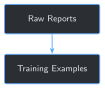

# Turning Drilling & Completions Reports into Training Examples {#sec-chapter-02}

::: {.content-visible when-format="html"}
::: {.pipeline-diagram}
{.diagram-light width="180"}
{.diagram-dark width="180"}
:::
:::

::: {.content-visible when-format="pdf"}
{width="180" fig-align="center"}
:::

::: {.chapter-status}
Progress `██░░░░░░░░░░░` **2 / 13** &nbsp;·&nbsp; **Estimated time:** 30–40 min &nbsp;·&nbsp; **Difficulty:** 🟢 Beginner
:::

## Learning objectives

By the end of this chapter, you will be able to:

- Extract structured fields from a real report PDF with `pdfplumber`
- Explain what an instruction/response training example is, and why its
  `output` should come from the report itself rather than a written
  summary
- Turn a folder of reports into a training-ready `.jsonl` file
- Recognize when a report doesn't match your extractor's assumptions,
  and handle that case instead of silently getting it wrong
- Explain why one recognized, well-formed report should still be
  deliberately held out of training, before fine-tuning ever enters
  the picture

## Operational Problem

Oumy, still turning over what Chapter 1 showed her, asks the obvious
next question: *"The report file itself already says what happened,
plainly — 'Present Operations,' 'Activity Planned.' Why can't we just
point the model at that?"*

Because a model doesn't learn from being pointed at a folder of PDFs. It
learns from *training examples* — a specific, structured shape a
fine-tuning process (Chapter 5) can actually consume. This chapter turns
that folder of PDFs into exactly that shape, using nothing but the
reports' own words.

## Example report excerpt

The same real report from Chapter 1, `Drilling_038` (2020-11-26), has
two short, plain-language fields sitting right at the top of the form,
before any of the technical tables:

::: {.callout-note title="Sample report excerpt -- FORGE-16A-78-32_Drilling_038_2020-11-26.pdf"}
```
PRESENT OPERATIONS: PIPE FREE, TRIP OUT OF HOLE FOR BHA INSPECTION
ACTIVITY PLANNED: INSPECT BHA, TRIP IN HOLE DRILL CURVE
```
:::

These two fields — a snapshot of "what's happening right now" and
"what's planned next" — exist on every drilling report in this book's
archive. They're the raw material this chapter turns into training
examples.

## Theory

::: {.callout-tip title="Engineering Translation: instruction/response pair"}
A **training example** is like a single flashcard: the question you'd
ask (the *instruction*, plus optional *input* context), and the correct
answer (the *output*), written down together so a model can study from
it later. This book uses that three-part shape — `instruction`,
`input`, `output` — throughout.
:::

::: {.callout-tip title="Engineering Translation: field extraction"}
**Field extraction** means finding one specific labeled piece of
information inside a big block of text — the way you'd scan a paper
form for the line that starts with "Total:" rather than reading the
whole page. This chapter does it with regular expressions (*regex*): a
compact pattern-matching syntax for "find text that looks like this."
:::

## Why not just write our own summaries?

A tempting shortcut: read each report and write a one-sentence summary
by hand (or ask another AI to write one), and use that as the training
`output`. Resist it. The moment a summary is written by anyone other
than the report itself, it can be subtly wrong — a detail dropped, a
number transposed, a plausible-sounding guess where the report was
actually ambiguous — and that error becomes permanent, invisible ground
truth. Later chapters build a data quality gate (Chapter 6) and an
evaluation harness (Chapter 11) that both assume your labels are
trustworthy; if the labels themselves are fabricated, everything built
on top of them inherits the mistake.

This chapter's technique sidesteps the problem entirely: every `output`
below is the report's own field value, extracted verbatim. Nothing is
summarized, paraphrased, or invented. It's a narrower kind of training
example than a rich free-text summary would be — Chapter 7 builds
richer ones — but every word of it is real.

## Implementation

### Step 1: Extract structured fields from one report

## What problem are we solving?

Before anything can become a training example, you need the report's
raw text, and then the two specific fields inside it — `PRESENT
OPERATIONS` and `ACTIVITY PLANNED` — pulled out from everything else on
the form (casing tables, mud properties, survey data) that isn't
relevant here.

## Inputs

- One report PDF, e.g. `datasets/sample_training_set/FORGE-16A-78-32_Drilling_038_2020-11-26.pdf`

## Expected Output

A dictionary of the fields this report actually contains.

```{python}
#| eval: false
import re
import pdfplumber

FIELD_PATTERNS = {
    "well_name": r"WELL NAME:\s*(.+?)\s+JOB:",
    "rpt_date": r"RPT DATE:\s*([\d/]+)",
    "rpt_num": r"RPT NUM\.?:\s*(\d+)",
    "present_operations": r"PRESENT OPERATIONS:\s*(.+?)\nACTIVITY PLANNED",
    "activity_planned": r"ACTIVITY PLANNED:\s*(.+?)\n",
}

def extract_text(pdf_path):
    with pdfplumber.open(pdf_path) as pdf:
        return pdf.pages[0].extract_text()

def extract_fields(text):
    fields = {}
    for name, pattern in FIELD_PATTERNS.items():
        match = re.search(pattern, text)
        fields[name] = match.group(1).strip() if match else None
    return fields

text = extract_text("datasets/sample_training_set/FORGE-16A-78-32_Drilling_038_2020-11-26.pdf")
print(extract_fields(text))
```

Running this exact code prints:

```
{'well_name': 'FORGE 16A [78]-32', 'rpt_date': '11/26/2020', 'rpt_num': '38',
 'present_operations': 'PIPE FREE, TRIP OUT OF HOLE FOR BHA INSPECTION',
 'activity_planned': 'INSPECT BHA, TRIP IN HOLE DRILL CURVE'}
```

## What just happened?

`pdfplumber` read the PDF and returned its text as one long string —
column layout flattened, so lines that appear side by side on the page
(like a table's column headers and a row of values) can end up on
separate lines here. `extract_fields` then used regex to find each
labeled field regardless of exactly where it landed in that string.

## Production Reality

This regex assumes a specific, fixed field layout — the one every
`Drilling_NNN` report in this archive happens to share. `pdfplumber`
itself doesn't get everything right either: scanned or handwritten
reports don't have extractable text at all (Chapter 6 covers detecting
that). And even for a clean, digital report, a different operator's
form, or even this same operator's *completion* reports, can use
different field labels entirely — which is exactly what you'll run into
next.

### Step 2: Turn one report's fields into training examples

## What problem are we solving?

Extracted fields aren't training examples yet — they need to be
reshaped into the `instruction` / `input` / `output` triples a
fine-tuning process expects, and a report that doesn't have both fields
needs to be skipped rather than silently producing a broken example.

## Inputs

- The `extract_fields()` dictionary from Step 1, for every report in
  `datasets/sample_training_set/`

## Expected Output

Two training examples per successfully-parsed report; a printed notice
naming any report that was skipped.

```{python}
#| eval: false
from datetime import datetime

def normalize_date(raw_date):
    return datetime.strptime(raw_date, "%m/%d/%Y").strftime("%Y-%m-%d")

def build_examples_for_report(pdf_path):
    text = extract_text(pdf_path)
    fields = extract_fields(text)

    if not fields["present_operations"] or not fields["activity_planned"]:
        return []  # unrecognized field layout -- see Production Reality above

    context = (
        f"Well: {fields['well_name']} | Report #{fields['rpt_num']} | "
        f"Date: {normalize_date(fields['rpt_date'])}"
    )
    return [
        {
            "instruction": "What are the present operations reported on this well?",
            "input": context,
            "output": fields["present_operations"],
        },
        {
            "instruction": "What activity is planned next?",
            "input": context,
            "output": fields["activity_planned"],
        },
    ]
```

Running `build_examples_for_report()` on `Drilling_038` prints:

```json
[
  {
    "instruction": "What are the present operations reported on this well?",
    "input": "Well: FORGE 16A [78]-32 | Report #38 | Date: 2020-11-26",
    "output": "PIPE FREE, TRIP OUT OF HOLE FOR BHA INSPECTION"
  },
  {
    "instruction": "What activity is planned next?",
    "input": "Well: FORGE 16A [78]-32 | Report #38 | Date: 2020-11-26",
    "output": "INSPECT BHA, TRIP IN HOLE DRILL CURVE"
  }
]
```

## What just happened?

Each report becomes two training examples, one per field, sharing the
same `input` context (well, report number, date) so the model can learn
to condition its answer on which report is being asked about.
`normalize_date` just makes every date consistently `YYYY-MM-DD`, since
this archive's own reports don't all format dates the same way.

### Step 3: Build and save the full training set — minus one report, on purpose

## What problem are we solving?

One report is a proof of concept; Chapter 5's fine-tune needs the whole
sample archive, saved to a file the next chapters can load without
re-running PDF extraction every time. But if Chapter 5 trains on every
report and then tests on those same reports, a good score would only
prove the model *memorized* 18 flashcards — not that fine-tuning taught
it anything that generalizes. This step reserves one drilling report,
`Drilling_037` (2020-11-25), out of the training set entirely, so
Chapter 5 has a report the model has genuinely never seen to test
against.

## Inputs

- Every PDF in `datasets/sample_training_set/`

## Expected Output

A `.jsonl` file (one JSON object per line — the standard format this
book uses for training data) plus summary lines reporting the held-out
report, how many examples were built, and how many reports were
skipped.

```{python}
#| eval: false
import json
from pathlib import Path

SAMPLE_SET_DIR = Path("datasets/sample_training_set")
OUTPUT_PATH = Path("datasets/training_examples/sample_training_examples.jsonl")
HELD_OUT_REPORT = "FORGE-16A-78-32_Drilling_037_2020-11-25.pdf"

def build_training_examples(sample_dir=SAMPLE_SET_DIR):
    examples, skipped, held_out = [], [], []
    for pdf_path in sorted(sample_dir.glob("*.pdf")):
        if pdf_path.name == HELD_OUT_REPORT:
            held_out.append(pdf_path.name)
            continue
        report_examples = build_examples_for_report(pdf_path)
        if report_examples:
            examples.extend(report_examples)
        else:
            skipped.append(pdf_path.name)
    if held_out:
        print(f"Reserved {len(held_out)} held-out report(s) for Chapter 5's generalization check: {held_out}")
    if skipped:
        print(f"Skipped {len(skipped)} report(s) with an unrecognized field layout: {skipped}")
    return examples

def save_examples_jsonl(examples, output_path=OUTPUT_PATH):
    output_path.parent.mkdir(parents=True, exist_ok=True)
    with output_path.open("w", encoding="utf-8") as f:
        for example in examples:
            f.write(json.dumps(example) + "\n")

examples = build_training_examples()
save_examples_jsonl(examples)
print(f"Built {len(examples)} training examples -> {OUTPUT_PATH}")
```

Running this exact code prints:

```
Reserved 1 held-out report(s) for Chapter 5's generalization check: ['FORGE-16A-78-32_Drilling_037_2020-11-25.pdf']
Skipped 1 report(s) with an unrecognized field layout: ['FORGE-16A-78-32_Completion_003_2021-01-06.pdf']
Built 16 training examples -> datasets/training_examples/sample_training_examples.jsonl
```

## What just happened?

Of the ten sample reports, one (`Completion_003`) is a *completion*
report using different field labels (`Present Ops:` / `Next 24 Hours:`
instead of `PRESENT OPERATIONS:` / `ACTIVITY PLANNED:`) and gets
correctly skipped rather than silently producing a garbage example. A
second, `Drilling_037`, is a perfectly normal, recognized drilling
report — it isn't skipped for a data-quality reason, it's *deliberately
withheld* from training. That leaves eight reports, each contributing
two examples — 16 total. `datasets/training_examples/` is generated, not
committed to this repository — regenerate it any time by re-running this
script (see `book/.gitignore`).

::: {.callout-tip title="Engineering Translation: held-out data"}
**Held-out data** is data you deliberately keep out of training so you
have something honest to test on afterward — like a well test string
never touched during a workover, kept clean specifically so its
before/after readings mean something. A model tested only on the exact
data it trained on can't tell you whether it learned anything general;
it can only tell you whether it memorized.
:::

This is a deliberately simple first training set — every `output` is a
single field value copied verbatim from a report, not a rich summary or
judgment call. That's on purpose (see "Why not just write our own
summaries?" above), but it also means this training set mostly teaches
field recall, not operational reasoning. Later chapters build richer
training examples (Chapter 7) and a proper evaluation harness beyond
one held-out report (Chapter 11); this chapter's job is just to get a
first, honest training/held-out split in place before fine-tuning ever
starts.

## Practical exercise

🟢 **Beginner**

**Try it yourself:** run `python code/chapter_02/build_training_examples.py`
from inside `book/`, then open the generated
`datasets/training_examples/sample_training_examples.jsonl` in a text
editor.

**You'll know it worked when:** the script prints `Built 16 training
examples`, the file has exactly 16 lines, the first one matches report
`#3` (`Drilling_003`, 2020-10-22) — the earliest report in the sample
set — and no line anywhere in the file mentions `Report #37`.

## Field notes

::: {.callout-warning title="Field notes: one field, not the whole story"}
**Query/Action:** extracting fields for reports `#49` and `#50` — the
same packers-fail-to-fishing sequence referenced in the author's
previous book.

**Result:** report `#49`'s `activity_planned` is literally `"FISHING
OPERATIONS"` — confirming that real event directly from this archive.
Report `#50`'s `present_operations`, the very next day, is `"TRIP IN
HOLE WITH DIRECTIONAL BHA"` — not a restatement of "fishing" at all,
even though report `#49` had just announced it as the plan.

**Why:** the reports say (report `#49`, activity planned): `"FISHING
OPERATIONS"`; (report `#50`, present operations): `"TRIP IN HOLE WITH
DIRECTIONAL BHA"`. Each field is a narrow, honest snapshot of *one*
report at *one* moment — it was never written to also summarize what
happened the next day.

**Lesson:** even perfectly clean, extractive ground truth like this only
answers questions about a single report in isolation. Connecting the
story across reports — the plan in `#49` to the actual outcome by
`#50` — needs more than two fields from one PDF. That's exactly why
Part II exists: Chapter 9's hybrid retrieval is what eventually lets a
question span more than one report.
:::

## Challenge exercise

🟠 **Intermediate**

**Challenge:** extend `build_examples_for_report()` to also handle the
completion report's different field layout (`Present Ops:` / `Next 24
Hours:`, and a two-digit-year date format), so 9 of the 10 sample
reports contribute examples instead of 8 (`Drilling_037` stays reserved
either way — see Step 3). A reference solution is at
`code/chapter_02/challenge/challenge.py` — it produces 18 training
examples total, 0 reports skipped.

## Key takeaways

- A training example in this book is an `instruction` / `input` /
  `output` triple — a single flashcard the model can study from.
- Using a report's own self-reported fields as the `output` avoids
  fabricating ground truth; the label is never anyone's guess.
- `pdfplumber` plus a handful of regex patterns reliably extracts
  structured fields from a fixed-form report — but only the form layout
  it was written for.
- Different report types (drilling vs. completion) can use different
  field labels even within the same archive. Detect and skip what your
  extractor doesn't recognize, rather than silently producing a bad
  example.
- Skipping and holding out are different things done for different
  reasons: a report gets *skipped* because your extractor can't parse
  it; a report gets *held out* on purpose, even though it parses fine,
  so there's an honest, unseen test left once fine-tuning starts.

## Repository files

| File | Purpose |
|---|---|
| `code/chapter_02/build_training_examples.py` | Extracts fields and builds instruction/response training examples |
| `code/chapter_02/challenge/challenge.py` | Reference solution: also handles the completion report's field layout |
| `datasets/sample_training_set/` | The 10 source report PDFs this chapter reads |
| `datasets/training_examples/sample_training_examples.jsonl` | Generated output (not committed — regenerate by running the script) |
| `notebooks/chapter_02_explore.ipynb` | Interactive companion notebook |

::: {.callout-caution title="CHECKPOINT — Chapter 2"}
- [x] Extracted structured fields from a real report PDF with `pdfplumber`
- [x] Built instruction/response training examples using a report's own
      words as ground truth
- [x] Detected and skipped a report with an unrecognized field layout,
      instead of silently mishandling it
- [x] Reserved one recognized, well-formed report as held-out data,
      instead of training on everything available
:::

::: {.callout-tip .built-box title="✓ WHAT YOU BUILT"}
**`build_training_examples.py`** — turns 8 of the 9 drilling-format
reports in `datasets/sample_training_set/` into 16 real training
examples, saved to `datasets/training_examples/sample_training_examples.jsonl`.
The 9th, `Drilling_037`, is reserved untouched for Chapter 5's held-out
generalization check. Chapter 5 fine-tunes on data built exactly this
way, at a larger scale.
:::

## What can you do now that you couldn't do before?

You can turn a folder of real, inconsistently-formatted report PDFs into
a training-ready dataset without inventing a single label — and you know
precisely which reports your extractor handles and which it doesn't,
instead of hoping.

## Suggested next step

**Coming up in Chapter 3:** before spending any time actually
fine-tuning, Chapter 3 runs a proper baseline test — the base model
against a batch of real questions drawn from the 16 training examples
you just built — so you have hard, reproducible evidence of exactly what
it gets wrong, and something concrete to compare Chapter 5's fine-tuned
model against afterward. `Drilling_037`, held out here, stays untouched
until Chapter 5.
