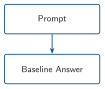
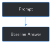

# Baseline Prompting: What the Model Gets Wrong Before Fine-Tuning {#sec-chapter-03}

::: {.content-visible when-format="html"}
::: {.pipeline-diagram}
{.diagram-light width="180"}
{.diagram-dark width="180"}
:::
:::

::: {.content-visible when-format="pdf"}
{width="180" fig-align="center"}
:::

::: {.chapter-status}
Progress `███░░░░░░░░░░` **3 / 13** &nbsp;·&nbsp; **Estimated time:** 20-30 min &nbsp;·&nbsp; **Difficulty:** 🟢 Beginner
:::

## Learning objectives

By the end of this chapter, you will be able to:

- Turn Chapter 2's training examples into a fixed batch of baseline
  questions, with each example's own `output` withheld from the model
- Run the unmodified base model against that exact batch and save its
  answers to a reusable results file
- Explain why a baseline must reuse the *same* prompts a later
  fine-tuned model will be tested on, not a different, looser sample
- Describe, from a real run against this book's own archive, the
  specific way this base model fails when it isn't given a report's
  content — and why that's different from wild hallucination

## Operational Problem

Sarah, the intervention engineer, is skeptical: *"Before we spend any
time fine-tuning this thing, how do we even know it's wrong today? And
once it's fine-tuned, how do we prove it actually got better, instead of
just feeling better?"*

Chapter 1 showed the base model producing a fluent, generic answer with
no report-specific detail. That was one question, read once, judged by
eye. It's not something you can compare against later, and it isn't
built from the same training examples Chapter 5 will actually fine-tune
on. This chapter fixes both problems: it takes the exact instruction/input
prompts Chapter 2 built, asks the base model every one of them with the
real answer hidden, and saves the results to a file — a fixed,
reproducible baseline Chapter 5's fine-tuned model gets held against,
not a vibe.

## Example baseline question

Chapter 2 turned report `Drilling_038` (2020-11-26 — the stuck-pipe day
from Chapter 1) into this training example:

::: {.callout-note title="Training example -- from Chapter 2"}
```json
{
  "instruction": "What activity is planned next?",
  "input": "Well: FORGE 16A [78]-32 | Report #38 | Date: 2020-11-26",
  "output": "INSPECT BHA, TRIP IN HOLE DRILL CURVE"
}
```
:::

A training example and a baseline question are the same prompt used two
different ways. Fine-tuning (Chapter 5) shows the model the `output` so
it can learn from it. A baseline never does — this chapter sends the
model only the `instruction` and `input`, then compares whatever it says
back against the `output` it was never shown.

## Theory

::: {.callout-tip title="Engineering Translation: baseline"}
A **baseline** is a fixed, saved measurement taken *before* you change
anything — like recording a well's pressure before an intervention, so
you have something concrete to compare the after-reading against. A
baseline you can't reproduce, or that used different questions each
time, isn't useful for that comparison.
:::

::: {.callout-tip title="Engineering Translation: exact-match scoring"}
This chapter's `matched_expected` check asks one narrow question: does
the model's answer contain the report's exact expected value, word for
word? It's the simplest possible scoring rule — strict enough to never
give false credit, but too strict to reward an answer that's correct in
substance but phrased differently. Chapter 11 builds a more forgiving
evaluation harness; this chapter deliberately starts with the crude,
honest version.
:::

## Why not just eyeball a few answers?

A tempting shortcut: run the model on two or three questions, read the
replies, and decide informally whether it "seems okay." That's exactly
what Chapter 1 did, and it doesn't scale into evidence. You can't compare
"seemed okay" across a before-and-after fine-tune, you can't tell whether
one lucky answer is representative of the other seventeen, and you have
nothing saved to point to later if someone asks how you know fine-tuning
helped.

This chapter's harness fixes all three: the same 18 questions, every
time; every answer saved to
`datasets/training_examples/baseline_results.jsonl`; and a single number
— how many answers contained the report's actual value — that Chapter 5
can reproduce and compare against after fine-tuning.

## Implementation

### Step 1: Turn Chapter 2's training examples into baseline questions

## What problem are we solving?

Each Chapter 2 training example is a dictionary with `instruction`,
`input`, and `output`. A baseline question is just the first two, joined
into the single string the model actually receives — the `output` must
never appear in it, or the test proves nothing.

## Inputs

- One training example (as built by `build_training_examples()` in
  Chapter 2)

## Expected Output

A plain-text prompt string, with no trace of the expected answer.

```{python}
#| eval: false
import sys
from pathlib import Path

BOOK_ROOT = Path(__file__).resolve().parents[2]
sys.path.insert(0, str(BOOK_ROOT / "code" / "chapter_01"))
sys.path.insert(0, str(BOOK_ROOT / "code" / "chapter_02"))

from build_training_examples import build_training_examples
from load_local_model import MODEL_NAME, generate_reply, load_model_and_tokenizer


def build_prompt(example: dict) -> str:
    return f"{example['instruction']}\n{example['input']}"


examples = build_training_examples()
print(build_prompt(examples[0]))
```

Running this exact code prints:

```
What are the present operations reported on this well?
Well: FORGE 16A [78]-32 | Report #3 | Date: 2020-10-22
```

## What just happened?

`build_prompt` concatenates `instruction` and `input` with a newline —
nothing more. `build_training_examples()` is the exact same function
Chapter 2 uses to build the training set, imported directly rather than
copied, so this chapter's questions are guaranteed to be the same ones
Chapter 5 eventually trains on.

## Production Reality

Every one of these questions only ever gives the model the report's
*metadata* — well name, report number, date — never the report's actual
text. That's deliberate: it isolates exactly what fine-tuning is for
(Chapter 5 bakes each report's specific facts into the model's weights,
so it no longer needs the text handed to it). A separate, equally valid
question — can the model answer correctly when it *is* given the report
text? — is this chapter's challenge exercise, and it previews why
Chapter 9 eventually combines fine-tuning with retrieval instead of
picking one or the other.

### Step 2: Ask the base model, with the real answer hidden

## What problem are we solving?

For one baseline question, get the base model's answer and check it
against the report's real value — the smallest unit of this chapter's
harness.

## Inputs

- The loaded `model` and `tokenizer` from Chapter 1
- One training example

## Expected Output

A dictionary recording the question, the hidden expected answer, the
model's actual answer, and whether they matched.

```{python}
#| eval: false
def ask_baseline(model, tokenizer, example: dict, max_new_tokens: int = 60) -> dict:
    prompt = build_prompt(example)
    answer = generate_reply(model, tokenizer, prompt, max_new_tokens=max_new_tokens)
    expected = example["output"]
    return {
        "instruction": example["instruction"],
        "input": example["input"],
        "expected": expected,
        "base_model_answer": answer,
        "matched_expected": expected.strip().lower() in answer.strip().lower(),
    }


model, tokenizer = load_model_and_tokenizer(MODEL_NAME)
print(ask_baseline(model, tokenizer, examples[0]))
```

Running this exact code prints:

```json
{
  "instruction": "What are the present operations reported on this well?",
  "input": "Well: FORGE 16A [78]-32 | Report #3 | Date: 2020-10-22",
  "expected": "RIGGING UP WITH FRONTIER CREWS AND SUPERVISION AND JW JONES TRUCKING",
  "base_model_answer": "The report you've provided appears to be for a well called \"FORGE 16A [78]-32\" and it is dated October 22, 2020. The specific details of what operations were reported are not explicitly stated in your message. However, based",
  "matched_expected": false
}
```

## What just happened?

The model was asked exactly what Chapter 2's `input` field contains —
well name, report number, date — and nothing else. It answers honestly
that "the specific details... are not explicitly stated," rather than
inventing a plausible-sounding operation. That's a meaningfully
*better* failure than confident fabrication would be, but it's still a
failure: the harness needed the report's real value, and didn't get it.

## Production Reality

`max_new_tokens=60` caps the reply short on purpose, so this chapter's
18-question run finishes in a couple of minutes on CPU. A shorter cap
also means some replies (like the one above) get cut off mid-sentence
rather than reaching a natural stopping point — acceptable here because
`matched_expected` only checks for the report's specific value, which
would appear (or not) well before token 60 in every one of this
archive's short, single-line field outputs.

### Step 3: Run the full baseline and save it for Chapter 5

## What problem are we solving?

One question proves the harness works. Chapter 5 needs all 18, saved
somewhere it can load without re-running the base model.

## Inputs

- Every training example from `build_training_examples()`

## Expected Output

A summary line reporting how many of the 18 answers matched, and a
saved `.jsonl` file with one result per question.

```{python}
#| eval: false
import json

OUTPUT_PATH = BOOK_ROOT / "datasets" / "training_examples" / "baseline_results.jsonl"


def run_baseline(model, tokenizer, examples: list[dict]) -> list[dict]:
    return [ask_baseline(model, tokenizer, example) for example in examples]


def save_results_jsonl(results: list[dict], output_path: Path = OUTPUT_PATH) -> None:
    output_path.parent.mkdir(parents=True, exist_ok=True)
    with output_path.open("w", encoding="utf-8") as f:
        for result in results:
            f.write(json.dumps(result) + "\n")


results = run_baseline(model, tokenizer, examples)
save_results_jsonl(results)

matched = sum(r["matched_expected"] for r in results)
print(f"Baseline: {matched}/{len(results)} answers contained the report's actual value verbatim")
print(f"Saved -> {OUTPUT_PATH}")
```

Running this exact code prints:

```
Baseline: 0/18 answers contained the report's actual value verbatim
Saved -> datasets/training_examples/baseline_results.jsonl
```

## What just happened?

Every one of the 18 questions built from the 9 recognized sample reports
came back with `matched_expected: false`. Not one exact number, status,
or operation name from the archive appears in any answer — because the
model was never given any of them, and it has no other way to know
which specific well this is. `0/18` is this chapter's baseline number.
Chapter 5 reruns this exact harness against the fine-tuned model and
compares its score directly against this one.

## Practical exercise

🟢 **Beginner**

**Try it yourself:** run
`python code/chapter_03/baseline_prompting.py` from inside `book/`,
then open `datasets/training_examples/baseline_results.jsonl` and read
through all 18 answers.

**You'll know it worked when:** the script prints `Baseline: 0/18`, the
file has exactly 18 lines, and none of the model's answers contain a
specific operation, status, or number from the actual report — most
will instead say something like "not explicitly stated."

## Field notes

::: {.callout-warning title="Field notes: the model invents the wrong kind of document"}
**Query:** report `#49`'s "What activity is planned next?" question —
the same fishing-operations report referenced in Chapter 2's Field
notes.

**Result:** *"The text you provided appears to be from an online forum
or discussion board where someone has posted their progress on a
project called 'FORGE 16A' with the report number #49 and the date of
December 7, 2020. Without more context about what this refers..."*

**Why:** report `#49`'s real `activity_planned` value is `"FISHING
OPERATIONS"` — the model was never given that, only the metadata string
`"Well: FORGE 16A [78]-32 | Report #49 | Date: 2020-12-07"`. Rather than
guess at an oilfield operation, it guesses at what *kind of document*
would contain a bare project name and report number — and lands on "an
online forum or discussion board post," which is a reasonable guess for
generic internet text and a completely wrong one for a daily drilling
report.

**Lesson:** this base model doesn't just lack this well's facts — it
doesn't yet recognize the *shape* of the document it's being asked
about. That's a second, deeper gap fine-tuning has to close, beyond
memorizing individual report values.
:::

## Challenge exercise

🟠 **Intermediate**

**Challenge:** `baseline_prompting.py` only ever gives the model each
report's metadata, never its actual text — so `0/18` mostly proves the
model has no way to know the answer, not that fine-tuning is the only
possible fix. Extend the harness to include each report's full extracted
text (from Chapter 2's `extract_text()`) alongside the question, and
re-measure the match rate. A reference solution is at
`code/chapter_03/challenge/challenge.py` — on a real run, it scores
`6/18`, up from `0/18`, but still well short of perfect: even reading the
report directly, this small base model doesn't reliably reproduce its
exact wording. Keep that number in mind for Chapter 9, which combines
fine-tuning with exactly this kind of retrieved context.

## Key takeaways

- A baseline is only useful if it's fixed and reproducible: same
  questions, same withheld answers, saved results, every time.
- This chapter's baseline questions are Chapter 2's real training
  examples, with the `output` withheld — not a separate, invented test
  set.
- On this book's sample archive, the unmodified base model scores
  `0/18` on exact-match — not because it hallucinates wildly, but
  because it correctly (and unhelpfully) admits it wasn't given the
  report's content.
- `matched_expected` is a deliberately crude, honest scoring rule.
  Chapter 11 builds something more forgiving; this chapter's harness
  exists so there's a saved, comparable number to build on.

## Repository files

| File | Purpose |
|---|---|
| `code/chapter_03/baseline_prompting.py` | Builds baseline questions from Chapter 2's training examples, runs the base model, saves results |
| `code/chapter_03/challenge/challenge.py` | Reference solution: re-runs the same questions with each report's full text included |
| `datasets/training_examples/baseline_results.jsonl` | Generated output (not committed — regenerate by running the script) |
| `notebooks/chapter_03_explore.ipynb` | Interactive companion notebook |

::: {.callout-caution title="CHECKPOINT — Chapter 3"}
- [x] Turned Chapter 2's training examples into baseline questions with
      the answer withheld
- [x] Ran the base model against all 18 questions and saved every answer
- [x] Measured a real, reproducible baseline score (`0/18`) to compare
      Chapter 5's fine-tuned model against
:::

::: {.callout-tip .built-box title="✓ WHAT YOU BUILT"}
**`baseline_prompting.py`** — runs the unmodified base model against
Chapter 2's 18 training examples with every answer hidden, and saves the
results to `datasets/training_examples/baseline_results.jsonl`.
Chapter 5 reruns this same harness against the fine-tuned model and
compares scores directly.
:::

## What can you do now that you couldn't do before?

You can produce a fixed, reproducible number for exactly how well the
base model performs on your own training questions — something to point
to, not just a feeling — and you have it saved to a file Chapter 5 will
compare against directly.

## Suggested next step

**Coming up in Chapter 4:** fine-tuning (Chapter 5) works by adjusting
how the model represents text internally — but "text" isn't what a
model actually reads. Chapter 4 opens up tokenization and embeddings,
the layer underneath every prompt this chapter sent, so LoRA fine-tuning
doesn't feel like a black box when you get there.
