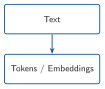
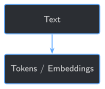

# Tokenization and Embeddings for Domain Fine-Tuning {#sec-chapter-04}

::: {.content-visible when-format="html"}
::: {.pipeline-diagram}
{.diagram-light width="180"}
{.diagram-dark width="180"}
:::
:::

::: {.content-visible when-format="pdf"}
{width="180" fig-align="center"}
:::

::: {.chapter-status}
Progress `████░░░░░░░░░` **4 / 13** &nbsp;·&nbsp; **Estimated time:** 30-40 min &nbsp;·&nbsp; **Difficulty:** 🟠 Intermediate
:::

## Learning objectives

By the end of this chapter, you will be able to:

- Explain what a tokenizer actually does to text before the model ever
  sees it, and show it splitting real oilfield shorthand into pieces
- Explain what an embedding is, and the difference between a raw,
  per-token embedding and a whole-phrase (contextual) embedding
- Show, from a real run, whether the base model's raw embeddings or a
  general-purpose sentence-embedding model recognize this book's own
  oilfield acronyms as equivalent to their spelled-out meaning
- Explain why neither result is evidence the model is "broken" — and
  what it means for what fine-tuning (Chapter 5) actually has to fix

## Operational Problem

Sean, the production engineer, pushes back on Chapter 1's finding:
*"Sure, this small model didn't know 'trip out of hole' — but ChatGPT
and every other LLM I've used seem to handle abbreviations and jargon
fine elsewhere. Isn't that basically a solved problem by now?"*

It's a fair challenge, and answering it honestly means looking one layer
lower than any question-and-answer test can show. Before a model
generates anything, your text gets cut into pieces and looked up against
a fixed table of numbers — and that happens the same way whether the
model has seen your domain's jargon a million times or never once. This
chapter looks directly at that layer: what pieces this book's oilfield
shorthand actually gets cut into, and whether the numbers those pieces
get looked up against already know anything about what that shorthand
means.

## Example training excerpt

A realistic instruction/response pair built the same way Chapter 2's
`Drilling_038` examples were, using report shorthand exactly as written:

::: {.callout-note title="Sample training example"}
```json
{
  "instruction": "Summarize the operational risk in this report excerpt.",
  "input": "0600-1130 POOH FR 9,842' TO CHANGE BHA. ERRATIC TORQUE OBSD LAST 3 STDS.",
  "output": "Erratic torque over the last three stands before pulling out of hole suggests a developing hole-cleaning or BHA issue that should be monitored on the next run."
}
```
:::

`POOH` and `BHA` sit right in the `input` above. Before this chapter is
over, you'll know exactly how the model's tokenizer splits both of
those, and how close — if at all — its own numbers place them next to
what they actually mean.

## Theory

::: {.callout-tip title="Engineering Translation: token"}
A **token** is the actual chunk of text a model reads — not necessarily
a whole word. A **tokenizer** is the fixed rulebook that decides where
those chunks break. It doesn't know your domain, your abbreviations, or
your intent; it just mechanically applies the same splitting rules to
everything, the way a shipping label printer wraps text at a fixed
column width whether or not that's where a word actually ends.
:::

::: {.callout-tip title="Engineering Translation: vocabulary"}
A model's **vocabulary** is the fixed list of pieces its tokenizer is
allowed to produce — tens of thousands of them, decided once when the
model was built and never updated by fine-tuning. If a term isn't one
whole piece on that list, it gets cut into smaller pieces that are.
:::

::: {.callout-tip title="Engineering Translation: embedding"}
An **embedding** is a list of numbers — a coordinate — that stands in
for a token or a phrase, so the model can do math with meaning instead
of with letters. Two coordinates being close together is supposed to
mean "these mean similar things," the same way two points close
together on a map are supposed to mean "these places are near each
other." That promise only holds if the model actually learned to place
them that way — nothing about having a coordinate guarantees it's a
*good* one.
:::

## Why "the model has seen jargon before" isn't evidence

Sean's instinct — that a language model trained on huge amounts of text
has probably seen abbreviations and shorthand before — is reasonable.
But "seen text like this somewhere" and "placed this specific term next
to its specific meaning" are different claims, and only the second one
matters for whether the model can answer a question about `BHA`
correctly. This chapter tests the second claim directly, two ways: by
looking at the model's own raw, per-token embeddings, and by checking
whether a dedicated, purpose-built sentence-embedding model — not this
book's small base model, something specifically designed to place
similar meanings close together — does any better. Both results below
are from real runs, not assumptions.

## Implementation

### Step 1: See exactly how the tokenizer splits oilfield shorthand

## What problem are we solving?

Before asking anything about meaning, see the literal pieces the
tokenizer produces — the raw material every later layer of the model
has to work with.

## Inputs

- The tokenizer loaded in Chapter 1 (`Qwen/Qwen2.5-1.5B-Instruct`)
- A handful of oilfield acronyms from this chapter's example, plus a few
  ordinary English words for contrast

## Expected Output

A token count and the exact pieces for each term.

```{python}
#| eval: false
import sys
from pathlib import Path

BOOK_ROOT = Path(__file__).resolve().parents[2]
sys.path.insert(0, str(BOOK_ROOT / "code" / "chapter_01"))

from load_local_model import MODEL_NAME, load_model_and_tokenizer

OILFIELD_TERMS = ["POOH", "TOOH", "BHA", "WOB", "SPP", "RPM"]
PLAIN_TERMS = ["pipe", "hello", "drilling", "stuck"]


def tokenize_with_pieces(tokenizer, text: str) -> list[str]:
    ids = tokenizer.encode(text, add_special_tokens=False)
    return tokenizer.convert_ids_to_tokens(ids)


model, tokenizer = load_model_and_tokenizer(MODEL_NAME)
for term in OILFIELD_TERMS + PLAIN_TERMS:
    pieces = tokenize_with_pieces(tokenizer, term)
    print(f"{term!r:12} -> {len(pieces)} token(s): {pieces}")
```

Running this exact code prints:

```
'POOH'       -> 2 token(s): ['PO', 'OH']
'TOOH'       -> 2 token(s): ['TO', 'OH']
'BHA'        -> 2 token(s): ['B', 'HA']
'WOB'        -> 2 token(s): ['W', 'OB']
'SPP'        -> 2 token(s): ['S', 'PP']
'RPM'        -> 2 token(s): ['R', 'PM']
'pipe'       -> 1 token(s): ['pipe']
'hello'      -> 1 token(s): ['hello']
'drilling'   -> 2 token(s): ['dr', 'illing']
'stuck'      -> 2 token(s): ['st', 'uck']
```

## What just happened?

Every oilfield acronym split into exactly two arbitrary pieces —
`'BHA'` became `'B'` + `'HA'`, with no more relationship to "bottom hole
assembly" than those two letters carry on their own. But notice
`'drilling'` and `'stuck'` split too, into pieces that are just as
arbitrary (`'dr'` + `'illing'`, `'st'` + `'uck'`) — so splitting itself
isn't a domain-jargon problem, it's just how this tokenizer's fixed
vocabulary handles anything not common enough to earn its own whole
token. `'pipe'` and `'hello'` happened to make the cut; `'BHA'` didn't.

## Production Reality

This book's tokenizer is fixed — it came with the base model and
Chapter 5's fine-tuning doesn't change it. A production system dealing
with truly nonstandard shorthand (a specific operator's internal codes,
say) sometimes trains or extends a custom tokenizer instead of just
fine-tuning on top of a generic one; that's a heavier, rarer move this
book doesn't cover, because for the vocabulary in this archive, as
Step 2 shows next, the fix doesn't need to happen at the tokenizer
level at all.

### Step 2: Check the base model's own raw embeddings for these terms

## What problem are we solving?

Tokenizing a term is not the same as the model understanding it. This
step looks up the model's own numeric coordinate for each piece,
combines them into one vector per term, and measures how close an
acronym's vector is to its spelled-out meaning's vector.

## Inputs

- The loaded `model` from Step 1 (specifically, `model.get_input_embeddings()`)
- Pairs of oilfield shorthand and their real meanings

## Expected Output

A cosine similarity score for each pair — closer to `1.0` means "close
together," closer to `0` means "no relationship," negative means
"pointing away from each other."

```{python}
#| eval: false
import torch

TERM_PAIRS = [
    ("POOH", "trip out of hole"),
    ("TOOH", "trip out of hole"),
    ("BHA", "bottom hole assembly"),
    ("BHA", "pizza delivery"),
    ("trip out of hole", "pull out of hole"),
]


def term_embedding(model, tokenizer, term: str) -> torch.Tensor:
    ids = tokenizer.encode(term, add_special_tokens=False)
    input_ids = torch.tensor([ids])
    vectors = model.get_input_embeddings()(input_ids)[0]
    return vectors.mean(dim=0)


def cosine_similarity(a: torch.Tensor, b: torch.Tensor) -> float:
    return torch.nn.functional.cosine_similarity(a.unsqueeze(0), b.unsqueeze(0)).item()


for term_a, term_b in TERM_PAIRS:
    vec_a = term_embedding(model, tokenizer, term_a)
    vec_b = term_embedding(model, tokenizer, term_b)
    print(f"{term_a!r:20} vs {term_b!r:20} -> {cosine_similarity(vec_a, vec_b):.3f}")
```

Running this exact code prints:

```
'POOH'               vs 'trip out of hole'   -> 0.046
'TOOH'               vs 'trip out of hole'   -> 0.026
'BHA'                vs 'bottom hole assembly' -> -0.035
'BHA'                vs 'pizza delivery'     -> -0.111
'trip out of hole'   vs 'pull out of hole'   -> 0.709
```

## What just happened?

The one pair that scored high — `'trip out of hole'` vs. `'pull out of
hole'` — shares three of its four literal tokens (`'out'`, `'of'`,
`'hole'`), so a high score there mostly reflects token overlap, not
proof the model reasoned about synonyms. The real test is the acronym
pairs, which share *no* tokens with their meanings: `'BHA'` scored
`-0.035` against its own spelled-out meaning — statistically no
relationship at all, and barely different from `-0.111` against
`'pizza delivery'`. These raw, per-token embeddings are the model's
very first, static lookup table, before any contextual reasoning
happens — and at that layer, an acronym and its meaning are strangers.

## Production Reality

Raw input embeddings are the crudest possible measurement — a
mean-pooled lookup with no context at all, nothing like how the model
actually reasons once text moves through its attention layers during
generation. A production system checking "does the model already know
this term" would never stop at this layer. Step 3 checks a proper,
purpose-built embedding model instead, to see if that changes the
answer.

### Step 3: Check a purpose-built sentence-embedding model too

## What problem are we solving?

Maybe the problem is specific to this small base model's raw embedding
table, not embeddings in general. This step repeats the exact same
comparison using `sentence-transformers`, a general-purpose model built
specifically to place similar meanings close together — the same kind
of tool Chapter 9's retrieval system will use.

## Inputs

- The same `TERM_PAIRS` from Step 2
- `sentence-transformers`' `all-MiniLM-L6-v2` model (downloaded once,
  then cached)

## Expected Output

The same style of cosine similarity scores, from a different, dedicated
embedding model.

```{python}
#| eval: false
from sentence_transformers import SentenceTransformer

st_model = SentenceTransformer("all-MiniLM-L6-v2")

for term_a, term_b in TERM_PAIRS:
    vec_a, vec_b = st_model.encode(term_a), st_model.encode(term_b)
    sim = float(
        torch.nn.functional.cosine_similarity(
            torch.tensor(vec_a).unsqueeze(0), torch.tensor(vec_b).unsqueeze(0)
        )
    )
    print(f"{term_a!r:20} vs {term_b!r:20} -> {sim:.3f}")
```

Running this exact code prints:

```
'POOH'               vs 'trip out of hole'   -> 0.249
'TOOH'               vs 'trip out of hole'   -> 0.167
'BHA'                vs 'bottom hole assembly' -> 0.115
'BHA'                vs 'pizza delivery'     -> 0.128
'trip out of hole'   vs 'pull out of hole'   -> 0.747
```

## What just happened?

A real, dedicated embedding model does slightly better on `'POOH'`
(`0.249`, up from `0.046`) — some improvement, though still a weak
score for two phrases that mean exactly the same thing. But `'BHA'`
barely moved, and not in the direction that matters: `0.115` against its
own meaning versus `0.128` against `'pizza delivery'` — the unrelated
phrase still scores *higher*. A general-purpose embedding model, built
by people who never saw this archive, has no more reason to know that
`BHA` means "bottom hole assembly" than the base language model did.

## Practical exercise

🟢 **Beginner**

**Try it yourself:** run
`python code/chapter_04/tokenize_and_embed.py` from inside `book/`, then
pick two more terms from `Drilling_038`'s excerpt above (`OBSD`, `STDS`,
`FR`) and check how they tokenize.

**You'll know it worked when:** you can point to the exact pieces each
term splits into, and explain in one sentence why a short acronym isn't
necessarily "safe" from being split, even though it's already short.

## Field notes

::: {.callout-warning title="Field notes: a blowout preventer scores lower than a birthday party"}
**Query:** how closely does each embedding approach place `BOP` (the
industry-standard abbreviation for **blowout preventer**, a critical
well-control safety device, appearing 36 times across this book's 9
drilling reports) next to its own meaning — compared to an unrelated
phrase, `"birthday party"`?

**Result:**

| Comparison | Raw input embedding | Sentence embedding |
|---|---|---|
| `BOP` vs. `"blowout preventer"` | `0.131` | `0.059` |
| `BOP` vs. `"birthday party"` | `-0.105` | `0.320` |

**Why:** the safest claim this result supports is the direct one —
neither embedding approach encodes the equivalence between `BOP` and
"blowout preventer" strongly enough for this task. Exactly *why* the
sentence-embedding model happens to place `"birthday party"` closer is
not something these two numbers prove on their own (this chapter
doesn't inspect the model's internals to confirm a specific cause); what
they do prove is that whatever `0.320` is picking up on, it isn't
domain understanding of well control.

**Lesson:** a safety-critical abbreviation is exactly the kind of term
where "the embedding space probably has this covered" is the most
dangerous assumption to make casually. Neither this chapter's raw
embeddings nor a real, dedicated embedding model can be trusted with
your domain's specific vocabulary out of the box. (Reproduce this
yourself with `code/chapter_04/challenge/challenge.py`, below.)
:::

## Challenge exercise

🟠 **Intermediate**

**Challenge:** extend the comparison to real acronyms pulled from this
book's own archive instead of hand-picked examples — `BOP` (blowout
preventer) and `TVD` (true vertical depth), both genuinely present
dozens of times across the 9 drilling reports. A reference solution is
at `code/chapter_04/challenge/challenge.py` — on a real run, `TVD` vs.
`"true vertical depth"` scores `0.024` raw / `0.118` sentence-embedding,
in the same range as this chapter's other acronym pairs.

## Key takeaways

- A tokenizer mechanically splits text into fixed pieces from a
  vocabulary decided when the model was built — it has no awareness of
  your domain, and fine-tuning doesn't change it.
- Splitting into multiple pieces isn't unique to jargon — plenty of
  ordinary English words split too. The real question is whether the
  resulting pieces get placed anywhere near their meaning.
- Raw, per-token embeddings are the model's crudest, first-layer lookup
  — a real run shows this book's oilfield acronyms placed no closer to
  their own meanings than to an unrelated phrase.
- A dedicated, purpose-built sentence-embedding model does only
  marginally better, and for at least one safety-critical term (`BOP`)
  actually favors an unrelated phrase. Off-the-shelf embeddings, of
  either kind, cannot be assumed to already understand your domain's
  specific shorthand.

## Repository files

| File | Purpose |
|---|---|
| `code/chapter_04/tokenize_and_embed.py` | Tokenizes oilfield terms and compares raw vs. sentence-embedding similarity |
| `code/chapter_04/challenge/challenge.py` | Reference solution: real archive acronyms (`BOP`, `TVD`) |
| `notebooks/chapter_04_explore.ipynb` | Interactive companion notebook |

::: {.callout-caution title="CHECKPOINT — Chapter 4"}
- [x] Inspected the exact sub-word pieces the tokenizer produces for
      real oilfield shorthand
- [x] Measured the base model's raw embedding similarity between
      shorthand and its own spelled-out meaning
- [x] Measured the same comparison with a dedicated sentence-embedding
      model, and confirmed it doesn't reliably do better
:::

::: {.callout-tip .built-box title="✓ WHAT YOU BUILT"}
**`tokenize_and_embed.py`** — inspects tokenization and compares two
kinds of off-the-shelf embeddings against this book's own oilfield
shorthand, with real, reproducible numbers showing neither reliably
understands it. This is the concrete evidence for *why* Chapter 5 has
to actually update the model's weights, not just hope a bigger
embedding model would fix it.
:::

## What can you do now that you couldn't do before?

You can show, with real numbers instead of intuition, exactly what a
model reads before it ever generates a word — and you have direct,
reproducible evidence that off-the-shelf embeddings, of any kind, can't
be assumed to already understand your operation's specific shorthand.

## Suggested next step

**Coming up in Chapter 5:** tokenization and embeddings are the fixed
starting material every chapter until now has quietly relied on.
Chapter 5 is where that finally changes — your first LoRA fine-tune,
which updates the model's own weights using Chapter 2's 16 training
examples, then reruns Chapter 3's training baseline *and* its held-out
check against `Drilling_037` to see, honestly, how much actually
improved.
