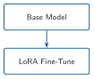
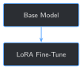
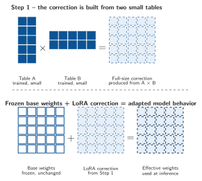
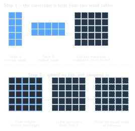
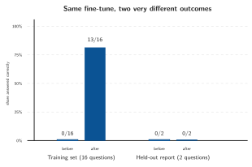
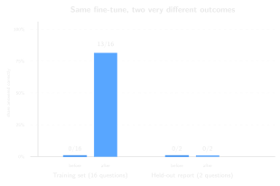

# Your First LoRA Fine-Tune {#sec-chapter-05}

::: {.content-visible when-format="html"}
::: {.pipeline-diagram}
{.diagram-light width="180"}
{.diagram-dark width="180"}
:::
:::

::: {.content-visible when-format="pdf"}
{width="180" fig-align="center"}
:::

::: {.chapter-status}
Progress `█████░░░░░░░░` **5 / 13** &nbsp;·&nbsp; **Estimated time:** 45-60 min &nbsp;·&nbsp; **Difficulty:** 🟠 Intermediate
:::

## Learning objectives

By the end of this chapter, you will be able to:

- Explain what a LoRA adapter is: a small set of extra weights trained
  on top of a frozen base model, not a rewrite of the model itself
- Fine-tune the base model on Chapter 2's 16 training examples with a
  plain PyTorch training loop — no framework magic hidden from you
- Rerun Chapter 3's training baseline against your fine-tuned model and
  measure a real, honest improvement
- Run, for the first time in this book, a held-out generalization check
  against Chapter 2's reserved report — and explain, from a real run,
  exactly *how* the fine-tuned model fails on it

## Operational Problem

Mike, the completions engineer, has watched this book build up evidence
for four chapters — the base model doesn't know this well's vocabulary,
doesn't know its specific reports, and its embeddings don't already
understand the shorthand. He's ready for the payoff, but wary of a
different failure: *"If we fine-tune this on sixteen examples, are we
teaching it our operation — or just teaching it to repeat sixteen
sentences back at us?"*

That's exactly the right question, and this chapter answers it two
ways, not one. It fine-tunes the base model on Chapter 2's 16 training
examples, then checks *both* whether it learned those exact examples
(training recall) *and* whether that learning transfers to a report it
never saw during training (generalization, using Chapter 2's reserved
`Drilling_037`). Chapter 3 already scored the base model `0/16` and
`0/2` on both. This chapter reruns that exact same harness against the
fine-tuned model — same questions, same scoring, same code — so the
comparison means something.

## Example: what the model actually trains on

Fine-tuning doesn't feed the model `instruction`/`input`/`output`
dictionaries directly — it feeds it the same chat-formatted text Chapter
1's `generate_reply` builds, except this time with the correct answer
appended as the assistant's turn:

::: {.callout-note title="What one training example looks like, chat-formatted"}
```
<|im_start|>system
You are Qwen, created by Alibaba Cloud. You are a helpful assistant.<|im_end|>
<|im_start|>user
What are the present operations reported on this well?
Well: FORGE 16A [78]-32 | Report #3 | Date: 2020-10-22<|im_end|>
<|im_start|>assistant
RIGGING UP WITH FRONTIER CREWS AND SUPERVISION AND JW JONES TRUCKING<|im_end|>
```
:::

Fine-tuning's whole job is to adjust the model so that, given the
`system` and `user` turns above, it becomes more likely to produce that
exact `assistant` turn — and nothing else changes about how the model
reads or generates text.

## Theory

::: {.callout-tip title="Engineering Translation: LoRA adapter"}
**LoRA** stands for **Low-Rank Adaptation**. Full fine-tuning would mean
updating all 1.5 billion of the base model's numbers. A **LoRA adapter**
is a small, separate set of numbers — a correction that gets trained
instead, while the original 1.5 billion stay frozen, untouched. LoRA
does not replace the base model's weights: at inference time the model
reads its usual weights *and* this correction, added on top, together —
as if the correction had been written directly into the model, without
the original numbers ever having changed.

"Low-rank" describes *how* that correction stays small: instead of
training one full table of correction numbers — one for every
connection in the layer — LoRA trains two much smaller tables. Multiply
those two tables together and you get a full-size correction, the same
shape as the layer it's correcting, without needing to store that
full-size version separately. How narrow those two tables are is the
adapter's **rank** (`r=8` in Step 2 below) — small by design. Fewer
numbers to store and train, at the cost of only approximating what a
full-size correction could do.
:::

::: {.content-visible when-format="html"}
::: {#fig-lora-lowrank .pipeline-diagram}
{.diagram-light width="480" fig-alt="Two-row diagram. Row 1: a tall Table A multiplied by a wide Table B produces a full-size correction grid. Row 2: frozen base weights plus that correction equal the effective weights used at inference."}

{.diagram-dark width="480"}

LoRA trains two small adapter tables. Their product creates a full-size correction, which is added to the frozen base weights. The original model is not rewritten.
:::
:::

::: {.content-visible when-format="pdf"}
{width="480" fig-align="center" #fig-lora-lowrank}
:::

::: {.callout-tip title="Engineering Translation: epoch and loss"}
One **epoch** is one full pass through the training data — all 16
examples, once. **Loss** is a single number measuring how wrong the
model's predictions were on that pass; it should generally fall as
training continues, the way a golf score should generally fall as you
improve. Chapter 11 covers proper evaluation metrics; loss here is just
a training-time signal, not a measure of correctness by itself.

Why more than one pass? Each pass only nudges the adapter's weights a
small amount toward the correct answers — like tightening a connection
in small, controlled turns instead of one big one, so it doesn't
overshoot. One epoch barely moves the model; this chapter runs 20 so
those small nudges can actually accumulate into something. The loss
numbers in Step 3 (`4.7173` on epoch 1, falling to `0.1201` by epoch 20)
are the visible trace of that accumulation.
:::

::: {.callout-tip title="Engineering Translation: training recall vs. generalization"}
**Training recall** is how well the model reproduces the exact examples
it trained on — an open-book test where it already saw the answer key.
**Generalization** is how well it does on something it never saw — the
real test of whether it learned anything transferable. A model can
score perfectly on the first and close to zero on the second; Chapter 3
built the held-out check specifically to catch that gap.
:::

## Why LoRA instead of updating the whole model?

A full fine-tune — updating all 1.5 billion parameters — is a
reasonable thing to *want*: more of the model can adapt, in principle.
It's a much harder thing to actually run: 1.5 billion trainable
parameters means 1.5 billion optimizer states to keep in memory, and a
saved checkpoint the same multi-gigabyte size as the base model itself,
for every fine-tune you ever run. LoRA trains a small fraction of that
— for this chapter's setup, about `0.14%` of the model's parameters —
and saves a corresponding adapter file measured in megabytes, not
gigabytes. You'll see the exact numbers for both in Step 2.

## Implementation

### Step 1: Format a training example and mask the prompt out of the loss

## What problem are we solving?

The model shouldn't be trained to predict the *question* — only the
*answer*. This step builds the full chat-formatted text for one
example, then marks every token before the assistant's turn as "don't
compute loss here."

## Inputs

- The tokenizer loaded in Chapter 1
- One training example (`instruction`, `input`, `output`)

## Expected Output

Two tensors of matching shape: the full token sequence, and a labels
tensor where the prompt portion is replaced with `-100` (PyTorch's
"ignore this position" marker for loss computation).

```{python}
#| eval: false
import torch

def build_training_ids(tokenizer, example: dict) -> tuple[torch.Tensor, torch.Tensor]:
    user_message = f"{example['instruction']}\n{example['input']}"
    prompt_only = tokenizer.apply_chat_template(
        [{"role": "user", "content": user_message}], tokenize=False, add_generation_prompt=True
    )
    full_text = tokenizer.apply_chat_template(
        [
            {"role": "user", "content": user_message},
            {"role": "assistant", "content": example["output"]},
        ],
        tokenize=False,
        add_generation_prompt=False,
    )
    prompt_ids = tokenizer(prompt_only, return_tensors="pt", add_special_tokens=False)["input_ids"]
    full_ids = tokenizer(full_text, return_tensors="pt", add_special_tokens=False)["input_ids"]
    labels = full_ids.clone()
    labels[:, : prompt_ids.shape[1]] = -100
    return full_ids, labels


input_ids, labels = build_training_ids(tokenizer, examples[0])
print(f"Full sequence: {input_ids.shape[1]} tokens, {int((labels[0] == -100).sum())} masked (prompt)")
```

Running this exact code prints:

```
Full sequence: 92 tokens, 71 masked (prompt)
```

## What just happened?

92 tokens make up the full chat-formatted example; the first 71 —
everything through `<|im_start|>assistant` — are masked out of the
loss, leaving only the 21 tokens of the actual answer for the model to
be trained on. This is the same masking idea Chapter 3's baseline used
in reverse: there, the answer was hidden from the model at inference
time; here, everything *except* the answer is hidden from the loss at
training time.

## Production Reality

Real fine-tuning pipelines batch many examples together with padding,
not one at a time — Chapter 7 covers formatting and chunking training
data at scale. This chapter keeps it to one example per step
deliberately, so every line of the training loop in Step 3 stays easy
to read and reason about.

### Step 2: Wrap the base model with a LoRA adapter

## What problem are we solving?

Turn the frozen base model into one with a small, trainable adapter
attached — everything else about the model stays exactly as Chapter 1
loaded it.

## Inputs

- The loaded `model` from Chapter 1
- A `LoraConfig` naming which layers get an adapter

## Expected Output

A wrapped model, plus a printed count of how many parameters are
actually trainable.

```{python}
#| eval: false
from peft import LoraConfig, TaskType, get_peft_model

LORA_CONFIG = LoraConfig(
    r=8,
    lora_alpha=16,
    lora_dropout=0.05,
    target_modules=["q_proj", "k_proj", "v_proj", "o_proj"],
    task_type=TaskType.CAUSAL_LM,
)

lora_model = get_peft_model(model, LORA_CONFIG)
lora_model.print_trainable_parameters()
```

Running this exact code prints:

```
trainable params: 2,179,072 || all params: 1,545,893,376 || trainable%: 0.1410
```

## What just happened?

`target_modules` names the specific weight matrices inside each
attention layer that get a LoRA adapter attached —
`q_proj`/`k_proj`/`v_proj`/`o_proj` are the query, key, value, and
output projections every attention layer has. `r=8` sets the adapter's
size (its "rank" — a small number by design). The result: `2,179,072`
trainable parameters out of `1,545,893,376` total — `0.141%`. Everything
else in the model is frozen and will never change during this chapter's
training.

## Production Reality

`target_modules` and `r` are real hyperparameters a production
fine-tuning pipeline would sweep, not fix once — different layers
targeted, or a larger rank, trade off adapter size against how much the
model can actually learn. This chapter's challenge exercise tries a
smaller `target_modules` list and shows the real effect on results.

One more deliberate choice, worth naming directly: this chapter's
training loop runs entirely on CPU, the same as Chapter 1's default. A
GPU or Apple Silicon (MPS) machine can fine-tune this faster, but this
book keeps every reader's numbers reproducible against the same
baseline rather than depending on whichever accelerator a given machine
happens to have. If you have a GPU and want to try it, `model.to("cuda")`
(or `"mps"`) before Step 2, and moving `input_ids`/`labels` in
`build_training_ids` to the same device, is the change — the rest of
this chapter's logic doesn't depend on which device it runs on.

### Step 3: Fine-tune, then measure recall *and* generalization

## What problem are we solving?

Actually train the adapter on Chapter 2's 16 examples, then answer
Mike's question with numbers: did the model learn these exact examples,
and separately, did anything transfer to a report it never saw?

## Inputs

- The wrapped `lora_model` from Step 2
- Chapter 2's 16 training examples, and its held-out report's 2 examples
- Chapter 3's `run_baseline` harness, reused unchanged

## Expected Output

A loss that falls across 20 epochs, then two before/after score
comparisons.

```{python}
#| eval: false
def fine_tune(lora_model, tokenizer, examples: list[dict], num_epochs: int = 20) -> None:
    lora_model.train()
    optimizer = torch.optim.AdamW(lora_model.parameters(), lr=2e-4)
    for epoch in range(num_epochs):
        epoch_loss = 0.0
        for example in examples:
            input_ids, labels = build_training_ids(tokenizer, example)
            loss = lora_model(input_ids=input_ids, labels=labels).loss
            loss.backward()
            optimizer.step()
            optimizer.zero_grad()
            epoch_loss += loss.item()
        if (epoch + 1) % 5 == 0 or epoch == 0:
            print(f"  epoch {epoch + 1}/{num_epochs}: avg loss {epoch_loss / len(examples):.4f}")
    lora_model.eval()


def score(results: list[dict]) -> tuple[int, int]:
    return sum(r["matched_expected"] for r in results), len(results)


print("Before fine-tuning:")
print(f"  Training baseline:  {score(run_baseline(model, tokenizer, examples))}")
print(f"  Held-out baseline:  {score(run_baseline(model, tokenizer, held_out_examples))}")

fine_tune(lora_model, tokenizer, examples)

print("After fine-tuning:")
print(f"  Training recall:         {score(run_baseline(lora_model, tokenizer, examples))}")
print(f"  Held-out generalization: {score(run_baseline(lora_model, tokenizer, held_out_examples))}")
```

Running this exact code prints:

```
Before fine-tuning:
  Training baseline:  0/16
  Held-out baseline:  0/2

  epoch 1/20: avg loss 4.7173
  epoch 5/20: avg loss 1.2688
  epoch 10/20: avg loss 0.3360
  epoch 15/20: avg loss 0.1850
  epoch 20/20: avg loss 0.1201

After fine-tuning:
  Training recall:         13/16
  Held-out generalization: 0/2
```

## What just happened?

::: {.content-visible when-format="html"}
::: {#fig-recall-gap .pipeline-diagram}
{.diagram-light width="440" fig-alt="Grouped bar chart. Training set questions rise from an exact-match score of 0 of 16 before fine-tuning to 13 of 16 after. Held-out report questions stay flat at 0 of 2, both before and after fine-tuning."}

{.diagram-dark width="440"}

The same fine-tune produces two very different outcomes — training recall jumps from 0/16 to 13/16, while held-out generalization stays flat at 0/2.
:::
:::

::: {.content-visible when-format="pdf"}
{width="440" fig-align="center" #fig-recall-gap}
:::

Be precise about what this run actually shows: fine-tuning **changed**
the model, not simply "improved" it. Training recall jumped from
`0/16` to `13/16` — real, measurable learning, not a training artifact.
Held-out generalization stayed at `0/2`, exactly where it started.
Sixteen examples was enough for this small model to memorize sixteen
answers; it was not enough to teach it anything that transfers to a
report it never saw. That's not a bug — it's the honest, predictable
result of a training set this size, and precisely why Chapter 2
reserved that report in the first place.

Of the 18 total questions across both checks (16 training + 2
held-out), 13 training answers came back right, which leaves 5 wrong —
3 from the training set, 2 from the held-out report. Looking at
*which* answers came back wrong is more revealing than the scores
alone. Every one of those 5 is a real answer from a *different* report,
borrowed wholesale — never an invented guess:

| Question | Expected | Model said | Actually belongs to |
|---|---|---|---|
| Report #3, activity planned | `CONTINUE RIGGING UP...` | `CONTINUE BUILDING CURVE TO 65°` | Report #36 |
| Report #36, present ops | `BUILDING CURVE SECTION...` | `PIPE FREE, TRIP OUT OF HOLE...` | Report #38 |
| Report #48, present ops | `LAYING DOWN COOLING BHA 31` | `CIRCULATE FOR TEMPERATURE` | Report #49 |
| Report #37 (held-out), present ops | `RIG UP SCHLUMBERGER...` | `PIPE FREE, TRIP OUT OF HOLE...` | Report #38 |
| Report #37 (held-out), activity planned | `RUN UBI LOG...` | `CONTINUE BUILDING CURVE TO 65°` | Report #36 |

The fine-tuned model didn't get vaguer or more hesitant on questions it
couldn't answer — the way the honest, ungrounded base model did back in
Chapter 3. It got *more* confident, and confidently wrong, reaching for
the nearest memorized answer instead. That's a materially worse failure
mode for a production system than "I don't know," and it's the direct
consequence of training on too little, too narrow a dataset.

The principle behind all three results together: a tiny fine-tune can
teach a model to prefer the *shape* of your archive — its vocabulary,
its formatting, the fact that answers are short, well-specific field
values — without teaching it reliable judgment over reports it hasn't
seen. Shape is real and worth having. It is not the same thing as
judgment, and this chapter's numbers are exactly what the difference
looks like.

## Practical exercise

🟢 **Beginner**

**Try it yourself:** run
`python code/chapter_05/first_lora_finetune.py` from inside `book/` (it
takes about 5 minutes on CPU) and watch the loss fall across the 20
epochs.

**You'll know it worked when:** you see `Training recall: 13/16` and
`Held-out generalization: 0/2` — and you can explain, in one sentence,
why those two numbers moving so differently is exactly the point.

## Field notes

::: {.callout-warning title="Field notes: wrong, but never randomly wrong"}
**Query:** every one of this chapter's 5 wrong answers (3 training
misses, both held-out misses), collected as a set.

**Result:** all 5 are word-for-word answers that belong to *other* real
reports in the training set — `"PIPE FREE, TRIP OUT OF HOLE FOR BHA
INSPECTION"` (really report #38's answer) shows up twice, once for
report #36's question and once for the held-out report #37's question.

**Why:** with only 16 examples and 20 epochs of repetition, the model
learned a shortcut: *produce something that looks like a report answer
from this well*, without reliably learning *which* answer belongs to
*which specific report*. Its confusion isn't noise — it consistently
reaches for one of a small set of memorized, real sentences.

**Lesson:** a fine-tuned model's mistakes are diagnostic. Random
gibberish would suggest something broken in training; consistently
borrowed real answers point specifically at "not enough distinct
training signal to tell reports apart" — exactly what Chapter 6's data
quality gate and Chapter 7's richer training examples exist to fix.
:::

## Challenge exercise

🟠 **Intermediate**

**Challenge:** Step 2 targets all four attention projections
(`q_proj`, `k_proj`, `v_proj`, `o_proj`). A more common minimal LoRA
setup only targets `q_proj` and `v_proj`. Rerun fine-tuning with that
lighter config and see whether training recall changes. A reference
solution is at `code/chapter_05/challenge/challenge.py` — on a real
run, it trains `1,089,536` parameters (`0.0705%`, about half of this
chapter's setup) and scores `10/16` training recall, down from `13/16`.

## Key takeaways

- A LoRA adapter trains a small fraction of a model's parameters (here,
  `0.141%`) while the rest stay frozen — a real fine-tune, not a
  simulation of one, at a fraction of full fine-tuning's cost.
- Training recall and generalization are different claims that need
  different evidence. This chapter's model aced the first (`0/16` →
  `13/16`) and made zero progress on the second (`0/2` → `0/2`), on the
  exact same fine-tune.
- A fine-tuned model's wrong answers are worth reading, not just
  counting. Every miss here was a real, memorized answer from a
  *different* report — evidence of a specific, fixable data problem,
  not random model failure.
- Sixteen examples is enough to prove fine-tuning works mechanically.
  It is deliberately not enough to teach real operational judgment —
  that's what Part II's larger, higher-quality training sets are for.

## Repository files

| File | Purpose |
|---|---|
| `code/chapter_05/first_lora_finetune.py` | Fine-tunes a LoRA adapter on Chapter 2's training examples and reports training/held-out scores |
| `code/chapter_05/challenge/challenge.py` | Reference solution: a lighter `q_proj`/`v_proj`-only LoRA config |
| `checkpoints/chapter_05_lora/` | Generated adapter (not committed — regenerate by running the script) |
| `notebooks/chapter_05_explore.ipynb` | Interactive companion notebook |

::: {.callout-caution title="CHECKPOINT — Chapter 5"}
- [x] Fine-tuned a LoRA adapter on real training data with a plain
      PyTorch training loop
- [x] Measured a real improvement in training recall (`0/16` → `13/16`)
- [x] Ran a held-out generalization check for the first time, and
      found it did *not* improve (`0/2` → `0/2`)
- [x] Traced every wrong answer back to a specific, explainable cause
      rather than shrugging at "the model got it wrong"
:::

::: {.callout-tip .built-box title="✓ WHAT YOU BUILT"}
**`first_lora_finetune.py`** — trains a LoRA adapter on Chapter 2's 16
examples and saves it to `checkpoints/chapter_05_lora/` (about 8 MB,
next to the base model's ~2.9 GB of weights on disk). Reruns Chapter
3's exact baseline harness before and after, against both the training
set and the held-out report, so the comparison is honest and
reproducible.
:::

## What can you do now that you couldn't do before?

You can fine-tune a real language model on your own data and produce
real, measurable evidence of what it learned — and, just as
importantly, honest evidence of what it didn't, instead of assuming a
falling loss number means the job is done.

## Suggested next step

**Coming up in Chapter 6:** this chapter's fine-tune worked exactly as
a 16-example, single-well dataset should: real memorization, no
generalization. The obvious next move is more data — but simply
pointing this same pipeline at hundreds of reports, without checking
them first, would just memorize more inconsistencies faster. Chapter 6
builds a data quality gate: the checks a training set needs to pass
*before* it's trusted at the scale Part II is about to introduce.
