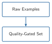
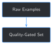

# A Data Quality Gate for Training Data {#sec-chapter-06}

::: {.content-visible when-format="html"}
::: {.pipeline-diagram}
{.diagram-light width="180"}
{.diagram-dark width="180"}
:::
:::

::: {.content-visible when-format="pdf"}
{width="180" fig-align="center"}
:::

::: {.chapter-status}
Progress `██████░░░░░░░` **6 / 13** &nbsp;·&nbsp; **Estimated time:** 30-40 min &nbsp;·&nbsp; **Difficulty:** 🟢 Beginner
:::

## Learning objectives

By the end of this chapter, you will be able to:

- Run Chapter 2's field extractor across the full 76-report archive
  instead of the 10-report sample, and read a real pass/fail rate at
  that scale
- Explain the difference between a hard failure (a report's fields
  can't be extracted at all — must be excluded) and a soft flag (fields
  extracted fine, but something about them deserves a human look before
  training)
- Detect field values duplicated across different reports, and
  distinguish likely-benign duplicates from ones that need review
- Explain why "extraction succeeded" and "this data is trustworthy to
  train on" are two different claims

## Operational Problem

Oumy, who built Chapter 2's small proof of concept from just 10
reports, asks the obvious next question now that Part II is about
scaling that same pipeline to the full archive: *"If we just point this
extractor at all 76 reports, how do we know we're not scaling up hidden
problems right along with the data?"*

Chapter 2's extractor either finds both fields on a report or it
doesn't — a binary, visible failure Chapter 2 already handles by
skipping the report. What it can't tell you is whether two *different*
reports somehow ended up with the exact same field value, which is a
much quieter, easier-to-miss kind of problem. This chapter builds a
gate that checks for both, run for real against all 76 reports.

## Example: the same answer, two different reports

Chapter 2 and Chapter 3 both used report `#49` — the day `activity_planned`
read `"FISHING OPERATIONS"` — as a running example. Run this chapter's
extractor across the *full* archive, not just the 10-report sample, and
a report three weeks later turns up something worth a second look:

::: {.callout-note title="Two reports, one identical field value"}
```
Report #49 (2020-12-07), present_operations: "CIRCULATE FOR TEMPERATURE"
Report #70 (2020-12-28), present_operations: "CIRCULATE FOR TEMPERATURE"
```
:::

Word-for-word identical, 21 days apart. That could be a completely
routine, independently-occurring operation — or a sign something got
copy-pasted or misfiled. Chapter 2's extractor has no way to even
notice this happened; it only looks at one report at a time.

## Theory

::: {.callout-tip title="Engineering Translation: data quality gate"}
A **quality gate** is a checkpoint data has to pass through before it's
trusted for the next stage — like a pre-shift equipment check. It
doesn't fix anything by itself; it stops something visibly wrong from
silently making it further down the line, and it flags anything
borderline for a human to actually look at.
:::

::: {.callout-tip title="Engineering Translation: hard fail vs. soft flag"}
A **hard fail** is unambiguous enough to act on automatically — Chapter
2's "couldn't extract required fields" is one, so that report gets
excluded, no judgment call needed. A **soft flag** is something
worth a human's attention that isn't automatically wrong — like this
chapter's duplicate values. Treating every soft flag as a hard fail
would silently delete real, correct data; treating every hard fail as
just a suggestion would let broken data through.
:::

## Why "just remove duplicates" falls short

The tempting, simpler rule: any field value that appears on more than
one report is suspicious, so drop every report involved. Running that
rule on this archive would delete report `#6` (`"RIGGING UP WITH
FRONTIER DRILLING"`, identical to `#5`), report `#33`
(`"DRILLING 8 3/4" PRODUCTION HOLE WITH BHA #14"`, identical to `#32`),
and report `#35` (`"CORING"`, identical to `#34`) — three reports whose
"duplicate" value is just the same operation genuinely continuing into
the next day, which is completely normal in a real drilling program.
This chapter's gate checks *which* reports share a value, not just
*whether* they do: report numbers one apart are almost certainly a
continued operation; any bigger gap is what actually deserves review.

## Implementation

### Step 1: Extract fields from all 76 reports and check completeness

## What problem are we solving?

Confirm Chapter 2's extractor's real pass rate at archive scale, not
just on the curated 10-report sample where every quirk was already
known.

## Inputs

- Every PDF in `datasets/full_training_set/`
- `extract_text` and `extract_fields` from Chapter 2, reused unchanged

## Expected Output

A status (`ok` or `unrecognized_format`) attached to every report.

```{python}
#| eval: false
import sys
from pathlib import Path

BOOK_ROOT = Path(__file__).resolve().parents[2]
sys.path.insert(0, str(BOOK_ROOT / "code" / "chapter_02"))

from build_training_examples import extract_fields, extract_text

FULL_SET_DIR = BOOK_ROOT / "datasets" / "full_training_set"


def build_archive_records(full_dir: Path = FULL_SET_DIR) -> list[dict]:
    records = []
    for pdf_path in sorted(full_dir.glob("*.pdf")):
        text = extract_text(pdf_path)
        fields = extract_fields(text)
        status = "ok" if fields["present_operations"] and fields["activity_planned"] else "unrecognized_format"

        record = dict(fields)
        record["file"] = pdf_path.name
        record["status"] = status
        record["rpt_num"] = int(fields["rpt_num"]) if fields["rpt_num"] else None
        records.append(record)
    return records


records = build_archive_records()
passed = [r for r in records if r["status"] == "ok"]
failed = [r for r in records if r["status"] != "ok"]
print(f"Extraction: {len(passed)}/{len(records)} reports passed")
print(f"Failed: {[r['file'] for r in failed]}")
```

Running this exact code prints:

```
Extraction: 75/76 reports passed
Failed: ['FORGE-16A-78-32_Completion_003_2021-01-06.pdf']
```

## What just happened?

75 of 76 reports — every drilling report, at full archive scale, not
just the 10-report sample — extracted cleanly with Chapter 2's exact
same regex patterns. The one failure is the same completion report
Chapter 2 already knew about, using different field labels entirely.
That consistency is itself useful information: this archive's drilling
reports really do share one fixed layout, at scale, not just by
coincidence in the small sample.

## Production Reality

This archive comes from a single well, a single operator's report
template, over a few months. A multi-well, multi-operator archive would
show a much lower pass rate here, with several different field layouts
needing their own extractor (Chapter 2's challenge exercise handles
exactly one such case — the completion report). A production quality
gate would need a library of layout patterns, not one regex per field.

### Step 2: Find field values duplicated across different reports

## What problem are we solving?

A report passing extraction doesn't mean its *value* is trustworthy on
its own — the same exact text on two different reports is invisible to
a per-report check and needs comparing across the whole archive at once.

## Inputs

- The `records` list from Step 1

## Expected Output

Every field value that appears on more than one report, with the report
numbers involved.

```{python}
#| eval: false
from collections import defaultdict


def find_duplicate_values(records: list[dict], field_name: str) -> dict[str, list[int]]:
    by_value = defaultdict(list)
    for record in records:
        if record["status"] == "ok" and record[field_name]:
            by_value[record[field_name]].append(record["rpt_num"])
    return {value: sorted(nums) for value, nums in by_value.items() if len(nums) > 1}


for field_name in ("present_operations", "activity_planned"):
    print(f"Duplicate {field_name} values:")
    for value, nums in find_duplicate_values(records, field_name).items():
        print(f"  reports {nums}: {value!r}")
```

Running this exact code prints:

```
Duplicate present_operations values:
  reports [5, 6]: 'RIGGING UP WITH FRONTIER DRILLING'
  reports [32, 33]: 'DRILLING 8 3/4" PRODUCTION HOLE WITH BHA #14'
  reports [34, 35]: 'CORING'
  reports [49, 70]: 'CIRCULATE FOR TEMPERATURE'
Duplicate activity_planned values:
  reports [32, 33]: 'DRILL AHEAD WITH BHA #14'
  reports [47, 59]: 'DRILL AHEAD'
```

## What just happened?

Six duplicate groups turned up across both fields — four where the
report numbers are exactly one apart (an operation continuing into the
next day), and two where they aren't: `#49`/`#70` (21 days apart) and
`#47`/`#59` (12 days apart). Nothing here is auto-corrected or removed
yet — this step's only job is to surface every duplicate so Step 3 can
decide which ones actually need a human's attention.

## Production Reality

This only catches *exact* text matches. A near-duplicate — the same
operation described with slightly different wording or a typo fixed —
would slip through entirely. Catching that reliably needs a fuzzy or
embedding-based similarity check (Chapter 4's tools are directly
applicable here), which is real, valuable future work this simple
version deliberately leaves out.

### Step 3: Classify duplicates and produce the final gate report

## What problem are we solving?

Turn the raw duplicate list into the actual verdict this chapter opened
with: which duplicates are almost certainly fine, and which ones need a
person to look before this data gets trained on.

## Inputs

- The duplicate groups from Step 2

## Expected Output

Each duplicate group labeled `consecutive` or `needs_review`, plus a
final summary.

```{python}
#| eval: false
def classify_duplicate(rpt_nums: list[int]) -> str:
    gaps = [b - a for a, b in zip(rpt_nums, rpt_nums[1:])]
    return "consecutive" if all(gap == 1 for gap in gaps) else "needs_review"


def run_quality_gate(full_dir: Path = FULL_SET_DIR) -> dict:
    records = build_archive_records(full_dir)
    ok_records = [r for r in records if r["status"] == "ok"]
    failed_records = [r for r in records if r["status"] != "ok"]

    duplicates = {}
    for field_name in ("present_operations", "activity_planned"):
        for value, nums in find_duplicate_values(records, field_name).items():
            duplicates[(field_name, value)] = classify_duplicate(nums), nums

    return {"total": len(records), "passed": len(ok_records), "failed": failed_records, "duplicates": duplicates}


report = run_quality_gate()
needs_review = {k: v for k, v in report["duplicates"].items() if v[0] == "needs_review"}
consecutive = {k: v for k, v in report["duplicates"].items() if v[0] == "consecutive"}
print(f"Extraction: {report['passed']}/{report['total']} passed")
print(f"Duplicates: {len(consecutive)} consecutive (no action needed), {len(needs_review)} need review")
for (field_name, value), (_, nums) in needs_review.items():
    print(f"  {field_name}, reports {nums}: {value!r}")
```

Running this exact code prints:

```
Extraction: 75/76 passed
Duplicates: 4 consecutive (no action needed), 2 need review
  present_operations, reports [49, 70]: 'CIRCULATE FOR TEMPERATURE'
  activity_planned, reports [47, 59]: 'DRILL AHEAD'
```

## What just happened?

The gate's final verdict on this archive: 1 hard fail (excluded), 4
duplicate groups explained away as normal continued operations, and 2
flagged for a human to actually check before Chapter 7 formats this
archive into training examples at scale. Neither flagged case is
automatically rejected — `"DRILL AHEAD"` in particular is common enough
phrasing that it may well be an honest coincidence, not an error. The
gate's job is to surface it, not to guess.

## Practical exercise

🟢 **Beginner**

**Try it yourself:** run
`python code/chapter_06/data_quality_gate.py` from inside `book/`, then
open reports `#49` and `#70` from `datasets/full_training_set/` and
compare their `PRESENT OPERATIONS:` lines by eye.

**You'll know it worked when:** the script prints `75/76 passed`, `4
consecutive`, `2 need review`, and you can say in one sentence whether
you think `#49`/`#70`'s match looks like a real coincidence or a
data-entry duplicate.

## Field notes

::: {.callout-warning title="Field notes: the fishing report's echo, three weeks later"}
**Query:** every duplicate `present_operations` value across the full
76-report archive.

**Result:** report `#49` — 2020-12-07, the same day `activity_planned`
read `"FISHING OPERATIONS"` in Chapter 2 and Chapter 3's running example
— has `present_operations` `"CIRCULATE FOR TEMPERATURE"`. So does report
`#70`, dated 2020-12-28.

**Why:** the archive shows report `#49` sitting inside the
packers-fail-to-fishing sequence (`#48`–`#50`) already discussed in
earlier chapters, while `#70` is three weeks later with no narrative
connection to it at all — a different point in the drilling program
entirely. Circulating to stabilize wellbore temperature is a genuinely
common, unremarkable operation; there's no reason it couldn't happen
twice, unrelated, three weeks apart.

**Lesson:** a duplicate flag is a question, not a verdict. This one
most likely resolves to "yes, coincidence, both real" on inspection —
but the gate's job is only to make sure that judgment call gets made by
a person instead of silently vanishing into 75 reports' worth of
training data.
:::

## Challenge exercise

🟠 **Intermediate**

**Challenge:** add a third check: report dates should strictly increase
alongside report numbers. A scrambled or misfiled archive (two reports
swapped, one from the wrong well mixed in) would show up here as an
out-of-order or repeated date. A reference solution is at
`code/chapter_06/challenge/challenge.py` — on a real run against this
book's archive, it reports `75 reports checked, 0 issues`: every date
in this archive is exactly where it should be.

## Key takeaways

- A quality gate answers two different questions: which reports fail
  outright (hard fail, exclude automatically), and which ones are fine
  but worth a second look (soft flag, surface for a human).
- A naive "remove all duplicates" rule would have deleted three
  perfectly legitimate continued-operation reports in this archive. The
  *pattern* of the duplicate (consecutive vs. not) matters as much as
  the duplicate itself.
- "Extraction succeeded" and "this data is trustworthy to train on" are
  different claims — this chapter's gate is what actually checks the
  second one, at the same 76-report scale Chapter 7 onward builds on.
- Even a real, verified archive like this one — genuinely clean on
  chronological order, with 0 issues found — is worth checking
  explicitly rather than assumed clean by default.

## Repository files

| File | Purpose |
|---|---|
| `code/chapter_06/data_quality_gate.py` | Runs extraction and duplicate-value checks across the full 76-report archive |
| `code/chapter_06/challenge/challenge.py` | Reference solution: a chronological-order check |
| `notebooks/chapter_06_explore.ipynb` | Interactive companion notebook |

::: {.callout-caution title="CHECKPOINT — Chapter 6"}
- [x] Ran Chapter 2's extractor across the full 76-report archive and
      measured a real pass rate at scale
- [x] Found every field value duplicated across different reports, and
      distinguished likely-benign duplicates from ones needing review
- [x] Produced a final gate report separating hard fails from soft
      flags, instead of treating every anomaly the same way
:::

::: {.callout-tip .built-box title="✓ WHAT YOU BUILT"}
**`data_quality_gate.py`** — checks the full 76-report archive for
extraction failures and cross-report duplicate values, and separates
what needs automatic exclusion from what needs a human decision.
Chapter 7 builds its formatted, chunked training set on top of the 75
reports this gate actually passed.
:::

## What can you do now that you couldn't do before?

You can run a real data quality check across an entire report archive
before training on it, and you can tell the difference between a
problem worth automatically excluding and one worth a human's
judgment — instead of either training on everything blindly or manually
skimming 76 reports by eye.

## Suggested next step

**Coming up in Chapter 7:** this chapter decided *which* of the 76
reports are trustworthy enough to use. It didn't turn any of them into
training examples — Chapter 2's approach, one regex extraction per
report, worked fine for 10 reports typed out one at a time, but Chapter
7 needs to format and chunk 75 reports' worth of training data at scale,
without re-doing that work by hand.
