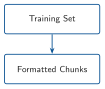
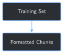

# Formatting and Chunking a Training Set at Scale {#sec-chapter-07}

::: {.content-visible when-format="html"}
::: {.pipeline-diagram}
{.diagram-light width="180"}
{.diagram-dark width="180"}
:::
:::

::: {.content-visible when-format="pdf"}
{width="180" fig-align="center"}
:::

::: {.chapter-status}
Progress `███████░░░░░░` **7 / 13** &nbsp;·&nbsp; **Estimated time:** 30-40 min &nbsp;·&nbsp; **Difficulty:** 🟠 Intermediate
:::

## Learning objectives

By the end of this chapter, you will be able to:

- Extract a report's full operational log — not just Chapter 2's two
  summary fields — into one structured entry per logged time window
- Turn each entry into its own training example, producing many more,
  richer examples per report than Chapter 2's fixed two
- Split ("chunk") any entry too long for one training example into
  several, without truncating or corrupting a single word
- Detect and filter a real PDF-extraction artifact that would otherwise
  put corrupted text straight into training data
- Build a full training set from every quality-gated, non-held-out
  report at once, instead of running Chapter 2's script by hand 74 times

## Operational Problem

Sean, the production engineer, looks at Chapter 2's output and asks the
obvious question: *"Two lines per report? These reports have a whole
shift-by-shift log in them. Are we just throwing the rest away?"*

He's right to ask. Every report in this archive has a `TIME BREAKDOWN`
section underneath the two fields Chapter 2 used — a real, multi-entry
operational log, one row per logged time window, each with its own
narrative. Chapter 2's regex never looked at it. This chapter does,
across all 74 reports Chapter 6's gate and Chapter 2's held-out
reservation leave available for training.

## Example: one report, ten training examples instead of two

Report `Drilling_038` — the stuck-pipe day from Chapter 1 — has a `TIME
BREAKDOWN` section with 10 separate logged time windows. One of them is
the exact moment Chapter 1 quoted:

::: {.callout-note title="One TIME BREAKDOWN entry, turned into a training example"}
```json
{
  "instruction": "What happened on this well during this time window?",
  "input": "Well: FORGE 16A [78]-32 | Report #38 | Date: 2020-11-26 | Time: 23:30-04:00",
  "output": "Drill From 6,360' to 6,507', (147') Total , 32.6' feet per hour. WOB 20 TO 35k, Rotary 50, Torque 6,500, SPP 3200 -3400 GPM 560, DIFF 200 - 300psi Production Drilling Trips During the slide lost tool face and became assembly became stuck"
}
```
:::

Chapter 2 turned this same report into 2 examples. This chapter turns
it into 10 — one per logged time window, each with real narrative
detail Chapter 2 never touched.

## Theory

::: {.callout-tip title="Engineering Translation: chunking"}
**Chunking** means splitting one long piece of text into several
smaller pieces that each fit inside one training example, instead of
one oversized example or a silently truncated one. Done well, it's
invisible — like cutting a long pipe run into standard joint lengths;
the pipe still does its job, it just now comes in handled pieces.
:::

::: {.callout-tip title="Engineering Translation: word-boundary splitting"}
Splitting text at a **word boundary** means never cutting in the middle
of a word — only at the spaces between them. A naive character-count
split (`text[:300]`) doesn't know or care where words end; a
word-boundary split builds each chunk up word by word, stopping just
before the next word would push it over the limit.
:::

## Why not just use the whole report as one training example?

The simplest alternative to timeline-by-timeline chunking: skip parsing
entirely, and use each report's full raw text as a single training
example. It's tempting, and it's worse for two concrete reasons. First,
most of a report's raw text is tabular data — casing, mud properties,
pump specs, BHA components — that `pdfplumber` flattens into dense,
confusing lines with no narrative value at all (Step 1's exact code
already skips past all of it). Second, and more importantly: one
example per report means the model only ever sees 74 examples total,
each one an undifferentiated wall of text mixing several unrelated time
windows together. This chapter's approach — one example per logged time
window — produces `669` focused, individually meaningful examples from
those same 74 reports, each one answering a specific question about a
specific window of time.

## Implementation

### Step 1: Parse the TIME BREAKDOWN section into time-window entries

## What problem are we solving?

Turn each report's `TIME BREAKDOWN` table — several rows of `FROM TO
HRS ... OPERATIONS`, with narrative text that can wrap across multiple
lines — into a clean list of `(from_time, to_time, text)` entries.

## Inputs

- One report's full extracted text (from Chapter 2's `extract_text`)

## Expected Output

A list of dictionaries, one per logged time window.

```{python}
#| eval: false
import re

TIMELINE_SECTION_PATTERN = re.compile(
    r"TIME BREAKDOWN\n(?:FROM TO HRS PHASE CODE NPT OPERATIONS\n)?(.*?)\nTOTAL HRS", re.DOTALL
)
TIMELINE_ENTRY_PATTERN = re.compile(r"^(\d{2}:\d{2})\s+(\d{2}:\d{2})\s+([\d.]+)\s+(.*)", re.MULTILINE)


def parse_timeline_entries(text: str) -> list[dict]:
    section = TIMELINE_SECTION_PATTERN.search(text)
    if not section:
        return []
    body = section.group(1)
    matches = list(TIMELINE_ENTRY_PATTERN.finditer(body))

    entries = []
    for i, match in enumerate(matches):
        start = match.end()
        end = matches[i + 1].start() if i + 1 < len(matches) else len(body)
        raw_text = f"{match.group(4)} {body[start:end].strip()}".strip()
        entries.append({"from_time": match.group(1), "to_time": match.group(2), "text": re.sub(r"\s+", " ", raw_text)})
    return entries


entries = parse_timeline_entries(text)
print(f"{len(entries)} timeline entries found")
print(entries[-2])
```

Running this exact code against `Drilling_038` prints:

```
10 timeline entries found
{'from_time': '23:30', 'to_time': '04:00', 'text': "Drill From 6,360' to 6,507', (147') Total , 32.6' feet per hour. WOB 20 TO 35k, Rotary 50, Torque 6,500, SPP 3200 -3400 GPM 560, DIFF 200 - 300psi Production Drilling Trips During the slide lost tool face and became assembly became stuck"}
```

## What just happened?

The regex finds every line that starts with two times and an hour
count, then treats everything up to the *next* such line as that
entry's narrative — which is what lets a real, multi-line entry (like
this one) get captured whole, instead of stopping at the first line
break. `PHASE`/`CODE` labels (`"Production Drilling Trips"` above) stay
mixed into the narrative text rather than parsed into their own
fields — `pdfplumber`'s column-flattening makes them genuinely
ambiguous to separate reliably, and this chapter doesn't pretend
otherwise.

## Production Reality

This regex assumes the same fixed `TIME BREAKDOWN` layout every report
in this archive happens to share — the same kind of assumption Chapter
2 made about its two fields, and the same kind of assumption that
breaks the moment a different operator's report template shows up.

### Step 2: Split long entries into word-boundary chunks

## What problem are we solving?

Some entries are short (`"Intermediate Drilling Lubricate Rig Rig
Service"`); others run past 900 characters. Every training example in
this book stays a manageable size, so anything over the limit needs to
become more than one example — without cutting through the middle of a
word.

## Inputs

- One entry's `text`, from Step 1
- A maximum length, in characters

## Expected Output

A list of one or more chunks, each within the limit, that concatenate
back into the original text exactly.

```{python}
#| eval: false
def chunk_text(text: str, max_chars: int = 300) -> list[str]:
    words = text.split()
    chunks, current, current_len = [], [], 0
    for word in words:
        added_len = len(word) + (1 if current else 0)
        if current and current_len + added_len > max_chars:
            chunks.append(" ".join(current))
            current, current_len = [], 0
            added_len = len(word)
        current.append(word)
        current_len += added_len
    if current:
        chunks.append(" ".join(current))
    return chunks


long_entry = entries[-2]["text"]  # the stuck-pipe entry, 237 characters -- under the limit here
print(chunk_text(long_entry, max_chars=100))
```

Running this exact code prints:

```
["Drill From 6,360' to 6,507', (147') Total , 32.6' feet per hour. WOB 20 TO 35k, Rotary 50, Torque",
 '6,500, SPP 3200 -3400 GPM 560, DIFF 200 - 300psi Production Drilling Trips During the slide lost',
 'tool face and became assembly became stuck']
```

## What just happened?

`chunk_text` builds each piece up one word at a time, and only closes a
chunk off *before* adding a word would push it past `max_chars` — never
mid-word. At this chapter's real setting, `max_chars=300`, this
particular entry (237 characters) doesn't need splitting at all; forced
down to `100` here just to show the mechanism working on real text.

## Production Reality

Splitting at word boundaries keeps words intact, but it can still split
a sentence — or a single measurement like `"WOB 20 TO 35k"` — across two
chunks, same as it did above. A more careful chunker would prefer to
break at sentence or clause boundaries first, only falling back to a
mid-sentence word split when a single sentence itself exceeds the
limit. This chapter's simpler version is honest about that trade-off
rather than hiding it.

### Step 3: Build the full training set, respecting Chapter 6 and Chapter 2

## What problem are we solving?

Combine Steps 1 and 2 across every report — but only the reports
Chapter 6's gate actually passed, and never Chapter 2's held-out
report — and catch one more real problem along the way: a PDF-extraction
artifact that would otherwise put corrupted text straight into training
data.

## Inputs

- Chapter 6's `build_archive_records()`, for status and file list
- Chapter 2's `HELD_OUT_REPORT`

## Expected Output

A `.jsonl` file with one example per line, plus counts of how many
examples, chunks, and filtered artifacts resulted.

```{python}
#| eval: false
def contains_cid_artifact(text: str) -> bool:
    return "(cid:" in text  # pdfplumber's stand-in for an undecoded glyph


def build_timeline_examples_for_report(pdf_path):
    text = extract_text(pdf_path)
    fields = extract_fields(text)
    context = f"Well: {fields['well_name']} | Report #{fields['rpt_num']} | Date: {normalize_date(fields['rpt_date'])}"

    examples, artifacts_filtered = [], 0
    for entry in parse_timeline_entries(text):
        chunks = chunk_text(entry["text"])
        for i, chunk in enumerate(chunks):
            if contains_cid_artifact(chunk):
                artifacts_filtered += 1
                continue
            time_label = f"Time: {entry['from_time']}-{entry['to_time']}"
            if len(chunks) > 1:
                time_label += f" (part {i + 1} of {len(chunks)})"
            examples.append({"instruction": "What happened on this well during this time window?", "input": f"{context} | {time_label}", "output": chunk})
    return examples, artifacts_filtered


def build_training_set_at_scale(full_dir=FULL_SET_DIR):
    records = build_archive_records(full_dir)
    examples, skipped, artifacts_filtered = [], [], 0
    for record in records:
        if record["file"] == HELD_OUT_REPORT:
            continue
        if record["status"] != "ok":
            skipped.append(record["file"])
            continue
        report_examples, report_artifacts = build_timeline_examples_for_report(full_dir / record["file"])
        examples.extend(report_examples)
        artifacts_filtered += report_artifacts
    return examples, skipped, artifacts_filtered


examples, skipped, artifacts_filtered = build_training_set_at_scale()
chunked = sum(1 for e in examples if "part" in e["input"])
print(f"Built {len(examples)} training examples (excluding {len(skipped)} unrecognized, 1 held out)")
print(f"{chunked} examples are chunks of a longer timeline entry")
print(f"{artifacts_filtered} chunk(s) filtered out for containing undecoded-glyph artifacts")
```

Running this exact code prints:

```
Built 669 training examples (excluding 1 unrecognized, 1 held out)
125 examples are chunks of a longer timeline entry
3 chunk(s) filtered out for containing undecoded-glyph artifacts
```

## What just happened?

74 reports (76 total, minus the 1 unrecognized-format report Chapter 6
already flagged, minus the 1 held-out report Chapter 5 fine-tuned
against) produced `669` training examples — more than 40 times Chapter
2's 16, from the same archive, just by reading further into each
report. `125` of those needed chunking; `3` chunks got filtered
entirely for containing `(cid:N)` markers, which turned up in exactly
the report with this chapter's single longest entry (see Field notes).

## Practical exercise

🟢 **Beginner**

**Try it yourself:** run
`python code/chapter_07/format_training_chunks.py` from inside `book/`,
then open `datasets/training_examples/full_training_examples.jsonl` and
search it for `Report #49` — the fishing-operations report from
Chapters 2, 3, and 6.

**You'll know it worked when:** the script prints `Built 669 training
examples`, and report `#49` has more than 2 entries in the file — direct
evidence this chapter captured more of that day than Chapter 2 ever did.

## Field notes

::: {.callout-warning title="Field notes: a garbled sub-table hiding inside the longest entry in the archive"}
**Query:** the single longest `TIME BREAKDOWN` entry across all 76
reports, before any chunking.

**Result:** report `#21`'s `18:00`–`23:00` entry, 991 characters —
nearly 4x the archive's median entry length — contains a step-rate-test
sub-table that `pdfplumber` couldn't decode: `"Time(cid:0)WOB(K) Rotary
(cid:0)Differential (cid:0)ROP 19:40 (cid:0)30 40(cid:0)(cid:0)95..."`.

**Why:** the source PDF embeds a small results table inside this one
entry — rows of timestamped WOB/rotary/differential/ROP readings from a
step-rate test. Most of this archive's tables extract cleanly (Chapter
6's gate flagged only 1 of 76 reports as an outright extraction
failure, and that was a different report using a different field
layout entirely); this one specific embedded table apparently uses
characters `pdfplumber` can't map to real text, leaving `(cid:N)`
placeholders instead — a narrower, quieter kind of extraction problem
than a whole report failing outright.

**Lesson:** the longest, most information-dense entry in the whole
archive is exactly the one most likely to contain something a simple
extractor mishandles — and exactly the one chunking was already about
to split into pieces anyway. Checking for corruption at the chunk
level, right where the chunking already happens, catches it for free.
:::

## Challenge exercise

🟠 **Intermediate**

**Challenge:** this chapter's `chunk_text` uses `max_chars=300`. Rerun
the full pipeline with a smaller limit, `150`, and see how many more
(shorter) examples result. A reference solution is at
`code/chapter_07/challenge/challenge.py` — on a real run, it produces
`855` examples with `405` chunks, up from `669`/`125` at `max_chars=300`.

## Key takeaways

- A report has more usable training signal in it than its two headline
  summary fields — this archive's `TIME BREAKDOWN` log alone turned 74
  reports into `669` examples, over 40x Chapter 2's count from the same
  data.
- Chunking at word boundaries keeps every word intact, at the cost of
  sometimes splitting a sentence or a single measurement across two
  examples — a real, named trade-off, not a hidden one.
- A quality check doesn't happen once. Chapter 6's gate checked the
  two summary fields; going one level deeper into each report's
  narrative surfaced a real extraction artifact Chapter 6 never had a
  chance to see.
- Every training-set-building step in this book — Chapter 2's, Chapter
  6's held-out and gate logic, and now this chapter's — composes
  directly: this chapter imports and reuses them rather than
  duplicating their logic.

## Repository files

| File | Purpose |
|---|---|
| `code/chapter_07/format_training_chunks.py` | Parses each report's timeline into chunked training examples at archive scale |
| `code/chapter_07/challenge/challenge.py` | Reference solution: a smaller `max_chars` chunk size |
| `datasets/training_examples/full_training_examples.jsonl` | Generated output (not committed — regenerate by running the script) |
| `notebooks/chapter_07_explore.ipynb` | Interactive companion notebook |

::: {.callout-caution title="CHECKPOINT — Chapter 7"}
- [x] Parsed a report's full operational timeline, not just its two
      summary fields
- [x] Split an overlong entry into multiple training examples at word
      boundaries, without cutting through a word
- [x] Caught a real PDF-extraction artifact before it reached training
      data, instead of after
- [x] Built a 669-example training set from 74 reports, respecting both
      Chapter 6's quality gate and Chapter 2's held-out reservation
:::

::: {.callout-tip .built-box title="✓ WHAT YOU BUILT"}
**`format_training_chunks.py`** — turns every quality-gated,
non-held-out report's full operational timeline into chunked training
examples, saved to
`datasets/training_examples/full_training_examples.jsonl`. Chapter 8
fine-tunes on this 669-example set — the "at scale" successor to
Chapter 5's 16-example proof of concept.
:::

## What can you do now that you couldn't do before?

You can turn an entire report archive's narrative content — not just
its two most obvious fields — into a properly sized, artifact-checked
training set automatically, instead of hand-extracting a couple of
lines per report the way Chapter 2 did.

## Suggested next step

**Coming up in Chapter 8:** `669` examples is a very different training
run than Chapter 5's `16` — long enough that a crash partway through
would be a real loss, and large enough that "did it actually learn
anything" needs more than eyeballing a loss number once at the end.
Chapter 8 fine-tunes on this chapter's full training set with
checkpointing (so a failure doesn't mean starting over) and experiment
tracking (so training behavior is visible while it's happening, not
just after).
