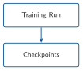
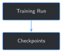

<!--
STATUS: placeholder only -- this chapter has not been written yet.
Draft it by filling in every TODO/comment section below, per
templates/chapter_template.qmd and book/README.md's chapter map.
-->

<!--
CHAPTER TEMPLATE
================
Copy this file into chapters/chapter_NN.qmd and fill in every section.
Do not delete a section — if it doesn't apply, write one sentence saying why.

Audience: drilling/completions/intervention/production engineers and
petroleum data scientists. Assume zero Python experience and zero software
engineering experience. Assume strong operational experience, strong Excel
skills, curiosity about AI, and willingness to type code manually. The
reader should never ask "why am I learning this?" — every concept appears
only after they've hit the problem it solves. Problem first, technology
second. If forced to choose between technical completeness and reader
confidence, choose reader confidence. The reader should finish saying
"I can build this," not "I understand the theory."

Style rules:
- Problem first. Never introduce a concept (tokenization, LoRA adapters,
  quantization, evaluation metrics, or anything else) before the reader
  has felt the failure that makes it necessary.
- Every chapter must produce a runnable artifact the reader can point to
  and say "I built that."
- Minimal mathematics. If you need an equation, put the intuition in prose
  first and the equation second, not the other way around.
- No chapter should run past ~20 pages without a practical exercise
  checkpoint.
- Code blocks must run as-is against the companion repository's sample
  training data. Do not show elided/pseudocode as if it were runnable.
- Avoid jargon in plain-English explanations. Bad: "This applies a
  low-rank update to the attention projections." Good: "We taught the
  model a small, targeted correction instead of retraining it from
  scratch."
- Every claimed result (a metric, an evaluation score, a before/after
  comparison) must come from an actual run of this book's own code
  against real training data — never invented or estimated.

Required structural elements (do not skip any of these):
1. A visual progress marker at the very top, e.g. `Base Model ↓ Fine-Tuned Model`.
2. "## Operational Problem" as the first section after Learning objectives,
   written in the language of a drilling morning call (a question someone
   would actually ask out loud), never "today we will learn X."
3. Before EVERY code block: "## What problem are we solving?", "## Inputs",
   "## Expected Output".
4. After EVERY code block: "## What just happened?" in plain English.
5. An "Engineering Translation" callout for every new programming or AI
   concept introduced (LoRA adapter -> a small swappable correction sheet
   clipped to the model, tokenizer -> the standard word-breakdown table
   everyone on the crew uses, checkpoint -> a saved snapshot of training
   progress, evaluation set -> a fixed exam the model has never seen,
   epoch -> one full pass through the training data, etc.) — invent the
   right analogy for whatever concept the chapter actually introduces.
6. If the chapter introduces a new AI/ML concept, include a
   "## Why prompting alone falls short" (or equivalent "why the simpler
   thing fails") section before introducing the new technique — show the
   question, why the simpler approach gets it wrong or inconsistent, then
   the fix.
7. A "## Production Reality" section: what this chapter's examples
   deliberately simplify away, and what a messier real training pipeline
   looks like (inconsistent report formats, duplicate or near-duplicate
   entries, class imbalance, limited hardware, drift between training and
   production data, etc.).
8. A closing "## What can you do now that you couldn't do before?" section
   — one or two sentences of concrete new capability, not a theory recap.
9. A ".chapter-status" div directly under the pipeline diagram: a 12-block
   progress bar (N filled for chapter N, rest empty), an estimated time,
   and a difficulty badge (🟢/🟠/🔴). See markup below.
10. Exactly one named persona (Mike/completions, Sarah/intervention,
    Sean/production, Oumy/drilling — see index.qmd's roster) appears in
    the opening sentence(s) of "## Operational Problem", asking the
    motivating question. Pick whichever persona the chapter's question
    naturally belongs to. Personas may be echoed once more in "##
    Practical exercise" for bookend effect, but never appear in Theory,
    Production Reality, or Field notes — those sections stay factual and
    unattributed, since their content must be independently verified
    against a real run, not invented dialogue.
11. A difficulty badge line under both exercise headings: "## Practical
    exercise" gets 🟢 **Beginner** always; "## Challenge exercise" gets
    🟠 **Intermediate** by default, escalated to 🔴 **Advanced** only when
    the challenge is genuinely harder than a typical chapter's (a
    judgment call, not a mechanical rule).
12. A "CHECKPOINT" box (`callout-caution`, GFM task-list checkboxes) and a
    "WHAT YOU BUILT" box (`callout-tip .built-box`), placed together right
    after "## Repository files" and before the closing "## What can you do
    now..." / "## Suggested next step" pair. CHECKPOINT is a terse,
    checkable skills list; WHAT YOU BUILT names the concrete artifact.
    Neither replaces "## Key takeaways" (conceptual) or "## What can you
    do now" (prose) — each reinforces achievement from a different angle.
13. "## Suggested next step" opens with a bolded **Coming up in Chapter
    N+1:** line before its bridging paragraph.
-->

# Fine-Tuning at Scale: Checkpoints and Experiment Tracking {#sec-chapter-08}

<!-- Progress marker: a small pipeline diagram showing this chapter's
input -> output transformation (2-4 boxes, vertical flow with arrows).
Add it to the DIAGRAMS dict in figures/diagrams/generate_diagrams.py and
run that script -- it compiles TikZ -> PDF via pdflatex, then produces
three files per diagram: pipeline_ch08_light.svg and _dark.svg (for
HTML), and pipeline_ch08.pdf (for PDF output -- see the note below on
why this can't just reuse the SVG). Do NOT use plain ASCII art here; it
doesn't get the crisp, theme-aware rendering the rest of the book's
diagrams have. -->

::: {.content-visible when-format="html"}
::: {.pipeline-diagram}
{.diagram-light width="180"}
{.diagram-dark width="180"}
:::
:::

::: {.content-visible when-format="pdf"}
{width="180" fig-align="center"}
:::
<!-- PDF format embeds the compiled .pdf directly, not the SVG -- Quarto's
LaTeX pipeline needs rsvg-convert to rasterize an SVG for PDF output,
which may not be installed on the CI runner. generate_diagrams.py should
save the compiled PDF alongside both SVG variants for exactly this
reason -- always reference the .pdf here, never the .svg.

fig-align="center" is required on this line -- a bare image (no caption)
isn't wrapped in pandoc's usual centering figure environment, so without
it the diagram renders flush against the left margin instead of
centered. The HTML version doesn't need this (.pipeline-diagram's
text-align: center in custom.scss already handles it there). -->

<!-- Chapter status strip (rule 9). Progress bar is 12 characters total,
N filled for chapter N. Estimated time is a plausible range for a reader
typing every example. Difficulty is the chapter's overall level, usually
🟢 for Part I and early Part II, 🟠/🔴 as fine-tuning and evaluation get
more involved. -->

::: {.chapter-status}
Progress `████████░░░░░` **8 / 13** &nbsp;·&nbsp; **Estimated time:** 45-60 min &nbsp;·&nbsp; **Difficulty:** 🟠 Intermediate
:::

## Learning objectives

By the end of this chapter, you will be able to:

- Objective 1 (a concrete capability, not a topic — "load a local
  open-weight model with `transformers` and generate a completion", not
  "learn about language models")
- Objective 2
- Objective 3

## Operational Problem

<!-- One or two paragraphs, opening with ONE named persona (rule 10)
asking a question in the language of a drilling morning call ("Why does
the model keep getting our sequencing wrong?", "Can we trust this answer
enough to act on it?"). Describe the real problem this chapter solves.
Ground it in a scenario: a specific fine-tuning attempt, a specific
question someone needed answered correctly, a specific way the current
(base model or manual) approach fails. Never open with "Today we will
learn X." Example opening: "Sarah, the intervention engineer, asks:
'...'" -->

## Example training excerpt

<!-- A short, realistic (synthetic or anonymised) instruction/response
training example that motivates the chapter's technique. Show it as a
callout so it's visually distinct from narrative text. -->

::: {.callout-note title="Sample training example"}
```json
{
  "instruction": "Summarize the operational risk in this report excerpt.",
  "input": "0600-1130 POOH FR 9,842' TO CHANGE BHA. ERRATIC TORQUE OBSD LAST 3 STDS.",
  "output": "Erratic torque over the last three stands before pulling out of hole suggests a developing hole-cleaning or BHA issue that should be monitored on the next run."
}
```
:::

## Theory

<!-- The minimum theory required to understand *why* the implementation
below works. If this section would exceed ~1.5 pages, you are including
theory the reader doesn't need yet — cut it or defer it to a later
chapter. Prefer diagrams and worked examples over formal definitions.

If this section needs its own flow diagram (an algorithm's internal
steps, not the chapter-opening progress marker), it follows the same
TikZ -> PDF/SVG pattern, added to THEORY_DIAGRAMS (not DIAGRAMS) in
figures/diagrams/generate_diagrams.py. The generator only draws a
straight vertical chain; a diagram that branches (a yes/no decision)
needs that support added first, or should stay as prose/ASCII for now.

Add an "Engineering Translation" callout for every new concept this
chapter introduces — see rule 5 above. Example: -->

::: {.callout-tip title="Engineering Translation: <concept>"}
<!-- One or two plain-language sentences mapping the concept onto
something the reader already knows from field operations. -->
:::

<!-- If this chapter introduces a new AI/ML concept, add a
"## Why prompting alone falls short" (or equivalent) section here, before
the new technique, following rule 6 above. -->

## Implementation

<!-- Step-by-step, runnable code, broken into named steps if more than one
logical block is involved. For EACH code block, follow this exact pattern: -->

### Step 1: <what this step accomplishes>

## What problem are we solving?

<!-- One or two sentences: what does this specific block of code solve? -->

## Inputs

<!-- Bullet list: what does this code need to run? -->

## Expected Output

<!-- What should the reader see when they run this? Show a concrete example. -->

```{python}
#| eval: false
# Minimal working example — replace with chapter-specific code.
print("Hello, local LLM")
```

## What just happened?

<!-- Plain-English explanation, no unnecessary jargon. Bad: "This applies
a low-rank update to the attention projections." Good: "We taught the
model a small, targeted correction instead of retraining it from
scratch." -->

## Production Reality

<!-- What does this chapter's example deliberately simplify away? What
does a messier, real, multi-well or multi-operator training pipeline
look like for this same problem? Follow rule 7 above. -->

## Practical exercise

🟢 **Beginner**

<!-- A guided exercise using the sample training data, with a clear,
checkable "you'll know you got it right when..." condition. This is not
optional — every chapter has one. -->

**Try it yourself:** ...

**You'll know it worked when:** ...

## Field notes

<!-- Optional but encouraged, and should recur often across the book: a
short, real, independently-verified vignette showing where the tool this
chapter just built actually breaks (or, in a later chapter, where a
previous chapter's tool breaks and this chapter's technique fixes it).
Every number and quote here must be checked against a real run before
writing it down -- run the code, don't estimate the outcome. The payoff
is a moment where the reader sees, concretely, why the next chapter's
added complexity is earning its keep, not complexity for its own sake.

Format:
  Query/Action -> the (surprising) result -> the real training/eval data
  that explains why -> the one-sentence lesson. -->

::: {.callout-warning title="Field notes: <short description>"}
**Query:** `"..."`

**Result:** ...

**Why:** the training/eval data shows:

- "..."
- "..."

but never shows "...".

**Lesson:** ...
:::

## Challenge exercise

🟠 **Intermediate** <!-- escalate to 🔴 Advanced per rule 11 if warranted -->

<!-- A harder, more open-ended extension for readers who want to go
further. No solution is provided in the main text; a reference solution
lives in the companion repository under `code/chapter_NN/challenge/`. -->

**Challenge:** ...

## Key takeaways

- Takeaway 1
- Takeaway 2
- Takeaway 3

## Repository files

<!-- Exact paths in the companion repo relevant to this chapter. -->

| File | Purpose |
|---|---|
| `code/chapter_08/finetune_at_scale.py` | ... |
| `datasets/...` | ... |
| `notebooks/chapter_08_explore.ipynb` | Interactive companion notebook |

<!-- Rule 12: CHECKPOINT + WHAT YOU BUILT, together, here. -->

::: {.callout-caution title="CHECKPOINT — Chapter 8"}
- [x] Skill 1 gained this chapter, phrased as something done, not learned
- [x] Skill 2
- [x] Skill 3
:::

::: {.callout-tip .built-box title="✓ WHAT YOU BUILT"}
**`artifact_name.py`** — one or two sentences naming the concrete artifact
and what it hands off to the next chapter.
:::

## What can you do now that you couldn't do before?

<!-- One or two sentences of concrete new capability, following rule 8
above. Not a theory recap — a plain statement of what the reader can now
do that they couldn't before this chapter. -->

## Suggested next step

<!-- Rule 13: open with a bolded "Coming up in Chapter N+1:" line, then
one paragraph bridging to the next chapter: what limitation of today's
artifact motivates tomorrow's work? -->

**Coming up in Chapter N+1:** ...
