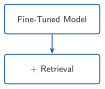
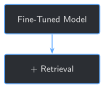

# Hybrid System: Combining Fine-Tuning with Retrieval {#sec-chapter-09}

::: {.content-visible when-format="html"}
::: {.pipeline-diagram}
{.diagram-light width="180"}
{.diagram-dark width="180"}
:::
:::

::: {.content-visible when-format="pdf"}
{width="180" fig-align="center"}
:::

::: {.chapter-status}
Progress `█████████░░░░` **9 / 13** &nbsp;·&nbsp; **Estimated time:** 45-60 min &nbsp;·&nbsp; **Difficulty:** 🔴 Advanced
:::

## Learning objectives

By the end of this chapter, you will be able to:

- Build a real keyword-based retrieval index over the full report
  archive, and explain why it covers every report, held-out one included
- Explain, with a real comparison, why dense sentence embeddings —
  Chapter 4's own tool — aren't the right retrieval method for this
  domain, and what to use instead
- Combine retrieval with Chapter 8's fine-tuned model so an answer
  comes with a citation: which report, which time window
- Explain why a retrieval query and the fine-tuned model's generation
  prompt need to be built differently, not reused as the same string
- Recognize, from a real run, that finding the right source and using
  it faithfully are two different problems — and that this chapter only
  solves the first one

## Operational Problem

Sarah, the intervention engineer, asks the question Chapter 3 predicted
she eventually would: *"The fine-tuned model sounds like it knows our
operation now. If I ask it what happened on a specific day, can I
actually trust the answer — or do I still have to go find the PDF
myself to check?"*

Chapter 3 already gave the honest answer in the abstract: fine-tuning
alone is a weak tool for citing a source. Chapter 8 measured exactly
how weak — `0/50` exact-match on its own training sample. This chapter
builds the other half of the system Chapter 3 promised: a real
retrieval layer that can find the report a fact actually came from, and
hand it to the fine-tuned model so the answer can be grounded in
something citable, not just fluent.

## Example: the same question, with and without retrieval

::: {.callout-note title="Report #37 -- the report Chapter 8's model never trained on"}
```
Without retrieval:
  Production Casing Run Csg & Cement Rig up casing

With retrieval:
  Trip out of hole with BHA #18. Stop at 5,800' and circulate to cool
  hole and tools.
  Sources: [{'report_num': 37, 'from_time': '20:30', 'to_time': '21:30'}, ...]
```
:::

The first answer is the same generic, style-only pattern Chapter 8's
Field Notes already caught — fluent, plausible, and wrong for this
specific report. The second is close to word-for-word what report `#37`
actually says at that exact time window, a report Chapter 8's model
never saw during training. The only thing that changed between them is
that the second one was handed the right three sentences from the right
report before it answered.

## Theory

::: {.callout-tip title="Engineering Translation: retrieval / RAG"}
**Retrieval** means searching a collection of documents for the ones
most relevant to a question, without needing a language model at all —
like a well-indexed filing cabinet. **RAG** (retrieval-augmented
generation) means handing what you found to a language model as extra
context before it answers, so the answer can be grounded in specific,
real text instead of only in what the model happened to memorize.
:::

::: {.callout-tip title="Engineering Translation: BM25 keyword search"}
**BM25** is a scoring method for keyword search: it ranks documents by
how many of the query's words they contain, weighted so rare, specific
words (`"fishing"`, `"Schlumberger"`) count for more than common ones
(`"the"`, `"drilling"`). It has no idea what any of these words *mean*
— it's just counting overlap, carefully. `rank_bm25`, already one of
this book's dependencies, implements it in a few lines.
:::

## Why not dense embeddings?

Chapter 4 already found that this archive's vocabulary defeats
general-purpose sentence embeddings at the single-term level — `BOP`
scored *lower* against its own meaning than against `"birthday party"`.
The same problem shows up again here, at the whole-sentence level. The
query `"lost tool face and became stuck during the slide"` — close to a
direct paraphrase of report `#38`'s actual text — should retrieve that
report immediately. With `sentence-transformers`, it doesn't: report
`#38`'s real entry ranks **340th** out of 677 chunks. With BM25, the
same query ranks it **1st**, by a wide margin over every other chunk in
the archive. For text this dense with exact technical phrasing, keyword
overlap turns out to be a stronger signal than semantic similarity from
a general-purpose embedding model. This chapter uses BM25 for exactly
that reason — not because keyword search is more sophisticated, but
because it's what the evidence actually supports here.

## Implementation

### Step 1: Build a retrieval corpus from every report

## What problem are we solving?

Get every timeline chunk from every report Chapter 6's gate passed —
including the held-out report. Retrieval isn't training: it should be
able to find facts about any report, whether or not the fine-tuned
model ever saw it.

## Inputs

- Chapter 6's `build_archive_records()`
- Chapter 7's `parse_timeline_entries`, `chunk_text`, `contains_cid_artifact`

## Expected Output

Every quality-gated report's chunks, in one flat list — more than
Chapter 7's training set, because this one keeps the held-out report in.

```{python}
#| eval: false
import sys
from pathlib import Path

BOOK_ROOT = Path(__file__).resolve().parents[2]
sys.path.insert(0, str(BOOK_ROOT / "code" / "chapter_02"))
sys.path.insert(0, str(BOOK_ROOT / "code" / "chapter_06"))
sys.path.insert(0, str(BOOK_ROOT / "code" / "chapter_07"))

from build_training_examples import extract_text
from data_quality_gate import build_archive_records, FULL_SET_DIR
from format_training_chunks import chunk_text, contains_cid_artifact, parse_timeline_entries


def build_retrieval_corpus(full_dir=FULL_SET_DIR):
    records = build_archive_records(full_dir)
    corpus = []
    for record in records:
        if record["status"] != "ok":
            continue
        text = extract_text(full_dir / record["file"])
        for entry in parse_timeline_entries(text):
            for chunk in chunk_text(entry["text"]):
                if contains_cid_artifact(chunk):
                    continue
                corpus.append({"report_num": record["rpt_num"], "from_time": entry["from_time"], "to_time": entry["to_time"], "text": chunk})
    return corpus


corpus = build_retrieval_corpus()
print(f"{len(corpus)} retrievable chunks across {len({c['report_num'] for c in corpus})} reports")
```

Running this exact code prints:

```
677 retrievable chunks across 75 reports
```

## What just happened?

`677` chunks, `677 - 669 = 8` more than Chapter 7's training set — the
held-out report's own 8 chunks, present here and nowhere in training.
Same hard exclusion as always (the 1 unrecognized-format report), same
reuse of Chapter 7's parsing and artifact-filtering — the only
difference from Chapter 7's `build_training_set_at_scale()` is which
one report this function chooses to keep.

## Production Reality

Every source report here is public DOE data, so indexing it all is
uncomplicated. A production system over confidential well data would
need access control baked into retrieval itself — not just "can this
user query the model," but "can this specific chunk even be returned to
this specific user" — which this simple version doesn't attempt.

### Step 2: Index with BM25 and retrieve

## What problem are we solving?

Turn the flat chunk list into something searchable, and get back the
most relevant chunks for a real question.

## Inputs

- The `corpus` from Step 1
- A query string

## Expected Output

The top-k chunks, ranked by BM25 score, each labeled with its source
report and time window.

```{python}
#| eval: false
import numpy as np
from rank_bm25 import BM25Okapi


def build_bm25_index(corpus):
    return BM25Okapi([chunk["text"].lower().split() for chunk in corpus])


def retrieve(query, corpus, bm25, k=3):
    scores = bm25.get_scores(query.lower().split())
    top_indices = np.argsort(-scores)[:k]
    return [{**corpus[i], "score": float(scores[i])} for i in top_indices]


bm25 = build_bm25_index(corpus)
for r in retrieve("trip out of hole stop at 5800 circulate cool hole and tools", corpus, bm25, k=3):
    print(f"  [{r['score']:.2f}] Report #{r['report_num']} {r['from_time']}-{r['to_time']}: {r['text'][:70]}")
```

Running this exact code prints:

```
  [18.07] Report #37 20:30-21:30: Production Drilling Trips Trip out of hole with BHA #18. Stop at 5,800
  [14.98] Report #28 01:30-04:30: Make up Ulterra U616M 6 PDC bit Stop and circulate at 3,000 ft to cool
  [14.13] Report #39 21:00-22:00: Production Drilling Cond Mud & Circ Circulate hole to cool directional
```

## What just happened?

The top result is report `#37`'s actual chunk, by a wide score margin
over the next-best match — and report `#37` is the one report Chapter
8's fine-tuned model never trained on. Retrieval doesn't need the
model to have seen something to find it; it only needs the something to
be in the corpus, which Step 1 made sure it was.

## Production Reality

677 chunks fit entirely in memory, so scoring every one of them against
a query, every time, is instant. A production archive with millions of
documents needs a real search index (Elasticsearch, or a proper BM25
implementation with precomputed term indexes) instead of scoring
everything from scratch per query — a different implementation of the
same idea, not a different idea.

### Step 3: Combine retrieval with the fine-tuned model

## What problem are we solving?

Get a grounded, cited answer out of Chapter 8's fine-tuned model — and
avoid a real mistake this chapter's own first draft made: using the
model's templated input as the retrieval query.

## Inputs

- Chapter 8's fine-tuned checkpoint
- A retrieval `query` — a real information need, not the templated
  `instruction`/`input_context` the fine-tuned model expects

## Expected Output

An answer, plus the specific report(s) and time window(s) it was
grounded in.

```{python}
#| eval: false
def build_grounded_prompt(instruction, input_context, retrieved_chunks):
    sources = "\n".join(f"[Report #{c['report_num']}, {c['from_time']}-{c['to_time']}]: {c['text']}" for c in retrieved_chunks)
    return f"{instruction}\n{input_context}\n\nRelevant report excerpts:\n{sources}"


def answer_with_retrieval(model, tokenizer, instruction, input_context, query, corpus, bm25, k=3):
    retrieved = retrieve(query, corpus, bm25, k=k)
    prompt = build_grounded_prompt(instruction, input_context, retrieved)
    answer = generate_reply(model, tokenizer, prompt, max_new_tokens=60)
    return {"answer": answer, "sources": [{"report_num": c["report_num"], "from_time": c["from_time"], "to_time": c["to_time"]} for c in retrieved]}


instruction = "What happened on this well during this time window?"
input_context = "Well: FORGE 16A [78]-32 | Report #37 | Time: 20:30-21:30"

# The mistake: using the templated input itself as the retrieval query
print("Metadata-only query:")
for r in retrieve(f"{instruction} {input_context}", corpus, bm25, k=3):
    print(f"  Report #{r['report_num']}")

# The fix: a query describing the actual information need
query = "trip out of hole stop at 5800 circulate cool hole and tools"
result = answer_with_retrieval(lora_model, tokenizer, instruction, input_context, query, corpus, bm25)
print(f"\nGrounded answer: {result['answer']}")
print(f"Sources: {result['sources']}")
```

Running this exact code prints:

```
Metadata-only query:
  Report #25
  Report #54
  Report #54

Grounded answer: Trip out of hole with BHA #18. Stop at 5,800' and circulate to cool hole and tools.
Sources: [{'report_num': 37, 'from_time': '20:30', 'to_time': '21:30'}, {'report_num': 28, 'from_time': '01:30', 'to_time': '04:30'}, {'report_num': 39, 'from_time': '21:00', 'to_time': '22:00'}]
```

## What just happened?

The metadata-only query — the templated `instruction` and
`input_context` the fine-tuned model was trained on — retrieves the
*wrong* reports entirely: `#25` and `#54`, nowhere near report `#37`.
That string is nearly identical across hundreds of chunks (`"What
happened on this well during this time window? Well: ... | Report #NN |
Time: ..."`) — it carries metadata, not the actual question. The real
query finds report `#37` immediately, and the grounded answer that
comes back is close to word-for-word what that report actually says.
Retrieval and generation need different inputs here: what finds the
right document and what the fine-tuned model expects to see are not the
same string, and treating them as interchangeable is the single easiest
way for a hybrid system like this one to quietly fail.

## Production Reality

This chapter hand-writes each `query` to demonstrate the mechanism.
A real system needs the query to come from somewhere — the user's own
natural-language question, most directly, possibly rewritten or
expanded first. Turning "what a user actually typed" into "a good
retrieval query" is its own real subfield (query reformulation);
this chapter assumes a reasonable query is already in hand.

## Practical exercise

🟢 **Beginner**

**Try it yourself:** run
`python code/chapter_09/hybrid_rag_finetune.py` from inside `book/`
(needs Chapter 8's checkpoint — run that chapter's script first if you
haven't), and compare the "without retrieval" and "with retrieval"
answers for each of the 4 test cases.

**You'll know it worked when:** the script prints `Retrieval found the
correct report in the top 3 for 4/4 test queries`, and you can point to
at least one case where the grounded answer contains a specific number
or name that only appears in the retrieved report text.

## Field notes

::: {.callout-warning title="Field notes: finding the source and using it faithfully are different problems"}
**Query:** all 4 of this chapter's test cases, comparing what the
retrieved source actually said against what the grounded answer said.

**Result:**

| Report | Retrieval | Grounded answer matches source? |
|---|---|---|
| `#37` (held-out) | ✓ found | Yes — near word-for-word |
| `#38` (stuck pipe) | ✓ found | No — answer ignores the retrieved text entirely |
| `#21` (step rate test) | ✓ found | No — answer is unrelated to the retrieved content |
| `#49` (fishing) | ✓ found | Partial — topically right, not the specific detail |

**Why:** retrieval succeeded in all 4 cases — the correct report was
always in the top 3. But handing the model the right text doesn't force
it to use that text. For `#38`, the model was given the exact "lost
tool face and became stuck" passage and generated an unrelated answer
about tripping in hole anyway. Nothing in this chapter's setup makes
the model's answer *accountable* to the context it was given.

**Lesson:** a hybrid system's citation only means "this is what was
retrieved," not "this is what the answer is actually based on." Those
can silently diverge, and this chapter has no way to catch it when they
do — checking whether an answer is actually consistent with its cited
source is exactly Chapter 10's job, not this one's.
:::

## Challenge exercise

🟠 **Intermediate**

**Challenge:** rerun this chapter's 4 test queries using dense
sentence-transformer embeddings (Chapter 4's tool) instead of BM25, and
compare retrieval accuracy directly. A reference solution is at
`code/chapter_09/challenge/challenge.py` — on a real run, it scores
`3/4` (missing exactly the `#38` stuck-pipe query, the same one that
ranked `340th` in this chapter's "Why not dense embeddings?" section),
against BM25's `4/4` on the same queries.

## Key takeaways

- Retrieval should cover everything, held-out data included — a
  fine-tuned model's blind spots are exactly where retrieval needs to
  work, not where it's optional.
- For this archive's dense technical phrasing, keyword search (BM25)
  beat general-purpose dense embeddings at finding the right source —
  the same domain-vocabulary gap Chapter 4 found at the single-term
  level shows up again at the sentence level.
- A retrieval query and a fine-tuned model's expected input are
  different things. Reusing one as the other — the templated metadata
  string as a search query — silently retrieves the wrong documents.
- Successful retrieval doesn't guarantee grounded generation. This
  chapter measured both separately and found them genuinely different:
  retrieval succeeded 4/4 times; the model faithfully used what it was
  given only some of that time.

## Repository files

| File | Purpose |
|---|---|
| `code/chapter_09/hybrid_rag_finetune.py` | Builds a BM25 retrieval index over the full archive and combines it with Chapter 8's fine-tuned model |
| `code/chapter_09/challenge/challenge.py` | Reference solution: dense-embedding retrieval, compared directly against BM25 |
| `notebooks/chapter_09_explore.ipynb` | Interactive companion notebook |

::: {.callout-caution title="CHECKPOINT — Chapter 9"}
- [x] Built a retrieval corpus covering every quality-gated report,
      including the one the fine-tuned model never trained on
- [x] Chose BM25 over dense embeddings based on a real, measured
      comparison, not by default
- [x] Combined retrieval with Chapter 8's fine-tuned model to produce
      answers with citations
- [x] Measured retrieval accuracy and generation faithfulness
      separately, and found they're not the same thing
:::

::: {.callout-tip .built-box title="✓ WHAT YOU BUILT"}
**`hybrid_rag_finetune.py`** — a BM25 retrieval index over all 75
quality-gated reports (held-out report included), combined with Chapter
8's fine-tuned checkpoint to produce cited, source-grounded answers.
Chapter 10 picks up exactly where this chapter's Field Notes left off:
checking whether an answer is actually consistent with what it cites.
:::

## What can you do now that you couldn't do before?

You can answer a question using both a model that's learned your
domain's language and a search over your actual reports, together — and
you can point to exactly which report and time window an answer came
from, instead of asking the model to simply be right.

## Suggested next step

**Coming up in Chapter 10:** this chapter's Field Notes found a real
gap — retrieval can find the right source and the model can still write
an answer that ignores it. Chapter 10 builds the check this chapter is
missing: verifying an answer is actually consistent with the report it
cites, and flagging it when it isn't, instead of trusting a citation
just because one was attached.
