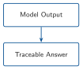
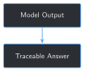

# Traceable Outputs and Hallucination Mitigation {#sec-chapter-10}

::: {.content-visible when-format="html"}
::: {.pipeline-diagram}
{.diagram-light width="180"}
{.diagram-dark width="180"}
:::
:::

::: {.content-visible when-format="pdf"}
{width="180" fig-align="center"}
:::

::: {.chapter-status}
Progress `██████████░░░` **10 / 13** &nbsp;·&nbsp; **Estimated time:** 30-40 min &nbsp;·&nbsp; **Difficulty:** 🟠 Intermediate
:::

## Learning objectives

By the end of this chapter, you will be able to:

- Explain why a citation Chapter 9 attaches to an answer means "this is
  what was retrieved," not "this is what the answer is actually based
  on" — and why those two claims can silently diverge
- Build a real, inspectable faithfulness check that scores an answer
  against each individual source chunk it was shown
- Run that check against Chapter 9's own 4 test cases and find a real
  case where an answer looks grounded but is actually traceable to the
  *wrong* report
- Explain the limits of a word-overlap faithfulness check: what kind of
  mistake it can and can't catch

## Operational Problem

Oumy, the drilling engineer who built Chapter 6's quality gate to catch
bad training data before anything gets trained on it, looks at Chapter
9's hybrid system and asks the natural next question: *"We check the
data going in. How do we check the answer coming out?"*

Chapter 9's own Field Notes already found the specific problem this
chapter has to fix: across its 4 test cases, retrieval found the
correct report every time, but the fine-tuned model's answer was only
actually consistent with that report's text once. A citation Chapter 9
attaches to an answer only ever meant "this is what retrieval handed
the model" — nothing in Chapter 9 checks whether the model's answer
*used* it.

## Example: a citation that's true, and an answer that isn't

Ask Chapter 9's system about report `#21`'s step rate test, and it
retrieves report `#21`'s real text in its top 3 — the actual test,
timestamped and logged:

::: {.callout-note title="Report #21, 15:30-16:00 -- the report actually asked about"}
```
Step Rate Test: 5K increments, 5 mins each
set 800 gpm, 40 rotary WOB
Depth Differential
20K 4,946 110
25K 4,946 130
...
```
:::

The grounded answer that comes back is fluent and specific: *"Test
choke manifold at 5000psi."* Every word of it is real — but it isn't
from report `#21`. It's lifted from a different report retrieval also
handed the model in the same prompt:

::: {.callout-note title="Report #27, 06:00-11:00 -- retrieved alongside #21, and where this answer actually came from"}
```
PJSM, pre job safety meeting
Production Drilling
Test B.O.P.
Test BOPE 250 psi low 5000 psi high, test casing 1500 psi,
test choke manifold 5000 psi
```
:::

Report `#27` is a blowout-preventer pressure test — a completely
different operation. The model didn't invent "5000psi" out of thin air,
so this isn't the obviously-wrong-and-fluent failure Chapter 3 first
showed. It's worse: a real number, from a real report, attached to the
wrong question. Chapter 9's citation for this answer would have listed
report `#21` right alongside `#27` — both were retrieved — with no way
to tell which one the answer actually came from.

## Theory

::: {.callout-tip title="Engineering Translation: faithfulness / grounding"}
An answer is **grounded** in a source if it's actually built from that
source's content — not just handed the source alongside an unrelated
guess. **Faithfulness** is how well an answer matches what a specific
source actually says. A hybrid system can be grounded in general (it
retrieved real reports) while being unfaithful in the specific answer
it gave (it didn't actually use them) — that gap is exactly what
report `#21`'s example above shows.
:::

::: {.callout-tip title="Engineering Translation: hallucination"}
A **hallucination** is a fluent, confident model output that isn't
actually supported by real evidence. Chapter 1 showed the obvious kind
— confident nonsense with nothing behind it. Report `#21`'s example
above is the harder kind: a hallucination made of entirely real words,
borrowed from the wrong place. Both are hallucinations; only one of
them is easy to spot by reading the answer alone.
:::

## Why trusting a citation isn't enough

The tempting shortcut: if an answer comes with a citation — a report
number and time window retrieval actually found — treat it as
trustworthy. Report `#21`'s example shows exactly why that fails: the
citation Chapter 9 would print alongside this answer is *true*
(report `#21` really was retrieved, really is relevant to the
question) and the *answer* is still wrong. A citation only proves
retrieval did its job. It proves nothing about whether the generation
step actually used the report it names, instead of a different one
sitting in the same prompt. Catching that gap needs something that
looks at the answer's own words, not just the list of sources it was
handed.

## Implementation

### Step 1: Score an answer against a single source

## What problem are we solving?

Turn "does this answer match this source?" into a real, checkable
number — something simple enough to read and trust, not a second
opaque model making an opaque judgment call.

## Inputs

- One generated `answer` (a string)
- One candidate `source_text` (a string) — a single retrieved chunk

## Expected Output

A score from 0.0 to 1.0: the fraction of the answer's meaningful words
that also appear somewhere in the source.

```{python}
#| eval: false
import re

# Words that appear in every prompt's own instruction/input template
# ("What happened on this well during this time window?"), not because
# the retrieved text was actually used. Counting them as "supported"
# would make every answer look more grounded than it is.
STOPWORDS = {
    "a", "an", "and", "are", "as", "at", "be", "been", "but", "by", "during",
    "for", "from", "happened", "in", "is", "it", "its", "of", "on", "or",
    "report", "the", "this", "time", "to", "was", "well", "were", "what",
    "which", "window", "with",
}


def content_words(text: str) -> set[str]:
    words = re.findall(r"[a-z0-9']+", text.lower())
    return {w for w in words if w not in STOPWORDS and len(w) > 2}


def faithfulness_score(answer: str, source_text: str) -> float:
    answer_words = content_words(answer)
    if not answer_words:
        return 0.0
    return len(answer_words & content_words(source_text)) / len(answer_words)


print(faithfulness_score("Test choke manifold at 5000psi", "test choke manifold 5000 psi"))
print(faithfulness_score("Test choke manifold at 5000psi", "Step Rate Test: 5K increments, 5 mins each, 800 gpm, 40 rotary WOB"))
```

Running this exact code prints:

```
0.75
0.25
```

## What just happened?

The exact same generated answer scores `0.75` against report `#27`'s
text and only `0.25` against report `#21`'s — the report it was
actually supposed to be about. The number alone already tells the
story Chapter 9 could only tell by reading both answers by eye: this
answer is faithful to *something*, just not the thing it was asked
about.

`0.75`, not `1.0`, is itself worth noticing: the answer's own
`"5000psi"` (no space) doesn't match report `#27`'s `"5000 psi"` (two
words) as a token, even though a person reading both would call them
the same number. A word-overlap check is exactly this literal —
Production Reality below has more on what that costs.

## Production Reality

This is a plain word-overlap check, not a semantic one. It will miss a
genuine paraphrase (an answer that says the same thing in different
words scores low even when it's correct), and it can't detect a
directional or factual inversion buried inside otherwise-matching
words — Field Notes below shows a real case of exactly that. A
production system checking higher-stakes claims would pair this with a
real entailment or fact-verification model; this chapter's version is
deliberately simple enough to read every line of and trust what it's
actually measuring.

### Step 2: Keep only the sources an answer is actually traceable to

## What problem are we solving?

Chapter 9's `answer_with_retrieval` cites every chunk retrieval handed
the model, whether or not the answer used it. Turn that into a
citation list that only survives if the answer is actually faithful to
it.

## Inputs

- The loaded, fine-tuned `model` and `tokenizer` from Chapter 8/9
- `instruction`, `input_context`, and a retrieval `query` (Chapter 9)
- The retrieval `corpus` and `bm25` index (Chapter 9)

## Expected Output

The generated answer, every retrieved chunk's faithfulness score, and
a `verified_sources` list containing only the chunks that actually
cross a faithfulness threshold.

```{python}
#| eval: false
def answer_with_traceable_sources(model, tokenizer, instruction, input_context, query, corpus, bm25, k=3, threshold=0.5) -> dict:
    retrieved = retrieve(query, corpus, bm25, k=k)
    prompt = build_grounded_prompt(instruction, input_context, retrieved)
    answer = generate_reply(model, tokenizer, prompt, max_new_tokens=60)

    scored = sorted(
        ({**chunk, "faithfulness": faithfulness_score(answer, chunk["text"])} for chunk in retrieved),
        key=lambda c: c["faithfulness"],
        reverse=True,
    )
    verified_sources = [c for c in scored if c["faithfulness"] >= threshold]

    return {"answer": answer, "retrieved": scored, "verified_sources": verified_sources, "grounded": len(verified_sources) > 0}
```

## What just happened?

`retrieve` and `build_grounded_prompt` are Chapter 9's own functions,
reused unchanged — this step doesn't touch how retrieval or generation
work, only what happens to the result afterward. `threshold=0.5` is a
plain default, not tuned to any one answer; Step 3 shows what it does
across all 4 of Chapter 9's real test cases.

## Production Reality

`k` (how many chunks get retrieved and shown to the model) directly
controls how much unrelated material sits in the same prompt as the
right answer, and report `#21`'s example is exactly what happens when
that goes wrong: the correct report was in the prompt, and the model
still reached for a different one next to it. A production system
would tune `k` against real faithfulness measurements like this one,
not just against retrieval accuracy.

### Step 3: Run the check against Chapter 9's real test cases

## What problem are we solving?

Apply Step 2's function to all 4 of Chapter 9's test cases and see,
with real numbers, how often "grounded" actually means "grounded in
the right report."

## Inputs

- Chapter 9's `TEST_CASES` (4 real report questions) and `INSTRUCTION`
- The fine-tuned checkpoint, retrieval corpus, and BM25 index

## Expected Output

Per-case answers, faithfulness scores against every retrieved chunk,
and which sources (if any) survive as verified citations.

```{python}
#| eval: false
for label, input_context, query, target_report in TEST_CASES:
    result = answer_with_traceable_sources(lora_model, tokenizer, INSTRUCTION, input_context, query, corpus, bm25)
    print(f"{label}: {result['answer']}")
    print(f"  grounded: {result['grounded']}")
    for chunk in result["retrieved"]:
        mark = "verified" if chunk["faithfulness"] >= 0.5 else "not used"
        print(f"    [{mark:>8}] Report #{chunk['report_num']} (faithfulness {chunk['faithfulness']:.2f})")
```

Running this exact code prints:

```
Report #37 (held-out): Trip out of hole with BHA #18. Stop at 5,800' and circulate to cool hole and tools.
  grounded: True
    [verified] Report #37 (faithfulness 1.00)
    [verified] Report #28 (faithfulness 0.78)
    [not used] Report #39 (faithfulness 0.44)

Report #38 (stuck pipe): Production Drilling Trips Trip in hole with drill pipe from 10,490' to surface
  grounded: False
    [not used] Report #38 (faithfulness 0.44)
    [not used] Report #60 (faithfulness 0.22)
    [not used] Report #61 (faithfulness 0.11)

Report #21 (step rate test): Test choke manifold at 5000psi
  grounded: True
    [verified] Report #27 (faithfulness 0.75)
    [not used] Report #21 (faithfulness 0.25)
    [not used] Report #17 (faithfulness 0.25)

Report #49 (fishing): Trip out of hole with fishing bha
  grounded: True
    [verified] Report #49 (faithfulness 0.80)
    [not used] Report #49 (faithfulness 0.40)
    [not used] Report #50 (faithfulness 0.20)
```

## What just happened?

Four answers, three different real outcomes:

- **`#37`** is genuinely faithful, and correctly verified against the
  right report — the check confirms what Chapter 9 already showed.
- **`#38`** is correctly flagged `grounded: False`. No retrieved chunk
  crosses the threshold, matching Chapter 9's own human judgment that
  this answer ignores the retrieved text entirely — automated now,
  not eyeballed.
- **`#21`** is the case a plain `grounded: True`/`False` flag would
  have gotten wrong. It reads as grounded — and it is, just not in the
  report the question was actually about. Only checking `verified_sources`
  against the *target* report catches this; the boolean alone would
  have silently counted it as a success.

`#49` is worth a closer look too — see Field Notes.

## Practical exercise

🟢 **Beginner**

**Try it yourself:** run
`python code/chapter_10/traceable_outputs.py` from inside `book/` and
compare its printed output to the transcript above.

**You'll know it worked when:** you see `grounded: False` for report
`#38` and `grounded: True` for report `#37`, and you can explain in one
sentence why report `#21`'s case is more concerning than `#38`'s, even
though both were flagged by Chapter 9 as failures.

## Field notes

::: {.callout-warning title="Field notes: right words, wrong direction"}
**Query:** report `#49`'s fishing-operation answer, checked word by
word against its own correctly-verified source.

**Result:** the grounded answer says *"Trip out of hole with fishing
bha"* — faithfulness `0.80` against report `#49`'s actual text, well
above threshold, correctly verified. Report `#49`'s real text says:

```
Production Drilling Trips
Pick up Fishing BHA # 33 and trip in hole to 7,996'
```

The report says **trip in hole**. The answer says **trip out of
hole** — the opposite direction — and drops the specific depth,
`7,996'`, entirely.

**Why:** `"out"` and `"in"` are both short, common words. This
chapter's check only tests whether an answer's words appear *somewhere*
in the source; it has no notion of which words modify which, so
`"trip"`, `"fishing"`, and `"bha"` all matching is enough to score high
even though the one word that actually changes the meaning of the
sentence flipped.

**Lesson:** a high faithfulness score means an answer's vocabulary
came from the right place — not that every claim in it is correct.
`#21`'s wrong-report case and `#49`'s flipped-direction case are two
different failure modes this simple check catches differently: one it
flags correctly by score alone, the other it verifies with a score
that's honestly still too high. Both are worth knowing about; only one
is currently caught automatically.
:::

## Challenge exercise

🟠 **Intermediate**

**Challenge:** does this chapter's check also catch hallucination when
there's no retrieval context at all — Chapter 9's original,
un-grounded baseline answers? Regenerate each of the 4 test cases
*without* retrieval, then score each answer against its own target
report's real text using this chapter's `faithfulness_score`. A
reference solution is at `code/chapter_10/challenge/challenge.py` — on
a real run, every un-grounded answer scores at or below `0.17` against
its own target report (one scores `0.00`), well under the `0.5`
threshold this chapter uses, confirming the check generalizes: it
isn't just tuned to Chapter 9's specific retrieval setup, it correctly
flags "no real evidence used" as unfaithful in general.

## Key takeaways

- A citation only proves retrieval did its job — it proves nothing
  about whether generation actually used the report it names. Report
  `#21`'s example is a true citation attached to a wrong answer.
- A plain `grounded: True`/`False` flag would have missed report
  `#21`'s failure entirely. Checking *which* source an answer verifies
  against, not just whether one does, is what actually catches it.
- This chapter's faithfulness check is lexical, not semantic — it
  reliably catches "used the wrong evidence" (`#21`) but can miss a
  factual inversion hiding inside otherwise-matching words (`#49`).
  Knowing which failure mode a check does and doesn't catch matters as
  much as having the check.
- The same check that catches a wrong-source hallucination also
  correctly flags a fully un-grounded answer as unfaithful — it isn't
  narrowly tuned to one failure mode.

## Repository files

| File | Purpose |
|---|---|
| `code/chapter_10/traceable_outputs.py` | Faithfulness scoring and traceable-source verification over Chapter 9's hybrid system |
| `code/chapter_10/challenge/challenge.py` | Reference solution: faithfulness-checking Chapter 9's un-grounded baseline answers |
| `notebooks/chapter_10_explore.ipynb` | Interactive companion notebook |

::: {.callout-caution title="CHECKPOINT — Chapter 10"}
- [x] Built a real, inspectable faithfulness score between an answer
      and a source, with no opaque second model involved
- [x] Found a real case where a true citation was attached to an
      answer that actually came from a different report
- [x] Ran the check against all 4 of Chapter 9's test cases and
      confirmed it flags exactly the failure Chapter 9's Field Notes
      found, plus one Chapter 9 couldn't distinguish from a success
- [x] Named a concrete limitation of the check (a factual inversion
      inside otherwise-matching words) instead of overselling it
:::

::: {.callout-tip .built-box title="✓ WHAT YOU BUILT"}
**`traceable_outputs.py`** — a faithfulness check that scores a
generated answer against each source chunk it was shown, and a
`verified_sources` list that only keeps the citations an answer is
actually traceable to. Applied to Chapter 9's hybrid system, it turns
"here's what was retrieved" into "here's what the answer is actually
based on" — catching a real, fluent, source-backed-sounding answer
that was grounded in the wrong report.
:::

## What can you do now that you couldn't do before?

You can tell the difference between an answer that cites a real source
and an answer that's actually faithful to it — and you have a concrete,
inspectable number to point to instead of reading every answer by eye
the way Chapter 9 had to.

## Suggested next step

**Coming up in Chapter 11:** this chapter checked faithfulness one
hand-picked test case at a time — exactly 4 of them, chosen because
Chapter 9 already knew what to look for in each. That doesn't scale,
and it doesn't produce the kind of summary metric a real evaluation
needs. Chapter 11 builds a proper evaluation harness: a fixed set of
questions with known-correct answers, run automatically, scored
consistently, so a change to the model or the retrieval setup can be
judged by a number instead of a handful of examples someone happened
to check by hand.
