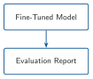
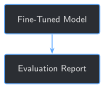

# Evaluating a Fine-Tuned Domain Model {#sec-chapter-11}

::: {.content-visible when-format="html"}
::: {.pipeline-diagram}
{.diagram-light width="180"}
{.diagram-dark width="180"}
:::
:::

::: {.content-visible when-format="pdf"}
{width="180" fig-align="center"}
:::

::: {.chapter-status}
Progress `███████████░░` **11 / 13** &nbsp;·&nbsp; **Estimated time:** 30-40 min &nbsp;·&nbsp; **Difficulty:** 🟠 Intermediate
:::

## Learning objectives

By the end of this chapter, you will be able to:

- Build a real, held-out evaluation set from a report that has never
  been in any training set in this book — not two hand-picked
  questions, eight real ones
- Explain why a single metric can make fine-tuning look like it did
  nothing, and why a second metric can prove that's wrong
- Compute perplexity — a metric that needs real held-out text, not a
  known-correct answer — and use it to measure something exact-match
  can't see at all
- Read Chapter 8's own `metrics.csv` for what it's been quietly
  tracking every epoch, and turn one column of it into a real
  evaluation harness

## Operational Problem

Mike, the completions engineer who asked back in Chapter 5 whether
fine-tuning teaches the operation or just memorizes flashcards, has a
sharper version of the same question now that Chapters 9 and 10 added
retrieval and faithfulness-checking on top: *"We've been checking all
of this on a handful of questions I picked myself, because I already
knew what I was looking for in each one. How do I know any of it holds
up on a question I didn't pick?"*

Chapter 5 answered a narrower version of this with `0/16` and `0/2`.
Chapter 9 and 10 each checked exactly 4 hand-picked cases. None of that
is a real evaluation — it's a handful of examples someone happened to
check by hand, exactly what Chapter 10 ended by admitting doesn't
scale. This chapter builds a real evaluation set — 8 real questions
from a report that has never been in any training set in this book —
and scores it more than one way, because a single number turns out not
to be enough to answer Mike's question honestly.

## Example: one answer, asked eight different questions

Run Chapter 8's fine-tuned model against all 8 real held-out questions
this chapter builds — no retrieval, no grounding context, exactly the
same setup Chapter 5's original held-out check used — and something
worth noticing happens before any scoring at all:

::: {.callout-note title="Eight different questions, from a report the model never trained on"}
```
Time: 06:00-18:30 (part 1 of 2) -> Production Casing Run Csg & Cement Rig up casing
Time: 18:30-20:30               -> Production Casing Run Csg & Cement Rig up cement
Time: 20:30-21:30               -> Production Casing Run Csg & Cement Rig up cement
Time: 21:30-00:30               -> Production Casing Run Csg & Cement Rig up casing
Time: 00:30-02:30               -> Production Casing Run Csg & Cement Rig up casing
Time: 02:30-03:30               -> Production Casing Run Csg & Cement Rig up cement
Time: 03:30-06:00               -> Production Casing Run Csg & Cement Rig up casing
```
:::

Eight different time windows, seven near-identical answers. Whatever
Chapter 8's fine-tune actually learned, it isn't "what happened at
each of these specific times" — it's something closer to a single
memorized-sounding template the model reaches for regardless of the
question. Scoring that against a known-correct answer is one useful
number. It is not the only useful number.

## Theory

::: {.callout-tip title="Engineering Translation: evaluation set"}
An **evaluation set** is a fixed, reusable list of questions with
known-correct answers, held back from training the same way Chapter
2's held-out report always has been — the difference this chapter
makes is *size*. Chapter 3's held-out check used 2 questions from that
report; this chapter uses all 8 real ones the report actually
contains, built with Chapter 7's own chunker.
:::

::: {.callout-tip title="Engineering Translation: perplexity"}
**Perplexity** measures how surprised a model is by a piece of real
text — lower means the model found the actual words more expected,
higher means it found them more surprising. Unlike exact-match or
overlap scoring, perplexity doesn't need a "correct answer" to compare
against at all — just real text the model never trained on. That
makes it a useful second opinion when the first metric says "no
progress."
:::

## Why one number isn't enough

The tempting shortcut: run the held-out set once, get an exact-match
score, and treat that as the verdict on whether fine-tuning worked.
Chapter 8 has quietly been logging exactly that number every epoch, in
its own `metrics.csv` — a `held_out_exact_match` column that reads
`0/8` at epoch 1, `0/8` at epoch 2, `0/8` at epoch 3. Read on its own,
that number says fine-tuning made zero progress on anything it hadn't
already memorized. Field Notes below shows a second, real metric that
says something very different about the exact same three checkpoints
— both numbers are true, and neither one alone tells Mike what he
actually asked.

## Implementation

### Step 1: Build a real, held-out evaluation set

## What problem are we solving?

Chapter 3's held-out check used exactly 2 examples — the report's two
coarse summary fields. Build a real evaluation set from the same
never-trained-on report, at the same granularity Chapter 7 used for
training at scale.

## Inputs

- `HELD_OUT_REPORT` (Chapter 2) and `FULL_SET_DIR` (Chapter 6)
- `build_timeline_examples_for_report` (Chapter 7), reused unchanged

## Expected Output

A list of real instruction/input/output examples, one per timeline
entry the held-out report actually contains.

```{python}
#| eval: false
def build_held_out_eval_set() -> list[dict]:
    examples, _artifacts_filtered = build_timeline_examples_for_report(FULL_SET_DIR / HELD_OUT_REPORT)
    return examples


eval_set = build_held_out_eval_set()
print(f"{len(eval_set)} held-out examples, report never used in any training set")
```

Running this exact code prints:

```
8 held-out examples, report never used in any training set
```

## What just happened?

`build_timeline_examples_for_report` is Chapter 7's own function,
called directly on the one report Chapter 2 reserved and Chapter 5 and
8 both excluded from training. This isn't new held-out data — it's the
exact same 8 examples Chapter 8's training script already builds
internally for its own `held_out_exact_match` logging. This chapter is
the first time this book actually looks past that one column.

## Production Reality

Eight examples is still small by production standards — a real
evaluation set for a deployed system would hold back dozens of
reports, not one, to make the score statistically meaningful rather
than a single report's quirks. This chapter's version stays honest
about that limit rather than implying 8 examples settles the question;
see Key takeaways.

### Step 2: Score two ways — exact-match and partial credit

## What problem are we solving?

Reuse Chapter 3's strict exact-match check, and pair it with Chapter
10's word-overlap scoring (originally built to check an answer against
a *retrieved source*) applied to a different comparison: an answer
against its *known-correct output*.

## Inputs

- The fine-tuned model and tokenizer (Chapter 8's checkpoint)
- The held-out evaluation set from Step 1
- `faithfulness_score` (Chapter 10), reused unchanged

## Expected Output

Every example scored both ways: a strict pass/fail and a 0–1 partial
credit score.

```{python}
#| eval: false
def exact_match(generated: str, expected: str) -> bool:
    return expected.strip().lower() in generated.strip().lower()


def evaluate(model, tokenizer, eval_set: list[dict]) -> list[dict]:
    results = []
    for example in eval_set:
        prompt = f"{example['instruction']}\n{example['input']}"
        generated = generate_reply(model, tokenizer, prompt, max_new_tokens=60)
        results.append({
            "input": example["input"],
            "expected": example["output"],
            "generated": generated,
            "exact_match": exact_match(generated, example["output"]),
            "overlap_score": faithfulness_score(generated, example["output"]),
        })
    return results


results = evaluate(lora_model, tokenizer, eval_set)
matches = sum(r["exact_match"] for r in results)
avg_overlap = sum(r["overlap_score"] for r in results) / len(results)
print(f"Exact-match: {matches}/{len(results)}")
print(f"Average overlap score: {avg_overlap:.2f}")
```

Running this exact code prints:

```
Exact-match: 0/8
Average overlap score: 0.17
```

## What just happened?

`0/8` on its own reads like total failure. `0.17` average overlap
tells a more precise story: not zero, but low — the generated answers
share some vocabulary with the real ones (mostly the archive's own
recurring category words, "Production," "Drilling") without capturing
the specific content each question actually asked about. Reusing
Chapter 10's exact scoring function for a different comparison is
deliberate: the same simple technique generalizes to a second real
problem without needing to be reinvented.

## Production Reality

`faithfulness_score` is still the same plain word-overlap check
Chapter 10 named the limits of — it can't detect a paraphrase that
uses different words correctly, and it can't detect a subtle inversion
hiding inside otherwise-matching words. Those limits carry over here
unchanged; a `0.17` average is a real, low signal, not a precise one.

### Step 3: Perplexity — a metric that doesn't need a correct answer

## What problem are we solving?

Measure whether fine-tuning changed how surprised the model is by real
held-out text, independent of whether it can reproduce that text
exactly.

## Inputs

- A base (pre-fine-tuning) model and Chapter 8's fine-tuned checkpoint
- The same held-out text from Step 1

## Expected Output

A perplexity score for each model on the same real text.

```{python}
#| eval: false
import math


def perplexity(model, tokenizer, texts: list[str]) -> float:
    total_loss, total_examples = 0.0, 0
    for text in texts:
        input_ids = tokenizer(text, return_tensors="pt")["input_ids"]
        with torch.no_grad():
            loss = model(input_ids=input_ids, labels=input_ids).loss
        total_loss += loss.item()
        total_examples += 1
    return math.exp(total_loss / total_examples)


held_out_texts = [e["output"] for e in eval_set]
print(f"Base model:   {perplexity(base_model, tokenizer, held_out_texts):.2f}")
print(f"Fine-tuned:   {perplexity(lora_model, tokenizer, held_out_texts):.2f}")
```

Running this exact code prints:

```
Base model:   159.91
Fine-tuned:   25.03
```

## What just happened?

The fine-tuned model found this exact-same real, never-trained-on text
about `6.4×` less surprising than the base model did — a real,
substantial change, on the exact same 8 examples that just scored
`0/8` exact-match. Fine-tuning taught the model this archive's
vocabulary and phrasing well enough to make genuinely unseen report
text far more expected, even though it still can't reliably reproduce
the *specific* content of a report it hasn't seen. Chapter 5 called
this "shape, not judgment" from a handful of wrong answers; this is
the same finding, quantified.

## Practical exercise

🟢 **Beginner**

**Try it yourself:** run
`python code/chapter_11/eval_finetuned_model.py` from inside `book/`
and compare its printed output to the transcript above.

**You'll know it worked when:** you see `Exact-match: 0/8` and a
fine-tuned perplexity noticeably lower than the base model's, and you
can explain in one sentence why both numbers are true at the same
time.

## Field notes

::: {.callout-warning title="Field notes: the number Chapter 8 already had, and never looked at twice"}
**Query:** Chapter 8's own `checkpoints/chapter_08/*/metrics.csv`,
read all the way across instead of just its `held_out_exact_match`
column.

**Result:**

| Epoch | Train loss | Held-out exact-match | Held-out perplexity |
|---|---|---|---|
| 1 | `2.755` | `0/8` | `27.99` |
| 2 | `2.164` | `0/8` | `25.40` |
| 3 | `1.821` | `0/8` | `25.03` |

**Why:** `held_out_exact_match` was `0/8` at every single checkpoint —
by that column alone, epochs 2 and 3 look like wasted training time.
Perplexity on the exact same held-out text tells a different,
consistent story: it falls at every checkpoint, tracking the falling
training loss almost exactly, even while exact-match never moves.

**Lesson:** a metric that never changes isn't proof that nothing is
changing — it can just be measuring something training isn't currently
improving. Chapter 8 logged the ingredients for this table from its
first real run; this chapter is what it took to actually read them
together.
:::

## Challenge exercise

🟠 **Intermediate**

**Challenge:** Chapter 8 saved a checkpoint after every epoch. Compute
this chapter's perplexity metric against all 3 of them and see whether
it falls monotonically, the way Field Notes above suggests. A
reference solution is at `code/chapter_11/challenge/challenge.py` — on
a real run: `checkpoint_1: perplexity 27.99`, `checkpoint_2: perplexity
25.40`, `checkpoint_3: perplexity 25.03` — the exact numbers behind
Field Notes' table, falling at every epoch.

## Key takeaways

- A single evaluation metric can make real training progress look like
  nothing happened. `held_out_exact_match` stayed `0/8` for all 3 of
  Chapter 8's epochs; perplexity on the identical text fell at every
  one of them.
- Perplexity's advantage is exactly that it doesn't need a
  known-correct answer — it only needs real, unseen text, which makes
  it usable even when you don't have (or trust) a labeled evaluation
  set.
- Reusing Chapter 10's `faithfulness_score` for a completely different
  comparison (answer vs. known-correct output, not answer vs. source)
  worked without modification — the same simple technique generalized
  to a second real problem.
- Eight examples is a real evaluation set, not a toy one — but it's
  still one report's worth of questions. Don't read `0.17` average
  overlap or `25.03` perplexity as more statistically solid than they
  are.

## Repository files

| File | Purpose |
|---|---|
| `code/chapter_11/eval_finetuned_model.py` | Builds the held-out evaluation set and scores exact-match, overlap, and perplexity |
| `code/chapter_11/challenge/challenge.py` | Reference solution: perplexity across all 3 of Chapter 8's checkpoints |
| `notebooks/chapter_11_explore.ipynb` | Interactive companion notebook |

::: {.callout-caution title="CHECKPOINT — Chapter 11"}
- [x] Built a real, 8-example held-out evaluation set from a report
      never used in any training set in this book
- [x] Scored it two ways — strict exact-match and partial-credit
      overlap — instead of trusting one number
- [x] Computed perplexity, a metric that needs no known-correct
      answer, and found it tells a different story than exact-match on
      the identical text
- [x] Read Chapter 8's own logged metrics all the way across instead
      of only its headline column
:::

::: {.callout-tip .built-box title="✓ WHAT YOU BUILT"}
**`eval_finetuned_model.py`** — a real evaluation harness: an 8-example
held-out set, scored by exact-match, word-overlap partial credit, and
perplexity. Applied to Chapter 8's checkpoints, it shows training
progress a single exact-match number completely hides.
:::

## What can you do now that you couldn't do before?

You can evaluate a fine-tuned model against a real, fixed, held-out
question set instead of a handful of examples you happened to check by
hand — and you know why a single metric isn't enough to trust the
answer.

## Suggested next step

**Coming up in Chapter 12:** this chapter evaluated one model version
against a fixed held-out set, one snapshot in time. A real deployment
doesn't stay still — new reports arrive, and eventually someone
retrains. Chapter 12 takes this exact evaluation harness and runs it
across multiple model versions, to catch the case this chapter can't:
a model that used to score well on this held-out set and quietly stops
doing so.
