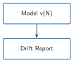
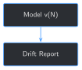

# Detecting Drift Across Model Versions {#sec-chapter-12}

::: {.content-visible when-format="html"}
::: {.pipeline-diagram}
{.diagram-light width="180"}
{.diagram-dark width="180"}
:::
:::

::: {.content-visible when-format="pdf"}
{width="180" fig-align="center"}
:::

::: {.chapter-status}
Progress `████████████░` **12 / 13** &nbsp;·&nbsp; **Estimated time:** 30-40 min &nbsp;·&nbsp; **Difficulty:** 🟠 Intermediate
:::

## Learning objectives

By the end of this chapter, you will be able to:

- Run Chapter 11's evaluation harness across more than one real model
  version and compare them directly, instead of judging each version
  in isolation
- Find a real case where two of Chapter 11's own metrics disagree
  about whether a newer model version is better or worse
- Investigate a metric disagreement by reading the model's actual
  generated text, instead of trusting either number alone
- Explain why a metric that stays flat across versions can hide a real
  change underneath it, and why a metric that moves needs a reason,
  not just a direction

## Operational Problem

Sean, the production engineer who worried back in Chapter 7 about
losing information by throwing away most of a shift's log, has a new
worry now that Chapter 11 gave the book a real evaluation harness:
*"We're not going to fine-tune once and stop — we'll retrain as new
reports come in. How do I know a new version isn't secretly worse than
the one it's replacing?"*

## Example: two checkpoints, two different verdicts

Run Chapter 11's evaluation harness against Chapter 8's first two real
checkpoints — epoch 1 and epoch 2 of the exact same training run — and
compare them directly:

::: {.callout-note title="checkpoint_1 -> checkpoint_2, the same held-out set both times"}
```
checkpoint_1: exact_match=0  avg_overlap=0.354  perplexity=27.99
checkpoint_2: exact_match=0  avg_overlap=0.167  perplexity=25.40

checkpoint_1 -> checkpoint_2: exact_match=unchanged  avg_overlap=regressed  perplexity=improved
```
:::

Perplexity says checkpoint_2 is a real improvement. The overlap score
says it's a real regression — average overlap dropped by more than
half. Both numbers come from the exact same two checkpoints, the exact
same 8 held-out questions, run the same way Chapter 11 already
verified. Neither one is wrong. Neither one is the whole answer either.

## Theory

::: {.callout-tip title="Engineering Translation: drift / regression"}
**Drift** is a model's behavior changing across versions or over time
— often, but not always, for the worse. A **regression** is a specific
kind of drift: something that used to work (or score well) stops
working, in a version that's supposed to be an improvement. Neither
term says *why* — only that something changed and is worth a second
look.
:::

## Why comparing one metric isn't enough

The tempting shortcut: pick one metric, watch it across versions, and
trust whatever it says. Chapter 11 already showed the risk of that
with a single version's evaluation; the checkpoint_1 → checkpoint_2
comparison above shows the same risk across versions, more sharply.
Trusting perplexity alone here says "ship checkpoint_2, it's better."
Trusting overlap alone says "checkpoint_2 is a regression, investigate
before shipping it." A real drift check needs more than one metric, and
when they disagree, it needs a way to actually look at what changed —
not just declare one metric the tiebreaker.

## Implementation

### Step 1: Summarize one model version across all three metrics

## What problem are we solving?

Turn Chapter 11's three separate metrics into a single, comparable
summary per model version.

## Inputs

- A loaded model version (a `PeftModel` wrapping the base model)
- The held-out evaluation set from Chapter 11

## Expected Output

One dictionary per version: exact-match count, average overlap score,
and perplexity.

```{python}
#| eval: false
def summarize_version(model, tokenizer, eval_set: list[dict]) -> dict:
    results = evaluate(model, tokenizer, eval_set)
    texts = [e["output"] for e in eval_set]
    return {
        "exact_match": sum(r["exact_match"] for r in results),
        "avg_overlap": sum(r["overlap_score"] for r in results) / len(results),
        "perplexity": perplexity(model, tokenizer, texts),
    }
```

## What just happened?

`evaluate` and `perplexity` are Chapter 11's own functions, reused
unchanged. This step doesn't add a new metric — it packages the three
that already exist into a shape that's easy to compare, version to
version.

## Production Reality

Real deployments version far more than a LoRA checkpoint — the
retrieval index, the prompt template, even the base model itself can
change between versions, and each is its own source of drift. This
chapter only compares the fine-tuned adapter, holding everything else
fixed, so a real difference is guaranteed to come from the adapter and
nothing else.

### Step 2: Compare two version summaries

## What problem are we solving?

Turn two summaries into a per-metric verdict: did this metric improve,
regress, or stay the same between versions?

## Inputs

- Two `summarize_version` outputs, one "before" and one "after"

## Expected Output

A direction per metric — `improved`, `regressed`, or `unchanged`.

```{python}
#| eval: false
def compare_versions(before: dict, after: dict) -> dict:
    def direction(before_value, after_value, lower_is_better=False):
        if after_value == before_value:
            return "unchanged"
        improved = after_value < before_value if lower_is_better else after_value > before_value
        return "improved" if improved else "regressed"

    return {
        "exact_match": direction(before["exact_match"], after["exact_match"]),
        "avg_overlap": direction(before["avg_overlap"], after["avg_overlap"]),
        "perplexity": direction(before["perplexity"], after["perplexity"], lower_is_better=True),
    }
```

## What just happened?

`compare_versions` reports direction, not a verdict — it doesn't decide
whether checkpoint_2 is "good enough to ship." That's deliberate:
collapsing three metrics into one automatic pass/fail would hide
exactly the kind of disagreement Field Notes below investigates.

## Production Reality

This function has no numeric threshold — any change in direction
counts, even a tiny one. A production system would need a real
threshold per metric (how much perplexity change is noise vs. signal),
tuned against many more than 8 examples. This chapter keeps it simple
enough to read every line of, at the cost of being oversensitive to
small, possibly meaningless fluctuations.

### Step 3: Run it across all 3 real checkpoints

## What problem are we solving?

Apply Steps 1 and 2 to every checkpoint from Chapter 8's real training
run, not just two hand-picked ones.

## Inputs

- Chapter 8's 3 real checkpoints (`checkpoint_1`, `checkpoint_2`, `checkpoint_3`)
- The held-out evaluation set

## Expected Output

A summary per checkpoint, and a direction comparison for every
consecutive pair.

```{python}
#| eval: false
summaries = {}
for checkpoint_dir in checkpoints:
    model, tokenizer = load_version(checkpoint_dir)
    summaries[checkpoint_dir.name] = summarize_version(model, tokenizer, eval_set)

for before_name, after_name in zip(list(summaries), list(summaries)[1:]):
    print(f"{before_name} -> {after_name}: {compare_versions(summaries[before_name], summaries[after_name])}")
```

Running this exact code prints:

```
checkpoint_1 -> checkpoint_2: {'exact_match': 'unchanged', 'avg_overlap': 'regressed', 'perplexity': 'improved'}
checkpoint_2 -> checkpoint_3: {'exact_match': 'unchanged', 'avg_overlap': 'unchanged', 'perplexity': 'improved'}
```

## What just happened?

Two consecutive comparisons, two different outcomes. `checkpoint_2 ->
checkpoint_3` is the boring, healthy case: perplexity keeps improving,
nothing regresses. `checkpoint_1 -> checkpoint_2` is the one worth
stopping for — a real metric disagreement, on real checkpoints, that
Field Notes below investigates by reading what the model actually
generated.

## Practical exercise

🟢 **Beginner**

**Try it yourself:** run
`python code/chapter_12/detect_model_drift.py` from inside `book/` and
compare its printed output to the transcripts above.

**You'll know it worked when:** you see `avg_overlap: regressed`
between `checkpoint_1` and `checkpoint_2`, and you can explain in one
sentence why that doesn't automatically mean checkpoint_2 is a worse
model.

## Field notes

::: {.callout-warning title="Field notes: same template, different template"}
**Query:** what `checkpoint_1` and `checkpoint_2` actually generated
for the same 8 held-out questions, side by side.

**Result:** `checkpoint_1` answers nearly every question with some
version of *"Production Casing Run down hole to 9,400'."*
`checkpoint_2` answers nearly every question with some version of
*"Production Casing Run Csg & Cement Rig up cement."* Neither
checkpoint is actually answering the specific question asked — both
fall back to one memorized-sounding template, the same "shape, not
judgment" pattern Chapter 3, 9, and 11 already found.

**Why:** `checkpoint_1`'s template happens to share more real words
("down hole," "run," numbers matching some of the true answers) with
this specific 8-question held-out set than `checkpoint_2`'s template
does — not because `checkpoint_1` understands the questions better,
but because of which arbitrary generic phrase each epoch happened to
settle into. The overlap score is measuring that coincidence, not a
real improvement or decline in understanding.

**Lesson:** a regressing metric is a reason to look, not a verdict on
its own. Here, looking revealed the "regression" wasn't really about
`checkpoint_2` getting worse at the task — it was two different
flavors of the same underlying limitation, one of which happened to
score better against this particular held-out set by chance. A real
production drift check would need to tell those two situations apart
before deciding whether to roll a version back.
:::

## Challenge exercise

🟠 **Intermediate**

**Challenge:** does the same kind of metric disagreement show up
comparing two completely different training regimes, not just
adjacent epochs of one run? Compare Chapter 5's 16-example fine-tune
against Chapter 8's "at scale" checkpoint using this chapter's own
`compare_versions`. A reference solution is at
`code/chapter_12/challenge/challenge.py` — on a real run: Chapter 5
scores `avg_overlap=0.5625`, `perplexity=112.28`; Chapter 8 scores
`avg_overlap=0.167`, `perplexity=25.03` — the exact same disagreement
pattern (`avg_overlap: regressed`, `perplexity: improved`) holds even
across two entirely different fine-tunes, not just two epochs of the
same one.

## Key takeaways

- Two of Chapter 11's own metrics can disagree about whether a newer
  model version is better — `checkpoint_2` looked worse by overlap
  score and better by perplexity than `checkpoint_1`, on the same
  held-out set.
- A regressing metric is a signal to investigate, not a verdict. The
  real cause here was two different memorized templates, not a genuine
  loss of understanding between epochs.
- `compare_versions` reports direction, deliberately not a pass/fail
  verdict — collapsing a disagreement into one automatic answer would
  have hidden exactly the thing worth catching.
- The same disagreement pattern (`avg_overlap` regressed, perplexity
  improved) showed up comparing two completely different training
  regimes, not just two epochs of one run — this isn't a one-off
  coincidence of this specific training run.

## Repository files

| File | Purpose |
|---|---|
| `code/chapter_12/detect_model_drift.py` | Summarizes and compares model versions across Chapter 11's three metrics |
| `code/chapter_12/challenge/challenge.py` | Reference solution: comparing Chapter 5's and Chapter 8's checkpoints as two real versions |
| `notebooks/chapter_12_explore.ipynb` | Interactive companion notebook |

::: {.callout-caution title="CHECKPOINT — Chapter 12"}
- [x] Ran Chapter 11's evaluation harness across more than one real
      model version instead of judging each in isolation
- [x] Found a real case where two metrics disagree about whether a
      newer version is an improvement
- [x] Investigated the disagreement by reading the model's actual
      generated text, and found a real, specific explanation
- [x] Confirmed the same pattern holds comparing two entirely
      different training regimes, not just adjacent epochs
:::

::: {.callout-tip .built-box title="✓ WHAT YOU BUILT"}
**`detect_model_drift.py`** — `summarize_version()` collapses Chapter
11's three metrics into one comparable summary per model version;
`compare_versions()` reports which metrics improved, regressed, or
stayed flat between two versions, without collapsing a disagreement
into a false single verdict.
:::

## What can you do now that you couldn't do before?

You can compare two real model versions on more than one metric at
once, catch the case where they disagree, and investigate why instead
of trusting whichever number happens to look best.

## Suggested next step

**Coming up in Chapter 13:** this chapter compares model versions that
already exist — it doesn't decide when a new one should get trained in
the first place, or what to do when this chapter's own comparison
flags a disagreement. Chapter 13 closes that loop: retraining as new
reports arrive, and running this exact comparison before deciding
whether a new version actually replaces the one currently in use.
