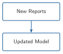
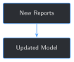

# Continuous Fine-Tuning: Keeping the Model Current {#sec-chapter-13}

::: {.content-visible when-format="html"}
::: {.pipeline-diagram}
{.diagram-light width="180"}
{.diagram-dark width="180"}
:::
:::

::: {.content-visible when-format="pdf"}
{width="180" fig-align="center"}
:::

::: {.chapter-status}
Progress `█████████████` **13 / 13** &nbsp;·&nbsp; **Estimated time:** 45-60 min &nbsp;·&nbsp; **Difficulty:** 🔴 Advanced
:::

## Learning objectives

By the end of this chapter, you will be able to:

- Simulate new reports arriving after a model is already in production,
  using a real chronological split of this book's own archive
- Continue fine-tuning an existing checkpoint on just the new batch,
  reusing Chapter 8's exact save-and-resume mechanism
- Run Chapter 12's comparison harness on the result to decide whether
  an updated model is actually worth deploying
- Explain, from a real run, why "new data arrived" is not the same
  claim as "the new model is better"

## Operational Problem

Sarah, the intervention engineer who first asked back in Chapter 9
whether she could trust an answer or still had to go find the PDF
herself, has one last version of that question now that the book is
almost done: *"Everything we've built assumes the reports we have
today. What happens when new ones come in next month — do we just
retrain and swap in whatever comes out?"*

## Example: the same question this book has asked all along, one more time

Simulate exactly that. Split this book's real, quality-gated archive
by report number — reports before `#60` stand in for "already in
production," reports `#60` onward stand in for "just arrived" — train
a model on the first group, continue training it on the second, and
ask Chapter 12's comparison harness whether the result is actually
better:

::: {.callout-note title="Current model vs. updated model, same held-out set both times"}
```
Current model: exact_match=0  avg_overlap=0.464  perplexity=25.92
Updated model: exact_match=0  avg_overlap=0.125  perplexity=25.73

Direction: exact_match=unchanged  avg_overlap=regressed  perplexity=improved
```
:::

New data arrived. Training ran without errors. Loss fell. And by one
of this book's own metrics, the result is a regression. This isn't a
hypothetical warning — it's what actually happened the one time this
book ran the full loop for real.

## Theory

::: {.callout-tip title="Engineering Translation: continuous fine-tuning"}
**Continuous fine-tuning** means updating a model again as new data
becomes available, instead of training it once and leaving it fixed
forever. It answers *how* to incorporate new data. It does not by
itself answer *whether* the result should replace what's currently
running — that's still Chapter 12's job, run again on the new
checkpoint.
:::

## Why "we retrained" isn't the same claim as "it's better"

The tempting shortcut this chapter exists to head off: new reports
arrived, so retrain, and deploy whatever comes out, because newer data
must mean a more current, more capable model. The Example above is the
real counter-case — training completed cleanly, loss fell every epoch,
and the resulting model still regressed on the same held-out set by
`avg_overlap`. Retraining is a mechanical step. Deciding whether the
result should replace what's live is a separate decision, and it needs
Chapter 12's comparison, run again, every time — not assumed from the
fact that training happened.

## Implementation

### Step 1: Split the archive by a chronological cutoff

## What problem are we solving?

Simulate "new reports arriving" using this book's own real archive,
without touching the one report (`#37`) reserved as held-out
everywhere else in this book.

## Inputs

- `build_archive_records` (Chapter 6), `HELD_OUT_REPORT` (Chapter 2)
- A cutoff report number

## Expected Output

Two lists of real report records: everything before the cutoff, and
everything at or after it.

```{python}
#| eval: false
CUTOFF_REPORT_NUM = 60


def split_archive_by_cutoff(cutoff: int = CUTOFF_REPORT_NUM) -> tuple[list[dict], list[dict]]:
    records = build_archive_records()
    ok = [r for r in records if r["status"] == "ok" and r["file"] != HELD_OUT_REPORT]
    current_reports = [r for r in ok if r["rpt_num"] < cutoff]
    new_reports = [r for r in ok if r["rpt_num"] >= cutoff]
    return current_reports, new_reports


current_reports, new_reports = split_archive_by_cutoff()
print(f"'Currently in production': {len(current_reports)} reports")
print(f"New reports just arrived:  {len(new_reports)} reports")
```

Running this exact code prints:

```
'Currently in production': 57 reports
New reports just arrived:  17 reports
```

## What just happened?

`57 + 17 = 74` — every quality-gated, non-held-out report in the
archive, split by report number into "before" and "after" a real
cutoff. Report `#37` never appears in either half, the same reservation
every earlier chapter has respected.

## Production Reality

This book's archive stops in early January 2021 — there's no genuinely
new data to wait for. A production system would use the actual date a
report was filed, not a chosen report-number cutoff, and the "new"
batch would arrive continuously, a few reports at a time, not as one
17-report batch.

### Step 2: Train the current model, then continue on the new batch

## What problem are we solving?

Produce two real checkpoints — one trained on the archive as it stood
before the cutoff, one continuing training on only the new batch —
using Chapter 8's exact checkpoint-and-resume mechanism.

## Inputs

- `current_examples` and `new_examples`, built with Chapter 7's chunker
- `train_with_checkpoints`, `save_checkpoint`, `load_checkpoint`
  (Chapter 8), reused unchanged

## Expected Output

Four checkpoints: two from training on the current archive, two more
continuing on the new batch alone.

```{python}
#| eval: false
model, tokenizer = load_model_and_tokenizer(MODEL_NAME)
lora_model = build_lora_model(model)
train_with_checkpoints(lora_model, tokenizer, current_examples, held_out_eval_set, run_dir, logger, num_epochs=2)
current_checkpoint = run_dir / "checkpoint_2"

del model, lora_model
model, tokenizer = load_model_and_tokenizer(MODEL_NAME)
lora_model = load_checkpoint(model, current_checkpoint)
train_with_checkpoints(lora_model, tokenizer, new_examples, held_out_eval_set, run_dir, logger, num_epochs=2, start_epoch=2)
updated_checkpoint = save_checkpoint(lora_model, run_dir, epoch=4)
```

Running this exact code prints:

```
  epoch 1: avg loss 3.0296, held-out 0/8 (410s) -> checkpoint_1
  epoch 2: avg loss 2.3672, held-out 0/8 (409s) -> checkpoint_2
  epoch 3: avg loss 1.8747, held-out 0/8 (142s) -> checkpoint_3
  epoch 4: avg loss 1.5092, held-out 0/8 (145s) -> checkpoint_4
```

## What just happened?

Loss fell at every epoch, in both stages — training worked exactly as
intended, on both the current archive and the new batch. `checkpoint_2`
is "currently in production"; `checkpoint_4` is "the update after new
reports arrived," produced the same reload-from-disk way Chapter 8
already simulates a crash and restart. Nothing about this step signals
a problem. That's the point of Step 3.

## Production Reality

Two epochs on 179 new examples is a small, fast update by design — a
real production system might retrain more or less aggressively
depending on how much new data has accumulated and how expensive a
full retrain is. This chapter's fixed 2-epoch continuation is a
teaching choice, not a tuned production schedule.

### Step 3: Compare before deciding to deploy

## What problem are we solving?

Answer the question Step 2's clean training run can't: is
`checkpoint_4` actually an improvement over `checkpoint_2`?

## Inputs

- Both checkpoints from Step 2, reloaded fresh from disk
- `load_version`, `summarize_version`, and `compare_versions`
  (Chapter 12), reused unchanged

## Expected Output

A direction per metric between the current and updated model.

```{python}
#| eval: false
lora_current, tokenizer = load_version(current_checkpoint)
summary_current = summarize_version(lora_current, tokenizer, held_out_eval_set)

lora_updated, _ = load_version(updated_checkpoint)
summary_updated = summarize_version(lora_updated, tokenizer, held_out_eval_set)

print(f"Current model: {summary_current}")
print(f"Updated model: {summary_updated}")
print(f"Direction:     {compare_versions(summary_current, summary_updated)}")
```

Running this exact code prints:

```
Current model: {'exact_match': 0, 'avg_overlap': 0.464, 'perplexity': 25.92}
Updated model: {'exact_match': 0, 'avg_overlap': 0.125, 'perplexity': 25.73}
Direction:     {'exact_match': 'unchanged', 'avg_overlap': 'regressed', 'perplexity': 'improved'}
```

## What just happened?

The same disagreement Chapter 12 found comparing two epochs of one
run, and comparing two entirely different training regimes, shows up a
third time here, on a genuinely new scenario: real new data, really
incorporated. `avg_overlap` says this update made things worse.
Perplexity's "improved" label points the right direction but by a
small margin — `25.92 -> 25.73` is about `0.7%`, nowhere near the
substantial, `6×` gap Chapter 11 found between a base and fine-tuned
model. Chapter 12's own Production Reality warned that this comparison
has no noise threshold; this run is a live example of why that
matters: a real disagreement (`avg_overlap`) sits next to a real but
minor "improvement" (`perplexity`), and only one of them is worth
acting on.

This step's loader is worth noticing too: it calls `load_version`
(Chapter 12), not Step 2's `load_checkpoint` (Chapter 8) — the two
look interchangeable but aren't. `load_checkpoint` sets
`is_trainable=True`, which leaves the model in **train mode**, dropout
included. That's correct for resuming training in Step 2; loading a
checkpoint the same way just to *evaluate* it would leave dropout
switched on during scoring, making perplexity noisy from run to run
for no real reason. Catching this meant literally checking
`model.training` after loading — it printed `True` where it should
have printed `False`, on the first attempt at this exact step.

## Practical exercise

🟢 **Beginner**

**Try it yourself:** run
`python code/chapter_13/continuous_finetune.py` from inside `book/`
(it takes roughly 20-25 minutes on CPU) and compare its printed output
to the transcripts above.

**You'll know it worked when:** you see `avg_overlap: regressed` in
the final comparison, and you can explain in one sentence why that
means this particular update shouldn't be deployed without a closer
look, even though training itself ran cleanly.

## Field notes

::: {.callout-warning title="Field notes: the new batch skews toward a different phase of the well"}
**Query:** what the 17 new reports (`#60` onward) actually describe,
compared to what the held-out evaluation report (`#37`) describes.

**Result:** `20` of the new batch's `179` examples mention casing or
cement — concentrated in the last several reports, right at the
archive's end (*"Rig up and run 7" casing,"* *"Cement 7" casing,"*
*"Production Casing Wait on Cement"*). The updated model's
memorized-sounding template shifts to match: *"Production Casing Run
Csg & Cement Rig up cementing equipment,"* replacing the current
model's *"Production Drilling Cond Mud & Circ Circulate for
temperature."* Report `#37`, the held-out report this chapter still
evaluates against, is from the middle of the well program — active
drilling, not casing.

**Why:** a real well program drills first and cases and cements later,
near total depth. The new batch isn't random new data; it's
disproportionately drawn from a later, different operational phase
than the report this chapter evaluates against. Continuing training on
it pulled the model's default template toward casing/cementing
language, which fits the new reports and doesn't fit report `#37`.

**Lesson:** "the new data is real and relevant" and "the new data
resembles what you're evaluating against" are different claims. A drop
in `avg_overlap` here isn't a training bug — it's an honest reflection
of what the new batch actually contains, and exactly the kind of thing
a human should look at before deciding whether report `#37`-style
questions are still important enough to weight for, or whether the
archive's growing casing/cementing content means the evaluation set
itself needs to grow too.
:::

## Challenge exercise

🟠 **Intermediate**

**Challenge:** this chapter's evaluation set is still Chapter 11's
original 8 questions, all from report `#37` — a report about active
drilling, not casing. Build a second held-out check from one of the
new batch's own reports (held out from the "new" training set the same
way `#37` is held out from everything) and compare the updated model
against it instead. A reference solution is at
`code/chapter_13/challenge/challenge.py` — on a real run, holding
report `#65` (2020-12-23, `20` real examples) out of the new-batch
continuation and evaluating against it afterward gives
`{'exact_match': 0, 'avg_overlap': 0.14, 'perplexity': 16.56}`.
Perplexity is noticeably lower here than either model scored against
report `#37` (`~25.8`) — the updated model finds a report from its own
new batch's operational phase less surprising than one from an earlier
phase, even though `avg_overlap` stays just as low. Recency alone
didn't fix what changed; matching the evaluation report's operational
phase did more than matching its training era.

## Key takeaways

- Training completing without errors, with loss falling every epoch,
  says nothing about whether the result should replace what's in
  production. This chapter's real run trained cleanly and still
  regressed on `avg_overlap`.
- The same metric-disagreement pattern Chapter 12 found comparing
  epochs, and comparing entirely different training regimes, showed up
  a third time in a genuinely new scenario — this isn't a one-off
  quirk of one comparison.
- A regression is worth investigating, not just flagging: the real
  cause here was traceable to what the new reports actually contain,
  not a training bug.
- Perplexity moving in the "improved" direction by under `1%` is not
  the same claim as the substantial, `6×` gap Chapter 11 found between
  a base and fine-tuned model. Direction alone, without magnitude, can
  overstate a trivial change.
- A model left in train mode (dropout still active) scores noisily
  even in eval-only code — `load_checkpoint`'s `is_trainable=True` is
  right for resuming training and wrong for scoring; catching it meant
  checking `model.training` directly, not just distrusting a number
  that looked slightly different between runs.

## Repository files

| File | Purpose |
|---|---|
| `code/chapter_13/continuous_finetune.py` | Splits the archive, trains a current model, continues training on new reports, and compares the result |
| `code/chapter_13/challenge/challenge.py` | Reference solution: evaluating against a held-out report from the new batch itself |
| `notebooks/chapter_13_explore.ipynb` | Interactive companion notebook |

::: {.callout-caution title="CHECKPOINT — Chapter 13"}
- [x] Simulated new reports arriving using a real chronological split
      of this book's own archive
- [x] Continued fine-tuning an existing checkpoint on just the new
      batch, reusing Chapter 8's save-and-resume mechanism unchanged
- [x] Ran Chapter 12's comparison on the result and found a real
      regression, not a hypothetical one
- [x] Traced that regression back to a real, sensible cause instead of
      treating the metric as unexplainable noise
:::

::: {.callout-tip .built-box title="✓ WHAT YOU BUILT"}
**`continuous_finetune.py`** — splits this book's real archive by a
chronological cutoff, trains a "current" model on one side, continues
training it on the "new" side using Chapter 8's exact checkpoint
mechanism, and runs Chapter 12's comparison to decide whether the
result actually deserves to replace what's running. On a real run, it
doesn't.
:::

## What can you do now that you couldn't do before?

You can retrain a model on new data as it arrives, and — because you
built Chapter 12's comparison first — you can tell the difference
between "we retrained" and "we improved," instead of deploying
whatever a clean training run happens to produce.

## See it side by side

Every real checkpoint sitting in `checkpoints/` right now — from
Chapter 5's first fine-tune through this chapter's continuously-updated
one — is something the book's companion app (`app/`) can load directly,
not a separate demo built beside this book. Its Model Playground puts
the base and fine-tuned answers side by side on the same real prompt;
Before vs. After Evaluation runs this book's own metrics live across
the full held-out set; Dataset Explorer browses the real training
examples behind them; and Failure Analysis reruns the book's own
documented failure cases — including a real regression like the one
this chapter just found — against whichever checkpoint you actually
have. See `app/README.md` to run it; nothing in it is pre-recorded, so
your own checkpoint may not reproduce this book's exact numbers, and
that difference is itself real information.

{#fig-app-evaluation fig-alt="Screenshot of the companion app's Before vs. After Evaluation page, showing a results table for the base model and three fine-tuned checkpoints, a callout stating the latest checkpoint regressed on both average overlap and perplexity compared to the previous one, and per-transition percentage changes for each metric."}

## Suggested next step

This is the last chapter. Every tool in it runs on your own data, not
just this book's Utah FORGE archive: Chapter 6's gate checks a new
archive's quality, Chapter 8 fine-tunes it at whatever scale it has,
Chapters 9 and 10 add retrieval and a faithfulness check on top,
Chapter 11 builds a real evaluation set from whatever you hold out, and
Chapters 12 and 13 decide, honestly, whether a new version is actually
worth deploying. The book's own archive stops in January 2021. Yours
doesn't have to.
