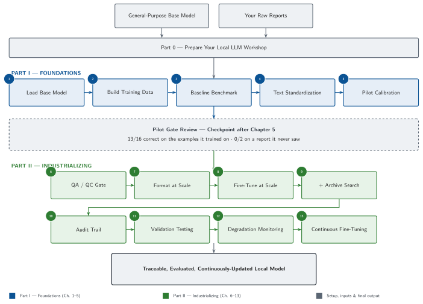
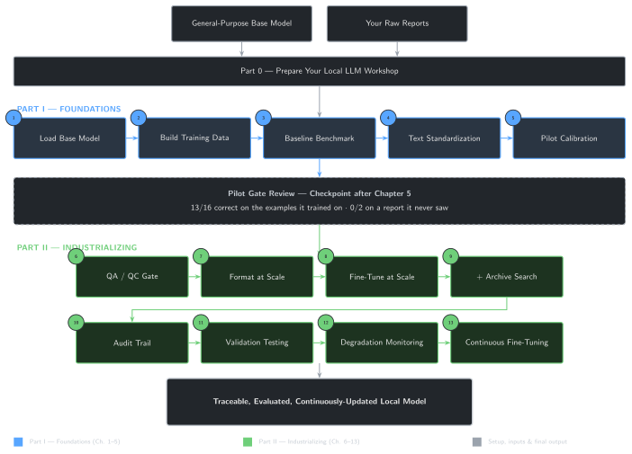

# Welcome {.unnumbered}

Every rig produces a paper trail, and every operator has a way of writing
things down that a general-purpose chatbot has never seen: shorthand,
local conventions, the specific judgment calls your team makes that
never show up in a public dataset. Ask a general local model a real
drilling or completions question and you'll often get something fluent,
confident, and subtly wrong — right vocabulary, wrong operational
instinct.

Fine-tuning fixes that, but only if you do it deliberately: with the
right training data, the right method, and a way to prove the result
actually improved instead of just changed.

This book builds, from scratch and in plain Python, a fine-tuned local
language model purpose-built for drilling and completions engineering —
one you build chapter by chapter and understand end to end. You will not
start with theory. You will start by loading a small local model and
watching it get something in your domain wrong. By the end, you will have
a model that has genuinely learned from your own operational text, runs
entirely on your own machine, and comes with an evaluation harness that
tells you, with numbers, whether it actually got better.

## Before and after

Today, a general local model answers a drilling or completions question
the way it would answer any question: plausibly, generically, and without
any real grounding in how your operation actually talks about pressure
tests, completions sequencing, or a stuck-pipe event. Getting it to
behave like it works *here* usually means one of two things: an enormous
prompt stuffed with context every single time, or a model that has
actually been trained on your language.

By Chapter 5, you'll have run your first parameter-efficient fine-tune —
a small, targeted update to a local model's weights — and be able to
compare its answers to the un-fine-tuned baseline side by side. By the
end of the book, that model is evaluated, checked for hallucination and
drift, and wired into a pipeline that keeps it current as new reports
arrive.

## What this becomes

The scripts in this book are the engine. Its optional companion app
(`book/app/`) puts the same evidence on one screen, reading whatever
real checkpoint you've actually trained: a Model Playground for the
same base-vs-fine-tuned comparison side by side, a Before vs. After
Evaluation page that runs this book's own metrics live across the full
held-out set, a Dataset Explorer for the real training examples behind
the result, and a Failure Analysis page that reruns the book's own
documented failure cases — including a fluent, confident wrong answer —
against your checkpoint. Nothing in it is pre-recorded; see
`app/README.md` once you're ready to run it, after Chapter 5 gives you
a first real checkpoint to load.

{#fig-app-playground fig-alt="Screenshot of the companion app's Model Playground page, showing a base model answer and a fine-tuned model answer side by side for the same held-out question, each scored for exact-match and overlap against the real reference answer."}

## Who this book is for

You should read this book if you are a drilling engineer, completions
engineer, intervention engineer, production engineer, petroleum data
scientist, or part of a digital transformation team in energy, and you:

- Have never written a line of Python in your life — or tried once and
  gave up.
- Have strong operational experience and are comfortable in Excel.
- Have never fine-tuned a model or worked with a local LLM runtime.
- Are curious about AI and automation, and are willing to type code
  examples yourself rather than just read about them.
- Want a model that works on your own operational language, not a
  generic assistant.

No prior programming or AI/ML background is assumed. Every concept — even
one as basic as what a function is — is introduced only after you've hit
the problem it solves, never before. The goal of this book isn't to turn
you into a machine learning researcher. It's to make you capable of
building and trusting a private, local, domain-specific model.

## What you will build

| Chapter | You will be able to... |
|---|---|
| 0 | Set up a working local LLM environment, checking your hardware along the way |
| 1 | Load and run a local base model |
| 2 | Turn raw drilling and completions reports into training examples |
| 3 | Show, with evidence, where the base model gets domain questions wrong |
| 4 | Understand tokenization and embeddings well enough to prepare training data correctly |
| 5 | Run your first LoRA fine-tune and compare it to the baseline |
| 6–13 | Scale the system to larger, cleaner datasets, combine fine-tuning with retrieval, evaluate rigorously, detect drift, and keep the model current as new reports arrive |

One picture for the whole route above, distinct from each chapter's own
two-box opening diagram: where you start, all 13 chapters grouped into
Part I and Part II, and the one honest checkpoint in the middle that
keeps this map from overselling itself.

::: {.content-visible when-format="html"}
::: {#fig-roadmap .pipeline-diagram}
{.diagram-light}

{.diagram-dark}

The reader's route through the book: Part I's five foundation chapters
reach a real, honest checkpoint (13/16 on trained examples, 0/2 on a
held-out report) before Part II's eight chapters industrialize the
system.
:::
:::

::: {.content-visible when-format="pdf"}
{#fig-roadmap-pdf fig-align="center"}
:::

## Management view: why this matters

If you're deciding whether to fund or adopt work like this, here's the
case in plain terms — and its limits.

- **Domain fluency.** A fine-tuned model responds in the vocabulary and
  operational logic your team actually uses, instead of generic
  boilerplate.
- **Private deployment.** Everything in this book runs locally, so
  confidential reports and the model trained on them never need to leave
  your environment.
- **Repeatability.** The training pipeline is code, not a one-off manual
  effort — it can be re-run as new data arrives (Chapter 13).
- **Measurable improvement.** Chapter 11's evaluation harness gives you
  numbers, not impressions, for whether fine-tuning actually helped.
- **Build vs. buy.** The core is a few hundred lines of standard Python
  plus open-weight models. The trade-off against a vendor product is
  control and inspectability versus vendor support and maintenance.
- **Known limits.** Fine-tuning teaches style and domain patterns; it is
  not a substitute for retrieval when the model needs to cite a specific,
  current document verbatim — Chapter 9 covers combining the two.

This supports an engineer's judgment; it doesn't replace it. A more
fluent model is only as good as the review process around how its
answers get used.

## How this book works

Every chapter solves one problem you'd actually hit fine-tuning a model
for this domain, and ends with something you can run. There is no
chapter you read passively — you will type code, run it against real
training data, and see the model change. Theory appears only when it
explains *why* the code in front of you behaves the way it does.

We follow one rule throughout: **measured improvement over AI novelty**.
A fine-tune that isn't evaluated is just a guess dressed up as progress —
so this book insists on comparing before and after, every time.

### The visual language of this book

A few recurring elements appear in every chapter, explained once here so
they never need repeating:

- **Progress bar** — `███░░░░░░░░░░ 3 / 13` at the top of every chapter,
  showing exactly how far you are through the book.
- **Estimated time** and **difficulty badge** (🟢 Beginner, 🟠
  Intermediate, 🔴 Advanced) — next to the progress bar, so you know the
  commitment before you start.
- **CHECKPOINT** — a checklist near the end of each chapter, confirming
  the specific skills you just gained.
- **WHAT YOU BUILT** — a green box naming the concrete artifact (a
  script, a fine-tuned checkpoint, an evaluation report) you now have,
  distinct from the conceptual "Key takeaways" earlier in the chapter.
- **Field notes** 🔧 — a real, independently-verified vignette showing
  where a chapter's tool succeeds or breaks against real training data.

You'll also meet four recurring engineers, each asking the question that
opens a chapter's **Operational Problem**:

| Name | Role |
|---|---|
| Oumy | Drilling Engineer |
| Mike | Completions Engineer |
| Sarah | Intervention Engineer |
| Sean | Production Engineer |

They're a framing device, not a source of data: whichever question Oumy,
Mike, Sarah, or Sean asks, every number and result used to answer it must
come from a real, reproducible run of this book's own code — never
invented on their behalf.

## Companion repository

All code, training data, and notebooks referenced in this book live in
the [companion
repository](https://github.com/djimrastephane/llm-ft-drilling-completions-book)
on GitHub. Every chapter lists exactly which files you need under
**Repository files**.

Stuck on something — a setup error, a package that won't install, a
script that fails partway through? The [Troubleshooting
Guide](https://github.com/djimrastephane/llm-ft-drilling-completions-book/blob/main/TROUBLESHOOTING.md)
in that same repository collects the errors readers hit most often, with
the likely cause for each.

If you've never installed Python or don't know which editor to use, start
with **Part 0 — Preparing Your Local LLM Workshop**: it works with any
of five common setups (Jupyter Notebook, VS Code, PyCharm Community,
Positron, or a terminal alone) and ends with your first script actually
running. If you already have Python and a working setup, jump straight to
Chapter 1.

Let's load our first local model.
